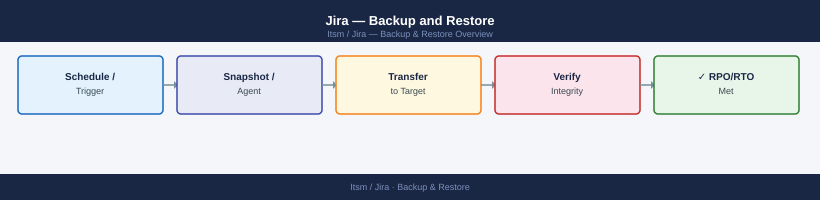
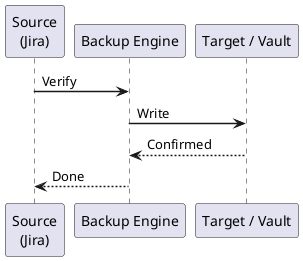

---
tags:
  - jira
  - operations
---
# Jira — Backup and Restore



```bash
#!/bin/bash
# xml-backup.sh — Trigger Jira XML backup via REST API
JIRA_URL="https://jira.example.com"
USER="admin"
TOKEN="your-api-token"
TIMESTAMP=$(date +%Y%m%d-%H%M%S)

curl -s -u "${USER}:${TOKEN}" \
  -X POST \
  -H "Content-Type: application/json" \
  "${JIRA_URL}/rest/api/2/plugins/1.0/resource/com.atlassian.jira.ext.backup%3AbackupService/data" \
  --data '{"cbAttachments": "false", "exportToCloud": "false"}' \
  -o /dev/null -w "%{http_code}\n"

echo "XML backup triggered at ${TIMESTAMP}"
```

```cron
# /etc/cron.d/jira-backup
0 1 * * * jira /opt/scripts/pg-backup-jira.sh >> /var/log/jira-backup.log 2>&1
```
```bash
#!/bin/bash
# filesystem-backup.sh
SHARED_HOME="/var/atlassian/application-data/jira/shared"
BACKUP_DIR="/backup/jira/filesystem"
TIMESTAMP=$(date +%Y%m%d-%H%M%S)

mkdir -p "${BACKUP_DIR}"

# Incremental rsync to staging area
rsync -av --delete \
  --link-dest="${BACKUP_DIR}/latest" \
  "${SHARED_HOME}/" \
  "${BACKUP_DIR}/${TIMESTAMP}/"

# Update "latest" symlink
ln -snf "${BACKUP_DIR}/${TIMESTAMP}" "${BACKUP_DIR}/latest"

# Create a compressed archive for off-site transfer
tar -czf "${BACKUP_DIR}/jira_fs_${TIMESTAMP}.tar.gz" \
  -C "${BACKUP_DIR}" "${TIMESTAMP}"

echo "Filesystem backup complete: ${BACKUP_DIR}/${TIMESTAMP}"
```

```bash
#!/bin/bash
# snapshot-backup.sh — Coordinated LVM snapshot backup

DB_HOST="db.example.com"
LV_PATH="/dev/vg_jira/lv_shared"
SNAP_NAME="lv_shared_snap"
SNAP_SIZE="50G"
MOUNT_POINT="/mnt/jira-snap"

# 1. Create DB backup (consistent point-in-time)
PGPASSWORD="${JIRA_DB_PASSWORD}" pg_dump \
  -h "${DB_HOST}" -U jira -Fc jiradb \
  -f /backup/jira/db/jira_$(date +%Y%m%d).pgdump &
DB_PID=$!

# 2. Create LVM snapshot (near-instant)
lvcreate -L "${SNAP_SIZE}" -s -n "${SNAP_NAME}" "${LV_PATH}"

# 3. Wait for DB dump to complete
wait "${DB_PID}"

# 4. Mount snapshot and archive
mkdir -p "${MOUNT_POINT}"
mount "/dev/${VG}/${SNAP_NAME}" "${MOUNT_POINT}"
tar -czf "/backup/jira/fs/jira_fs_$(date +%Y%m%d).tar.gz" \
  -C "${MOUNT_POINT}" .

# 5. Clean up snapshot
umount "${MOUNT_POINT}"
lvremove -f "/dev/${VG}/${SNAP_NAME}"
```
```bash
# All nodes
systemctl stop jira

# Verify no Jira processes remain
ps aux | grep -i jira | grep -v grep
```
```bash
# Drop and recreate the database
psql -h db.example.com -U postgres -c "SELECT pg_terminate_backend(pid) FROM pg_stat_activity WHERE datname = 'jiradb';"
psql -h db.example.com -U postgres -c "DROP DATABASE jiradb;"
psql -h db.example.com -U postgres -c "CREATE DATABASE jiradb OWNER jira ENCODING 'UTF8';"

# Restore from custom-format dump
PGPASSWORD="${JIRA_DB_PASSWORD}" pg_restore \
  -h db.example.com \
  -U jira \
  -d jiradb \
  --jobs 4 \
  --no-acl \
  --no-owner \
  /backup/jira/db/jira_db_20260101-010000.pgdump
```
```bash
# Clear existing shared home
rm -rf /var/atlassian/application-data/jira/shared/*

# Restore from archive
tar -xzf /backup/jira/fs/jira_fs_20260101.tar.gz \
  -C /var/atlassian/application-data/jira/shared/

# Fix ownership
chown -R jira:jira /var/atlassian/application-data/jira/shared/
```
```bash
# Start first node only
systemctl start jira

# Monitor startup logs
tail -f /opt/atlassian/jira/logs/catalina.out
```
```text
INFO  [main] Jira starting up...
INFO  [main] Jira has been successfully started
```
```bash
curl -u admin:token -X POST \
  "https://jira.example.com/rest/api/2/reindex" \
  -H "Content-Type: application/json" \
  -d '{"type": "FOREGROUND"}'
```
```bash
# Check cluster node registration
psql -h db.example.com -U jira -d jiradb \
  -c "SELECT node_id, node_name, status, last_heartbeat FROM clusternodeinfo;"

# Verify issue count matches backup
psql -h db.example.com -U jira -d jiradb \
  -c "SELECT COUNT(*) FROM jiraissue;"

# Health endpoint
curl -s https://jira.example.com/status | python3 -m json.tool
```
```bash
# Start additional nodes after primary is healthy
systemctl start jira   # on jira-app-02, jira-app-03
```



## Before you begin

- **Access:** Admin credentials on all affected systems
- **Timing:** safe to run during business hours unless a step is marked ⚠ (causes interruption)
- **Dependencies:** no active upgrades or migrations on the same infrastructure
- **Logging:** capture command output — paste into the change record on completion

---

---

## Verify

- Confirm the operation completed without errors in the log or management UI
- Verify the expected state change is visible (service running, object created, config applied)
- Document the outcome in the change record

---

## See also

- [Jira — Procedures](../procedures/)
- [Jira — Health Checks](../health-checks/)
- [Jira — Common Issues](../../troubleshooting/common-issues/)
