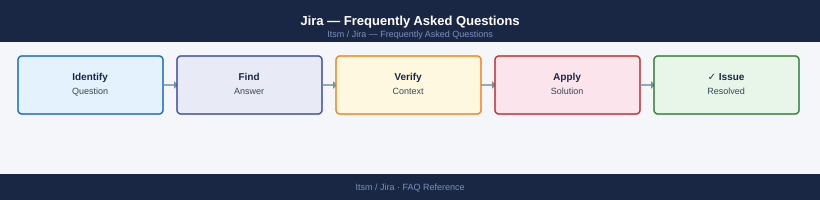

---
tags:
  - jira
  - faq
  - operations
---
# Jira — Frequently Asked Questions

Common questions about Jira operations, configuration, and troubleshooting. For step-by-step procedures, see the <a href="index.md">Operations</a> section.

## General

**Q: What Jira version is recommended?**
A: Jira Data Center 9.x for self-hosted. Cloud is always current. Check via Administration → System → System Info. Maintain within 2 major versions for Atlassian support.

**Q: How do I check the current Jira version?**
A: `Administration → System → System Info`

## Configuration

**Q: What is the default issue workflow and when should it change?**
A: Jira ships with a default workflow (To Do → In Progress → Done). Customise workflows per project type. Avoid modifying the default workflow directly — create project-specific workflows and apply via workflow schemes.

**Q: How do I enable Jira Service Management for an IT helpdesk project?**
A: Go to Project Settings → Project Type → Service Management. Or create a new project using the IT Service Management template. Configure queues, SLAs, and customer portal in the JSM project settings.

## Operations

**Q: How do I upgrade Jira Data Center with minimal downtime?**
A: Enable read-only mode before upgrade. Back up the database and Jira home. For clustered DC, stop all nodes, upgrade sequentially. Jira does not support rolling upgrades — all nodes must run the same version.

**Q: What is the correct procedure to create a new project with consistent settings?**
A: Use a project template that matches the desired workflow. Apply the correct Permission Scheme, Notification Scheme, and Issue Type Scheme before the team starts using the project. Audit schemes monthly.

## Troubleshooting

**Q: Jira shows 'Index recovery in progress'. What does it mean?**
A: The Lucene search index is being rebuilt (common after crash or version upgrade). Jira is still usable but search may be incomplete. Check progress under Administration → System → Indexing.

**Q: Jira is slow — where do I start?**
A: Check the thread dump (Administration → Logging and Profiling → Thread Dump). Review database slow queries. Check JVM heap (Administration → System → Memory). Disable unused plugins. Review JQL query performance.

## Backup and Recovery

**Q: How often should I back up Jira?**
A: Database daily backup. Jira home directory daily (includes attachments and plugins). Built-in XML backup is for migration only. Test restore quarterly to a staging environment.

**Q: Can I restore a single project without a full Jira restore?**
A: Not natively with standard restore. You need to restore to a separate Jira instance, then use project export/import or the Jira Cloud Migration Assistant to move just that project's data.

## See Also

- [Jira Operations](index.md)
- [Jira Troubleshooting](../../troubleshooting/index.md)
