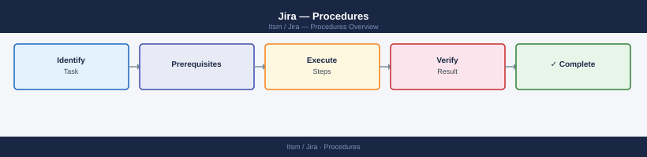

---
tags:
  - jira
  - operations
---
# Jira — Procedures


<div class="kb-summary">
Jira operational procedures — story and epic creation, sprint management, backlog grooming, workflow configuration, user and permission management, board setup, and reporting.

*Applies to: Jira 9.x / Cloud*
</div>



## Before you begin

- **Access:** Admin credentials on all affected systems
- **Timing:** safe to run during business hours unless a step is marked ⚠ (causes interruption)
- **Dependencies:** no active upgrades or migrations on the same infrastructure
- **Logging:** capture command output — paste into the change record on completion

---

## Stories

Story structure, acceptance criteria, story points, epics, and estimation.

## Story Structure

A well-formed user story answers: who needs this, what they need, and why.


Estimation tips:
- Use planning poker for team alignment
- Anchor estimates to reference stories the team knows
- If a story reaches 8 points, consider splitting it
- Avoid converting points to hours in team communication

```bash
# Set story points via API
curl -u user:token -X PUT \
  "https://your-instance.atlassian.net/rest/api/2/issue/PLAT-123" \
  -H "Content-Type: application/json" \
  -d '{"fields": {"customfield_10016": 5}}'

# Get story points for all issues in a sprint
curl -u user:token -G \
  "https://your-instance.atlassian.net/rest/api/2/search" \
  --data-urlencode 'jql=project = PLAT AND sprint in openSprints()' \
  --data-urlencode 'fields=summary,customfield_10016' \
  | jq '.issues[] | {key: .key, points: .fields.customfield_10016}'
```

## Epics

Epics group related stories under a theme or deliverable.

```bash
# Create an epic
curl -u user:token -X POST \
  "https://your-instance.atlassian.net/rest/api/2/issue" \
  -H "Content-Type: application/json" \
  -d '{
    "fields": {
      "project": {"key": "PLAT"},
      "summary": "Storage Automation",
      "issuetype": {"name": "Epic"},
      "customfield_10011": "Storage Automation"
    }
  }'

# Link a story to an epic
curl -u user:token -X PUT \
  "https://your-instance.atlassian.net/rest/api/2/issue/PLAT-123" \
  -H "Content-Type: application/json" \
  -d '{"fields": {"customfield_10014": "PLAT-10"}}'

# List all stories in an epic
curl -u user:token -G \
  "https://your-instance.atlassian.net/rest/api/2/search" \
  --data-urlencode 'jql=project = PLAT AND "Epic Link" = PLAT-10'
```

## Story Splitting

Split large stories using these patterns:

```bash
# Patterns for splitting
By workflow step:     One story per step in a user workflow
By data type:         Separate stories for each entity/type
By interface:         API first, then UI
By acceptance criterion: Each criterion becomes its own story
By happy/unhappy path: Core flow first, error handling separate
By permission level:  Admin view, user view as separate stories
```

| Signal | Action |
|--------|--------|
| Story > 8 points | Split before sprint planning |
| Multiple "and" clauses in title | Each clause is a separate story |
| Multiple system touches | Split by system boundary |
| Unclear acceptance criteria | Spike first, then story |

---

## Tasks

Task creation, sub-tasks, issue linking, workflow transitions, and bulk operations.

## Creating Tasks

Tasks represent technical work that does not map directly to a user story (infra changes, chores, spikes).

```bash
# Create a task via REST API
curl -u user:token -X POST \
  "https://your-instance.atlassian.net/rest/api/2/issue" \
  -H "Content-Type: application/json" \
  -d '{
    "fields": {
      "project": {"key": "PLAT"},
      "summary": "Upgrade Terraform AWS provider to v5",
      "issuetype": {"name": "Task"},
      "description": "Provider v5 required for new S3 features. See migration guide.",
      "priority": {"name": "Medium"},
      "assignee": {"name": "jsmith"},
      "labels": ["infrastructure", "terraform"]
    }
  }'

# Get a task by key
curl -u user:token \
  "https://your-instance.atlassian.net/rest/api/2/issue/PLAT-123"
```

## Sub-tasks

Sub-tasks break a parent issue into trackable pieces of work.

```bash
# Create a sub-task
curl -u user:token -X POST \
  "https://your-instance.atlassian.net/rest/api/2/issue" \
  -H "Content-Type: application/json" \
  -d '{
    "fields": {
      "project": {"key": "PLAT"},
      "summary": "Test provider upgrade in dev environment",
      "issuetype": {"name": "Sub-task"},
      "parent": {"key": "PLAT-123"}
    }
  }'

# List sub-tasks for a parent issue
curl -u user:token \
  "https://your-instance.atlassian.net/rest/api/2/issue/PLAT-123" \
  | jq '.fields.subtasks[] | {key: .key, summary: .fields.summary, status: .fields.status.name}'
```

| Issue Type | Has Parent | Use Case |
|-----------|-----------|----------|
| Epic | No | Large theme |
| Story | Epic (optional) | User-facing feature |
| Task | Epic (optional) | Technical work |
| Bug | Epic (optional) | Defect |
| Sub-task | Story / Task / Bug | Work breakdown |

## Issue Linking

Link issues to express relationships: blocks, is blocked by, duplicates, relates to.

```bash
# Create an issue link
curl -u user:token -X POST \
  "https://your-instance.atlassian.net/rest/api/2/issueLink" \
  -H "Content-Type: application/json" \
  -d '{
    "type": {"name": "Blocks"},
    "inwardIssue": {"key": "PLAT-123"},
    "outwardIssue": {"key": "PLAT-456"}
  }'

# List available link types
curl -u user:token \
  "https://your-instance.atlassian.net/rest/api/2/issueLinkType"

# Delete a link
curl -u user:token -X DELETE \
  "https://your-instance.atlassian.net/rest/api/2/issueLink/LINK_ID"
```

| Link Type | Direction | Meaning |
|-----------|----------|---------|
| Blocks | A blocks B | A must complete before B starts |
| Clones | A clones B | A is a duplicate of B |
| Relates to | A relates to B | General relationship |
| Duplicates | A duplicates B | Same work tracked twice |

## Workflow Transitions

```bash
# Get available transitions for an issue
curl -u user:token \
  "https://your-instance.atlassian.net/rest/api/2/issue/PLAT-123/transitions" \
  | jq '.transitions[] | {id: .id, name: .name}'

# Perform a transition (move to "In Progress")
curl -u user:token -X POST \
  "https://your-instance.atlassian.net/rest/api/2/issue/PLAT-123/transitions" \
  -H "Content-Type: application/json" \
  -d '{"transition": {"id": "21"}}'

# Transition with a comment
curl -u user:token -X POST \
  "https://your-instance.atlassian.net/rest/api/2/issue/PLAT-123/transitions" \
  -H "Content-Type: application/json" \
  -d '{
    "transition": {"id": "31"},
    "update": {
      "comment": [{"add": {"body": "Deployed to prod — monitoring for 30 min"}}]
    }
  }'
```

## Bulk Operations

```bash
# Bulk assign issues to a new assignee (via search + update loop)
ISSUES=$(curl -s -u user:token -G \
  "https://your-instance.atlassian.net/rest/api/2/search" \
  --data-urlencode 'jql=project = PLAT AND assignee = "olduser" AND status != Done' \
  | jq -r '.issues[].key')

for ISSUE in $ISSUES; do
  curl -s -u user:token -X PUT \
    "https://your-instance.atlassian.net/rest/api/2/issue/${ISSUE}" \
    -H "Content-Type: application/json" \
    -d '{"fields": {"assignee": {"name": "newuser"}}}' 
done

# Bulk transition via Jira UI:
# Board or issue list → select issues → Actions → Transition
```

```bash
# Add a label to multiple issues
for ISSUE in PLAT-100 PLAT-101 PLAT-102; do
  curl -s -u user:token -X POST \
    "https://your-instance.atlassian.net/rest/api/2/issue/${ISSUE}" \
    -H "Content-Type: application/json" \
    -d '{"update": {"labels": [{"add": "needs-review"}]}}'
done
```

---

## Reporting

Sprint reports, velocity, burndown charts, cumulative flow diagrams, and data exports.

## Sprint Reports

Sprint reports show which issues were completed, incomplete, or removed during a sprint.

```bash
# Get sprint report data via API
curl -u user:token \
  "https://your-instance.atlassian.net/rest/greenhopper/1.0/rapid/charts/sprintreport?rapidViewId=10&sprintId=42"

# List all sprints for a board
curl -u user:token \
  "https://your-instance.atlassian.net/rest/agile/1.0/board/10/sprint?state=closed&maxResults=10"

# Get issues completed in a sprint
curl -u user:token \
  "https://your-instance.atlassian.net/rest/agile/1.0/sprint/42/issue?jql=status+in+(Done,Resolved)"
```

Key sprint metrics to review:
- Commitment (story points planned at sprint start)
- Completed points vs committed points
- Issues added mid-sprint (scope creep)
- Carried-over issues (not completed)

## Velocity Chart

Velocity measures average story points completed per sprint. Use it for capacity planning.

```bash
# Fetch velocity data (GreenHopper endpoint)
curl -u user:token \
  "https://your-instance.atlassian.net/rest/greenhopper/1.0/rapid/charts/velocity?rapidViewId=10"

# Export last 10 sprints of velocity data with jq
curl -s -u user:token \
  "https://your-instance.atlassian.net/rest/greenhopper/1.0/rapid/charts/velocity?rapidViewId=10" \
  | jq '.velocityStatEntries | to_entries[] | {sprint: .key, completed: .value.completed.value, estimated: .value.estimated.value}'
```

| Metric | Formula | Use |
|--------|---------|-----|
| Velocity | Avg completed points / sprint | Sprint capacity planning |
| Predictability | Completed / committed | Team reliability signal |
| Scope creep rate | Mid-sprint added / committed | Process health indicator |

## Burndown Chart

Burndown shows remaining work over a sprint's timeline. A healthy burndown trends toward zero at sprint end.

```bash
# Fetch burndown data
curl -u user:token \
  "https://your-instance.atlassian.net/rest/greenhopper/1.0/rapid/charts/scopechangeburndownchart?rapidViewId=10&sprintId=42"

# Get current sprint remaining work via JQL
curl -u user:token -G \
  "https://your-instance.atlassian.net/rest/api/2/search" \
  --data-urlencode 'jql=sprint in openSprints() AND project = PLAT AND status != Done' \
  --data-urlencode 'fields=summary,story_points,status' \
  | jq '[.issues[].fields.customfield_10016 // 0] | add'
```

## Cumulative Flow Diagram (CFD)

CFD shows how many issues are in each status over time. Widening bands indicate bottlenecks.

```bash
# Fetch CFD data
curl -u user:token \
  "https://your-instance.atlassian.net/rest/greenhopper/1.0/rapid/charts/cumulativeflowdiagram?rapidViewId=10&swimlaneId=0&fromDate=2025-01-01&toDate=2025-03-31"
```

Interpreting the CFD:
- **Widening "In Progress" band** — WIP is accumulating, throughput is slower than input
- **Flat "Done" band** — work is not being completed
- **Steep "To Do" drop** — sudden scope removal
- **Parallel bands** — healthy, consistent flow

## JQL for Reporting

```bash
# Issues closed in the last 2 weeks
project = PLAT AND status changed to Done after "-2w"

# Issues created but not resolved in 30 days
project = PLAT AND created <= "-30d" AND resolution = Unresolved

# Bugs by priority
project = PLAT AND issuetype = Bug AND status != Done ORDER BY priority ASC

# Issues by assignee with story points
project = PLAT AND sprint in openSprints() AND assignee is not EMPTY
```

## Exporting Data

```bash
# Export issues to CSV via REST API
curl -u user:token -G \
  "https://your-instance.atlassian.net/rest/api/2/search" \
  --data-urlencode 'jql=project = PLAT AND sprint in closedSprints()' \
  --data-urlencode 'fields=summary,assignee,status,story_points,resolutiondate' \
  --data-urlencode 'maxResults=500' \
  | jq -r '.issues[] | [.key, .fields.summary, .fields.status.name, (.fields.customfield_10016 // ""), (.fields.resolutiondate // "")] | @csv' \
  > sprint_data.csv

# Export via Jira UI
# Issues → Export → CSV (all fields) or Excel
```

| Report | Location in Jira | Frequency |
|--------|-----------------|-----------|
| Sprint Report | Board → Reports → Sprint Report | End of each sprint |
| Velocity | Board → Reports → Velocity Chart | Sprint planning |
| Burndown | Board → Reports → Burndown | Daily standup |
| CFD | Board → Reports → Cumulative Flow | Weekly |
| Created vs Resolved | Project → Reports → Created vs Resolved | Monthly |

---

## Verify

- Confirm the operation completed without errors in the log or management UI
- Verify the expected state change is visible (service running, object created, config applied)
- Document the outcome in the change record

---

## See also

- [Jira — Health Checks](../health-checks/)
- [Jira — CLI Reference](../cli-reference/)
- [Jira — Common Issues](../../troubleshooting/common-issues/)
