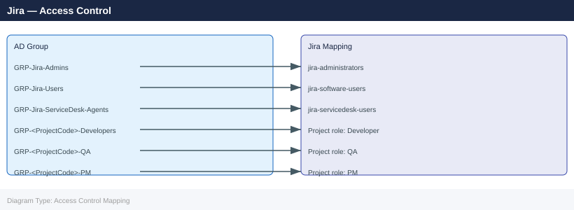

# Jira — Access Control

<div class="kb-summary">
Jira's access control model is layered: global permissions govern what users can do across the entire instance, project permission schemes govern per-project actions, and issue security schemes further restrict who can see individual issues.

*Applies to: Jira 9.x / Cloud*
</div>

---

## Before you begin

- **Access:** Admin credentials on all affected systems
- **Change management:** security changes require CAB approval in most environments
- **Rollback plan:** document current state before any security control change
- **Testing:** validate in a non-production environment first where possible

---

## Access Control Architecture

---

## Project Roles

Project Roles define positions within a project (Developer, QA, PM). Users and groups are assigned to roles per-project.

### Standard Role Structure

| Role | Typical Members | Permissions |
|---|---|---|
| Administrators | Project lead, IT admin | Full project admin |
| PM / Project Manager | Product owner | Manage sprints, schedule, delete |
| Developer | Dev team members | Create, edit, transition, view dev tools |
| QA | QA team members | Create, edit, transition, test execution |
| Viewer | Stakeholders, read-only users | Browse only |
| Service Desk Team | SD agents | Service Management specific |

```bash
# List all project roles in an instance
curl -u "admin:TOKEN" \
  "https://jira.corp.example.com/rest/api/2/role" | jq '.[].name'

# Get role members for a specific project
curl -u "admin:TOKEN" \
  "https://jira.corp.example.com/rest/api/2/project/{projectKey}/role/{roleId}"

# Add a user to a project role
curl -u "admin:TOKEN" \
  -H "Content-Type: application/json" \
  -X POST \
  "https://jira.corp.example.com/rest/api/2/project/{projectKey}/role/{roleId}" \
  -d '{"user": ["jsmith"]}'

# Add a group to a project role
curl -u "admin:TOKEN" \
  -H "Content-Type: application/json" \
  -X POST \
  "https://jira.corp.example.com/rest/api/2/project/{projectKey}/role/{roleId}" \
  -d '{"group": ["jira-developers"]}'
```


```text title="Expected output"
"Administrators"
"Developers"
"Users"
"Service Desk Team"
"Project Lead"

{
  "self": "https://jira.corp.example.com/rest/api/2/project/PROJ/role/10001",
  "name": "Developers",
  "id": 10001,
  "actors": [
    {
      "id": 10100,
      "displayName": "jsmith",
      "type": "atlassian-user-role-actor",
      "name": "jsmith"
    },
    {
      "id": 10101,
      "displayName": "jira-developers",
      "type": "atlassian-group-role-actor",
      "name": "jira-developers"
    }
  ]
}

(no output — command completes silently)

(no output — command completes silently)
```

!!! warning "Common errors"
    **`curl: (7) Failed to connect to jira.corp.example.com port 443: Connection refused`** — Verify the Jira instance is running and accessible; check firewall rules and DNS resolution with `nslookup jira.corp.example.com`.
    **`{"errorMessages":["User 'jsmith' does not exist"],"errors":{}}`** — Confirm the username exists in the Jira instance by checking User Management or using the `/rest/api/2/user/search` endpoint.
    **`{"errorMessages":["You do not have permission to edit this project's roles"],"errors":{}}`** — Ensure the admin account has the "Administer Projects" global permission or project-level role administration rights.
---

## Issue Security Schemes

Issue security schemes restrict which users can view specific issues — used for sensitive tickets (security bugs, HR incidents, executive escalations).

### Security Level Design

| Level | Who Can View | Use Case |
|---|---|---|
| Public (default) | All project members | Standard issues |
| Internal | Staff only (no contractors) | HR-adjacent issues |
| Security | Security team + PM + Reporter | Vulnerability reports |
| Executive | Exec group + PM | Executive escalations |
| Restricted | Reporter + Assignee + PM only | Confidential investigations |

```bash
# Create an issue security scheme
curl -u "admin:TOKEN" \
  -H "Content-Type: application/json" \
  -X POST \
  "https://jira.corp.example.com/rest/api/2/issuesecurityschemes" \
  -d '{
    "name": "Sensitive Issues Security",
    "description": "Restricts visibility of sensitive issues",
    "defaultSecurityLevelId": 10100,
    "levels": [
      {
        "name": "Public",
        "description": "Visible to all project members"
      },
      {
        "name": "Security Team Only",
        "description": "Visible only to security team and PM"
      }
    ]
  }'

# List existing security schemes
curl -u "admin:TOKEN" \
  "https://jira.corp.example.com/rest/api/2/issuesecurityschemes" | jq '.'
```


```text title="Expected output"
{
  "id": 10042,
  "name": "Sensitive Issues Security",
  "description": "Restricts visibility of sensitive issues",
  "defaultSecurityLevelId": 10100,
  "levels": [
    {
      "id": 10100,
      "name": "Public",
      "description": "Visible to all project members"
    },
    {
      "id": 10101,
      "name": "Security Team Only",
      "description": "Visible only to security team and PM"
    }
  ]
}
{
  "issueSecuritySchemes": [
    {
      "id": 10000,
      "name": "Default Issue Security Scheme",
      "description": "Default security scheme"
    },
    {
      "id": 10042,
      "name": "Sensitive Issues Security",
      "description": "Restricts visibility of sensitive issues"
    }
  ]
}
```

!!! warning "Common errors"
    **`curl: (7) Failed to connect to jira.corp.example.com port 443: Connection refused`** — Verify the Jira instance is running and accessible at the specified hostname and port.
    **`{"errorMessages":["You do not have permission to administer Jira."]}`** — Ensure the admin user account has global administrator permissions or use a service account with appropriate API access.
    **`{"errorMessages":["The security level with id '10100' does not exist."]}`** — Replace the defaultSecurityLevelId with a valid existing security level ID or remove it to let Jira auto-assign.
---

## Group Management

Maintain AD/LDAP group synchronisation as the source of truth. Avoid manually adding users to Jira-internal groups.

### Recommended Group Structure



```bash
# List group members
curl -u "admin:TOKEN" \
  "https://jira.corp.example.com/rest/api/2/group/member?groupname=jira-administrators"

# Add a user to a group
curl -u "admin:TOKEN" \
  -H "Content-Type: application/json" \
  -X POST \
  "https://jira.corp.example.com/rest/api/2/group/user?groupname=jira-software-users" \
  -d '{"name": "jsmith"}'

# Remove a user from a group
curl -u "admin:TOKEN" \
  -X DELETE \
  "https://jira.corp.example.com/rest/api/2/group/user?groupname=jira-administrators&username=jsmith"
```


```text title="Expected output"
{
  "size": 3,
  "items": [
    {
      "name": "admin",
      "emailAddress": "admin@corp.example.com",
      "displayName": "Administrator",
      "active": true
    },
    {
      "name": "mchen",
      "emailAddress": "mchen@corp.example.com",
      "displayName": "Michelle Chen",
      "active": true
    },
    {
      "name": "rjones",
      "emailAddress": "rjones@corp.example.com",
      "displayName": "Robert Jones",
      "active": true
    }
  ],
  "pagingInfo": {
    "startIndex": 0,
    "pageSize": 50,
    "total": 3
  }
}
(no output — command completes silently)
(no output — command completes silently)
```

!!! warning "Common errors"
    **`curl: (7) Failed to connect to jira.corp.example.com port 443: Connection refused`** — Verify the Jira instance is running and accessible at the specified hostname and port.
    **`{"errorMessages":["User 'jsmith' does not exist."],"errors":{}}`** — Confirm the username exists in Jira before adding to a group using the user search endpoint.
    **`{"errorMessages":["User 'jsmith' is not a member of group 'jira-administrators'."],"errors":{}}`** — Verify the user is actually a member of the group before attempting removal.
---

## Access Audit and Review

```bash
#!/bin/bash
# Audit Jira administrators
JIRA_URL="https://jira.corp.example.com"
TOKEN="admin:API_TOKEN"

echo "=== Jira Administrators ==="
curl -s -u "$TOKEN" \
  "$JIRA_URL/rest/api/2/group/member?groupname=jira-administrators" \
  | jq -r '.values[].displayName'

echo "=== Users with ADMINISTER permission ==="
curl -s -u "$TOKEN" \
  "$JIRA_URL/rest/api/2/user/permission/search?permissions=ADMINISTER&maxResults=100" \
  | jq -r '.[] | "\(.displayName) - \(.emailAddress)"'
```


```text title="Expected output"
=== Jira Administrators ===
Sarah Chen
Marcus Rodriguez
James O'Brien
DevOps Team Lead
Platform Engineering

=== Users with ADMINISTER permission ===
Sarah Chen - sarah.chen@corp.example.com
Marcus Rodriguez - mrodriguez@corp.example.com
James O'Brien - jobrien@corp.example.com
DevOps Team Lead - devops-lead@corp.example.com
Platform Engineering - platform-eng@corp.example.com
Alice Thompson - athompson@corp.example.com
```

!!! warning "Common errors"
    **`curl: (7) Failed to connect to jira.corp.example.com port 443: Connection refused`** — Verify the Jira instance is running and accessible; check firewall rules and DNS resolution with `nslookup jira.corp.example.com`.
    **`jq: parse error: Invalid JSON text at line 1`** — Ensure the API token is valid and the endpoint URL is correct; test with `curl -s -u "$TOKEN" "$JIRA_URL/rest/api/2/myself"` to verify authentication.
    **`curl: (401) Unauthorized`** — Verify the API token has not expired and is in the correct format `username:token`; regenerate the token in Jira user settings if needed.
**Quarterly review checklist:**

- [ ] Verify jira-administrators membership matches approved admin list
- [ ] Review service account activity — disable accounts inactive for 30+ days
- [ ] Audit outside contractor and vendor access — remove expired project access
- [ ] Check projects with "Anyone" or "All logged-in users" in permission schemes
- [ ] Review issue security levels — verify sensitive issues use appropriate levels
- [ ] Confirm LDAP/AD sync is current (no orphaned accounts)
- [ ] Review marketplace app permissions — revoke unused integrations

---

## Automation and Integration Access

### Jira Automation (Cloud)

Jira automation rules run as a service account or as the rule owner. Always use a dedicated service account.

```text
Jira Automation settings → Audit log → View all rule executions
```

**Service account for automation:**
- Minimum permissions: Create Issues, Edit Issues, Transition Issues
- No global admin permissions
- Named clearly: `svc-jira-automation@corp.example.com`

### Application Links (Data Center)

Administration → Application Links — controls OAuth between Jira and Confluence, Bitbucket, Bamboo.

```bash
# List application links
curl -u "admin:TOKEN" \
  "https://jira.corp.example.com/rest/applinks/1.0/applicationlink" | jq '.'
```


```text title="Expected output"
[
  {
    "id": "a1b2c3d4-e5f6-4789-a012-b3c4d5e6f7a8",
    "name": "Confluence",
    "rpcUrl": "https://confluence.corp.example.com",
    "displayUrl": "https://confluence.corp.example.com",
    "application": {
      "type": "com.atlassian.confluence.plugins.confluence-request-macro",
      "name": "Confluence"
    },
    "isPrimary": true,
    "isReciprocalLink": true
  },
  {
    "id": "b2c3d4e5-f6a7-4890-b123-c4d5e6f7a8b9",
    "name": "Bitbucket",
    "rpcUrl": "https://bitbucket.corp.example.com",
    "displayUrl": "https://bitbucket.corp.example.com",
    "application": {
      "type": "com.atlassian.bitbucket.server.integration.jira",
      "name": "Bitbucket"
    },
    "isPrimary": false,
    "isReciprocalLink": true
  }
]
```

!!! warning "Common errors"
    **`curl: (7) Failed to connect to jira.corp.example.com port 443: Connection refused`** — Verify the Jira instance is running and accessible; check firewall rules and DNS resolution with `nslookup jira.corp.example.com`.
    **`{"errorMessages":["User 'admin' does not have permission to access this resource."]}`** — Ensure the admin user has the Global Permissions > Administer Jira permission, or use a service account with appropriate API access.
    **`jq: parse error: Invalid JSON text at line 1`** — Remove `| jq '.'` and run the curl command alone to verify the API response is valid JSON before piping to jq.
- Remove application links to decommissioned systems immediately.
- Use OAuth 2.0 (not OAuth 1.0) for new integrations.
- Audit application link permissions annually.

---

## Related Pages

- [Jira — Authentication](../authentication/index.md)
- [Jira — Encryption](../encryption/index.md)
- [Jira — Hardening](../hardening/index.md)

---

## See also

- [Jira — Authentication](../authentication/)
- [Jira — Hardening](../hardening/)
- [Jira — Encryption](../encryption/)
