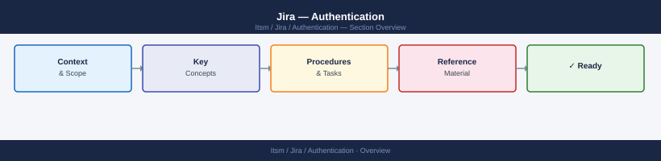

---
tags:
  - jira
  - security
---
# Jira — Authentication



```xml
<!-- atlassian-user.xml snippet for LDAP (Data Center) -->
<directory type="com.atlassian.crowd.directory.ActiveDirectory">
  <attribute name="ldap.url" value="ldaps://dc.corp.example.com:636"/>
  <attribute name="ldap.userdn" value="CN=jira-svc,OU=ServiceAccounts,DC=corp,DC=example,DC=com"/>
  <attribute name="ldap.password" value="ENCRYPTED_PASSWORD"/>
  <attribute name="ldap.basedn" value="DC=corp,DC=example,DC=com"/>
  <attribute name="ldap.usersdn" value="OU=Users,DC=corp,DC=example,DC=com"/>
  <attribute name="ldap.groupsdn" value="OU=Groups,DC=corp,DC=example,DC=com"/>
  <attribute name="ldap.usessl" value="true"/>
</directory>
```

```properties
# jira-config.properties — require SAML, disable local login
jira.saml.sso.loginpath.exclude=/rest/,/secure/Dashboard.jspa
jira.saml.sso.force=true
```
```bash
# Generate at: https://id.atlassian.com/manage-profile/security/api-tokens

# Test API token authentication
curl -u "user@corp.example.com:API_TOKEN" \
  -H "Accept: application/json" \
  "https://your-org.atlassian.net/rest/api/3/myself"

# List Jira projects
curl -u "user@corp.example.com:API_TOKEN" \
  "https://your-org.atlassian.net/rest/api/3/project/search" | jq '.values[].key'
```
```bash
# Create a PAT via REST API
curl -u "admin:password" \
  -H "Content-Type: application/json" \
  -X POST \
  "https://jira.corp.example.com/rest/pat/latest/tokens" \
  -d '{
    "name": "CI Pipeline Token",
    "expirationDuration": 90
  }'

# List all tokens for a user
curl -u "admin:password" \
  "https://jira.corp.example.com/rest/pat/latest/tokens"

# Revoke a token by ID
curl -u "admin:password" \
  -X DELETE \
  "https://jira.corp.example.com/rest/pat/latest/tokens/{tokenId}"
```
```xml
<!-- web.xml session configuration -->
<session-config>
  <session-timeout>480</session-timeout>
  <cookie-config>
    <http-only>true</http-only>
    <secure>true</secure>
  </cookie-config>
  <tracking-mode>COOKIE</tracking-mode>
</session-config>
```

## Before you begin

- **Access:** Admin credentials on all affected systems
- **Change management:** security changes require CAB approval in most environments
- **Rollback plan:** document current state before any security control change
- **Testing:** validate in a non-production environment first where possible

---

---

## See also

- [Jira — Access Control](../access-control/)
- [Jira — Hardening](../hardening/)
- [Jira — Encryption](../encryption/)
