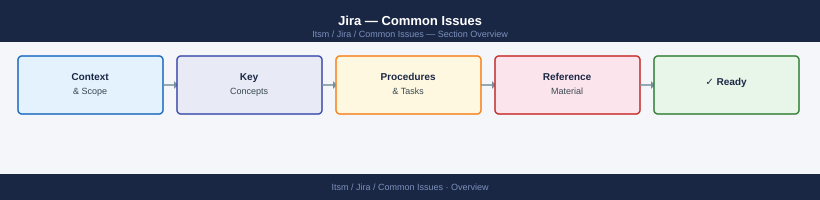
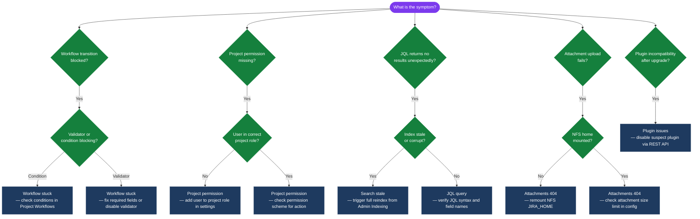

---
tags:
  - jira
  - troubleshooting
search:
  boost: 1.5
---
# Jira — Common Issues



```bash
# Check for OOM events in the last 24h
grep -i "OutOfMemoryError\|Java heap space\|GC overhead\|heap dump" \
  /opt/atlassian/jira/logs/catalina.out | tail -30

# Check GC log for frequent full GC
grep "Pause Full" /opt/atlassian/jira/logs/gc.log | tail -20

# Current heap usage (if Jira is running)
JIRA_PID=$(pgrep -f 'atlassian-jira' | head -1)
jcmd "${JIRA_PID}" GC.heap_info
```

```bash
# Add to setenv.sh JVM_SUPPORT_RECOMMENDED_ARGS
-XX:+UseG1GC
-XX:MaxGCPauseMillis=200
-XX:+ExplicitGCInvokesConcurrent
-XX:G1HeapRegionSize=16m
-XX:G1ReservePercent=20
```
```bash
# Check DB slow queries during board load (enable slow query log first)
psql -h "${JIRA_DB_HOST}" -U jira -d jiradb -c "
SELECT query, calls, total_exec_time, mean_exec_time
FROM pg_stat_statements
WHERE query ILIKE '%jiraissue%' OR query ILIKE '%customfieldvalue%'
ORDER BY mean_exec_time DESC
LIMIT 20;"

# Check board filter JQL (get board ID from URL)
curl -s -u "${JIRA_USER}:${JIRA_TOKEN}" \
  "${JIRA_URL}/rest/agile/1.0/board/42/configuration" | python3 -m json.tool
```
```jql
-- Before (returns ALL issues including resolved)
project = PROJ

-- After (only active work)
project = PROJ AND (
  sprint in openSprints()
  OR (status != Done AND updated >= -14d)
)
```
```bash
# Test LDAP connectivity from app server
ldapsearch -H ldaps://ad.example.com:636 \
  -D "CN=svc-jira,OU=ServiceAccounts,DC=example,DC=com" \
  -w "${LDAP_PASSWORD}" \
  -b "DC=example,DC=com" \
  "(sAMAccountName=testuser)" displayName mail

# Check Jira logs for LDAP errors
grep -i "ldap\|cwd\|crowd\|directory" \
  /opt/atlassian/jira/logs/atlassian-jira.log | grep -i "error\|warn\|fail" | tail -30
```
```bash
keytool -importcert \
  -alias ldap-server \
  -file /tmp/ldap-server.crt \
  -keystore "${JAVA_HOME}/lib/security/cacerts" \
  -storepass changeit
```
```bash
# Check workflow for issue type
curl -s -u "${JIRA_USER}:${JIRA_TOKEN}" \
  "${JIRA_URL}/rest/api/2/issue/PROJ-123/transitions" | python3 -m json.tool

# Check Jira log for validator errors during transition
grep -A5 "WorkflowException\|transition.*fail\|validator" \
  /opt/atlassian/jira/logs/atlassian-jira.log | tail -40
```
```bash
# Check outgoing mail configuration
curl -s -u "${JIRA_USER}:${JIRA_TOKEN}" \
  "${JIRA_URL}/rest/api/2/configuration" | python3 -m json.tool

# Test SMTP from server
telnet smtp.example.com 587

# Check Jira mail log
grep -i "mail\|smtp\|notification\|email" \
  /opt/atlassian/jira/logs/atlassian-jira.log \
  | grep -i "error\|warn\|fail" | tail -30
```
```bash
# Check index errors in log
grep -i "IndexException\|CorruptIndexException\|LockObtainFailedException" \
  /opt/atlassian/jira/logs/atlassian-jira.log | tail -20

# Check index directory size and permissions
ls -la /var/atlassian/application-data/jira/caches/indexes/
du -sh /var/atlassian/application-data/jira/caches/indexes/*
```
```bash
# 1. Stop Jira
systemctl stop jira

# 2. Delete index (safe — regenerated from DB)
rm -rf /var/atlassian/application-data/jira/caches/indexes/*

# 3. Start Jira
systemctl start jira

# 4. Trigger full reindex (foreground for safety)
curl -u "${JIRA_USER}:${JIRA_TOKEN}" -X POST \
  "${JIRA_URL}/rest/api/2/reindex?type=FOREGROUND"

# Monitor progress
watch -n30 "curl -s -u ${JIRA_USER}:${JIRA_TOKEN} \
  ${JIRA_URL}/rest/api/2/reindex | python3 -m json.tool"
```
```bash
# Check plugin-related errors
grep -i "plugin\|app\|addon\|atlassian" \
  /opt/atlassian/jira/logs/atlassian-jira.log \
  | grep -i "error\|fail\|disabled" | tail -30

# List disabled/errored plugins
curl -s -u "${JIRA_USER}:${JIRA_TOKEN}" \
  "${JIRA_URL}/rest/api/2/plugins/1.0/plugin" \
  | python3 -c "
import sys, json
for p in json.load(sys.stdin):
    if not p.get('enabled', True):
        print(f\"{p.get('key')} — {p.get('name')} — {p.get('version')}\")
"
```

```d2
direction: down

symptom: Identify Symptom {shape: diamond}
diagnostic_flow: "Diagnostic Flow" {shape: rectangle}
verify_resolution: "Verify resolution" {shape: rectangle}
resolution: Resolve or Escalate {shape: oval}

symptom -> diagnostic_flow: investigate
symptom -> verify_resolution: investigate
diagnostic_flow -> resolution
verify_resolution -> resolution
```

## Diagnostic Flow



---

## Before you begin

- **Access:** Admin credentials on all affected systems
- **Gather first:** recent error message text, event timestamps, and affected object names
- **Scope:** confirm whether the issue affects a single object, host, cluster, or site
- **Escalation:** open a vendor support ticket before running any destructive step
- **Logging:** document each command and output — required if escalation is needed

---

---

## Verify resolution

- Confirm the original symptom no longer occurs
- Check logs for any residual errors related to the issue
- Monitor for 10–15 minutes to confirm the fix is stable

---

## See also

- [Jira — Diagnostics](../diagnostics/)
- [Jira — Escalation](../escalation/)
- [Jira — Health Checks](../../operations/health-checks/)
