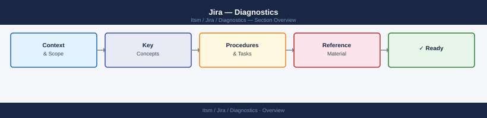
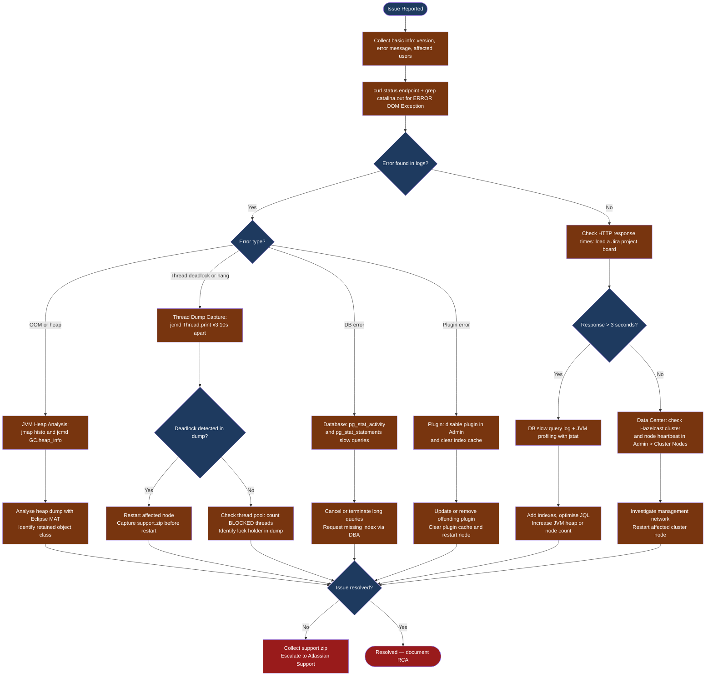

---
tags:
  - jira
  - troubleshooting
search:
  boost: 1.5
---
# Jira — Diagnostics

<div class="kb-summary">
Jira diagnostic commands: check instance health via the /status endpoint and REST serverInfo API, inspect JVM heap with jmap and jcmd to identify memory leaks, capture three thread dumps 10 seconds apart to diagnose deadlocks and blocking, run PostgreSQL pg_stat_statements and pg_stat_activity to identify slow JQL queries, and generate support.zip from the Atlassian Support Tools for escalation.

*Applies to: Jira 9.x / Data Center*
</div>





## Before you begin

- **Access:** SSH to Jira server(s) as root or jira OS user; PostgreSQL admin access (`psql -U postgres`); Jira Admin account for the web UI
- **Gather first:** the exact error message from the UI, the Jira version from Admin > System Information, the number of affected users, and whether the symptom started after a recent change (plugin install, upgrade, DB migration)
- **Scope:** confirm whether the issue affects one project, one user, or all users — a single slow project often points to a JQL index issue, while all-user slowness points to JVM or DB saturation

---

## Step 1 — Check instance health

```bash
# Confirm the Jira application is running
curl -s http://localhost:8080/status
# Expected: {"state":"RUNNING"}

# Recent application errors
JIRA_INSTALL=/opt/atlassian/jira
grep -i "ERROR\|OOM\|Exception" "${JIRA_INSTALL}/logs/catalina.out" | tail -50

# Full server info via REST API
curl -s -u "${JIRA_USER}:${JIRA_TOKEN}" \
  "${JIRA_URL}/rest/api/2/serverInfo" | python3 -m json.tool

# System health check (Data Center only)
curl -s -u "${JIRA_USER}:${JIRA_TOKEN}" \
  "${JIRA_URL}/rest/api/2/cluster/health" | python3 -m json.tool

# Current reindex status
curl -s -u "${JIRA_USER}:${JIRA_TOKEN}" \
  "${JIRA_URL}/rest/api/2/reindex" | python3 -m json.tool

# Disk usage on JIRA_HOME
df -h /var/atlassian/application-data/jira/
ls -lh /var/atlassian/application-data/jira/data/attachments/

# System memory
free -h
top -b -n1 | grep java | head -5
```

---

## Step 2 — JVM heap analysis

### Check live heap usage

```bash
JIRA_PID=$(pgrep -f 'atlassian-jira' | head -1)

# Heap summary
jcmd "${JIRA_PID}" GC.heap_info

# Histogram of object types by memory (top 30)
jmap -histo:live "${JIRA_PID}" | head -35

# Configured heap limits
jcmd "${JIRA_PID}" VM.flags | grep -E "HeapSize|Xmx|Xms"
```

### Capture heap dump

```bash
JIRA_PID=$(pgrep -f 'atlassian-jira' | head -1)
DUMP_FILE="/tmp/jira-heap-$(date +%Y%m%d-%H%M%S).hprof"

# Live objects only (reduces dump size, most useful for leak analysis)
sudo -u jira jmap -dump:format=b,live,file="${DUMP_FILE}" "${JIRA_PID}"

echo "Heap dump: ${DUMP_FILE} ($(du -sh ${DUMP_FILE} | cut -f1))"
```

### Analyse with Eclipse MAT

1. Download [Eclipse Memory Analyser Tool (MAT)](https://eclipse.dev/mat/)
2. Open the `.hprof` file
3. Run **Leak Suspects Report**
4. Look for classes with large retained heap (> 20% of total)
5. Common Jira leak sources:
   - `JiraIssue` cache not evicting
   - Plugin holding references to closed sessions
   - Lucene IndexSearcher not closed
   - Scheduled tasks accumulating results

### GC log analysis

```bash
GC_LOG=/opt/atlassian/jira/logs/gc.log

# Count full GC events (expensive, stop-the-world)
grep -c "Pause Full" "${GC_LOG}"

# Show full GC pause durations
grep "Pause Full" "${GC_LOG}" | awk '{print $NF}' | sort -rn | head -10

# GC throughput summary
grep "Pause" "${GC_LOG}" | awk '{
  sum += $NF
  count++
} END {
  printf "GC events: %d, Total pause: %.1fs, Avg: %.0fms\n",
    count, sum/1000, sum/count
}'
```

---

## Step 3 — Thread dump capture and analysis

Thread dumps reveal: deadlocks, blocked threads, thread pool saturation, slow external calls.

### Capture thread dumps

```bash
JIRA_PID=$(pgrep -f 'atlassian-jira' | head -1)
DUMP_DIR="/tmp/jira-thread-dumps-$(date +%Y%m%d)"
mkdir -p "${DUMP_DIR}"

# Capture 3 dumps 10 seconds apart (standard for hang analysis)
for i in 1 2 3; do
  DUMP_FILE="${DUMP_DIR}/dump-${i}-$(date +%H%M%S).txt"
  jcmd "${JIRA_PID}" Thread.print > "${DUMP_FILE}"
  echo "Captured dump ${i}: ${DUMP_FILE}"
  [ "${i}" -lt 3 ] && sleep 10
done

echo "Thread dumps in: ${DUMP_DIR}"
```

### Parse thread dumps

```bash
DUMP_FILE="${DUMP_DIR}/dump-1-*.txt"

# Count thread states
grep -E "^   java.lang.Thread.State:" "${DUMP_FILE}" \
  | sort | uniq -c | sort -rn

# Find threads blocked on locks
grep -A5 "BLOCKED" "${DUMP_FILE}" | head -50

# Find long HTTP request threads
grep -B2 "http-nio-8080" "${DUMP_FILE}" | grep "Thread.State: RUNNABLE"

# Detect deadlocks
grep -A10 "Found.*deadlock" "${DUMP_FILE}"
```

### Thread states interpretation

| State | Meaning | Concern |
|---|---|---|
| `RUNNABLE` | Actively executing or in native code | Normal, unless all threads RUNNABLE under load |
| `WAITING` | Waiting indefinitely (e.g., `Object.wait()`) | Normal for idle threads |
| `TIMED_WAITING` | Waiting with timeout (e.g., `Thread.sleep()`) | Normal |
| `BLOCKED` | Waiting to acquire a monitor lock | High count = contention / deadlock risk |

A healthy Jira shows mostly `TIMED_WAITING` threads (idle pool workers). Many `BLOCKED` threads indicate a lock contention issue.

---

## Step 4 — Database slow query analysis

### Enable pg_stat_statements

```sql
-- Run as PostgreSQL superuser
CREATE EXTENSION IF NOT EXISTS pg_stat_statements;

-- Add to postgresql.conf:
-- shared_preload_libraries = 'pg_stat_statements'
-- pg_stat_statements.track = all
```

### Identify slow queries

```sql
-- Top 20 slowest queries by average execution time
SELECT
  LEFT(query, 100) AS query,
  calls,
  ROUND(total_exec_time::numeric, 2) AS total_ms,
  ROUND(mean_exec_time::numeric, 2)  AS avg_ms,
  ROUND(max_exec_time::numeric, 2)   AS max_ms
FROM pg_stat_statements
WHERE query NOT LIKE '%pg_%'
ORDER BY mean_exec_time DESC
LIMIT 20;

-- Currently running queries > 10 seconds
SELECT pid, now() - query_start AS duration, state,
       LEFT(query, 150) AS query
FROM pg_stat_activity
WHERE datname = 'jiradb'
  AND state != 'idle'
  AND query_start < now() - interval '10 seconds'
ORDER BY duration DESC;

-- Blocking queries (lock wait chains)
SELECT
  blocked.pid AS blocked_pid,
  blocked.query AS blocked_query,
  blocking.pid AS blocking_pid,
  blocking.query AS blocking_query
FROM pg_stat_activity AS blocked
JOIN pg_stat_activity AS blocking
  ON blocking.pid = ANY(pg_blocking_pids(blocked.pid))
WHERE blocked.datname = 'jiradb';
```

### Kill long-running queries

```sql
-- Cancel query (graceful)
SELECT pg_cancel_backend(pid)
FROM pg_stat_activity
WHERE datname = 'jiradb'
  AND state != 'idle'
  AND query_start < now() - interval '5 minutes';

-- Terminate session (hard)
SELECT pg_terminate_backend(pid)
FROM pg_stat_activity
WHERE datname = 'jiradb'
  AND pid != pg_backend_pid()
  AND query_start < now() - interval '10 minutes';
```

### Missing index detection

```sql
-- Tables with high sequential scan count (candidates for indexing)
SELECT schemaname, relname, seq_scan, idx_scan,
       ROUND(100.0 * seq_scan / (seq_scan + idx_scan + 1), 1) AS seq_pct
FROM pg_stat_user_tables
WHERE schemaname = 'public'
  AND seq_scan > 1000
ORDER BY seq_pct DESC
LIMIT 20;
```

---

## Step 5 — Support ZIP collection

The Jira `support.zip` bundles all diagnostic information needed for Atlassian support escalation.

### Generate via Admin UI

`Admin → System → Atlassian Support Tools → Create Support Zip`

Options to include (recommended set):

- [x] Application logs (last 3 days)
- [x] Application properties
- [x] Thread dumps (auto-captured at generation time)
- [x] Jira configuration
- [x] Plugin information
- [ ] Attachments (usually too large)

### Generate via script (headless)

```bash
curl -s -u "${JIRA_USER}:${JIRA_TOKEN}" \
  -X POST \
  "${JIRA_URL}/rest/api/2/plugins/1.0/resource/com.atlassian.support.stp%3Asupport-tools-plugin/data" \
  -H "Content-Type: application/json" \
  -d '{
    "type": "supportZip",
    "options": {
      "logs": true,
      "configuration": true,
      "threadDump": true,
      "plugins": true
    }
  }' | python3 -m json.tool
```

The zip file is created in `<jira-home>/export/support/`. Retrieve and attach to your Atlassian support ticket.

### What the Support ZIP contains

| Included File | Purpose |
|---|---|
| `atlassian-jira.log` (last 3 days) | Application events |
| `catalina.out` | JVM/Tomcat output |
| `thread-dump-*.txt` | Live thread dumps |
| `system-info.txt` | JVM args, OS info, Jira version |
| `application-properties.txt` | Jira configuration (sanitised) |
| `installed-plugins.txt` | Plugin list with versions |
| `database-statistics.txt` | DB table sizes and connection info |

---

## Step 6 — Additional diagnostic commands

### Database record counts

```sql
-- Issue count by project
SELECT p.pkey, COUNT(i.id) AS issue_count
FROM project p
LEFT JOIN jiraissue i ON i.project = p.id
GROUP BY p.pkey
ORDER BY issue_count DESC
LIMIT 20;

-- Attachment count and total size
SELECT COUNT(*) AS attachments,
       pg_size_pretty(SUM(filesize)) AS total_size
FROM fileattachment;
```

### JMX monitoring (optional)

Enable JMX in `setenv.sh` for external monitoring:

```bash
# Add to JVM_SUPPORT_RECOMMENDED_ARGS in setenv.sh
-Dcom.sun.management.jmxremote
-Dcom.sun.management.jmxremote.port=9999
-Dcom.sun.management.jmxremote.authenticate=false
-Dcom.sun.management.jmxremote.ssl=false
-Djava.rmi.server.hostname=<node-ip>
```

Key MBeans to monitor:

| MBean | Attribute | Meaning |
|---|---|---|
| `java.lang:type=Memory` | `HeapMemoryUsage` | Live heap usage |
| `java.lang:type=GarbageCollector` | `CollectionTime` | GC time |
| `java.lang:type=Threading` | `ThreadCount` | Active threads |
| `Catalina:type=ThreadPool` | `currentThreadsBusy` | HTTP threads in use |
| `Catalina:type=ThreadPool` | `maxThreads` | Max HTTP threads |

---

## Log locations

| Log | Path | What to look for |
|---|---|---|
| Application log | `JIRA_HOME/log/atlassian-jira.log` | Plugin errors, workflow exceptions, auth failures |
| Tomcat stdout | `JIRA_INSTALL/logs/catalina.out` | JVM startup errors, OOM, thread dump output |
| GC log | `JIRA_INSTALL/logs/gc.log` | Full GC frequency and pause durations |
| Access log | `JIRA_INSTALL/logs/access_log.*.txt` | HTTP request timing per endpoint |
| PostgreSQL slow queries | `pg_stat_statements` + pg log | Slow or blocking JQL queries |
| Support ZIP | `JIRA_HOME/export/support/` | All-in-one — required for Atlassian SR |

---

## See also

- [Jira — Common Issues](../common-issues/)
- [Jira — Escalation](../escalation/)
- [Jira — Health Checks](../../operations/health-checks/)

## Verify resolution

- `curl -s http://localhost:8080/status` returns `{"state":"RUNNING"}`
- `jcmd $JIRA_PID GC.heap_info` shows heap below 80% of max (-Xmx) between GC cycles
- `grep -c "BLOCKED" /tmp/jira-thread-dumps-*/dump-1-*.txt` returns a low count (< 5)
- A Jira project board loads in under 3 seconds (browser network tab)
- `grep -i "OOM\|OutOfMemoryError" /opt/atlassian/jira/logs/catalina.out` returns no new entries after the fix
- PostgreSQL: `SELECT count(*) FROM pg_stat_activity WHERE state != 'idle'` shows normal connection count for the cluster size
