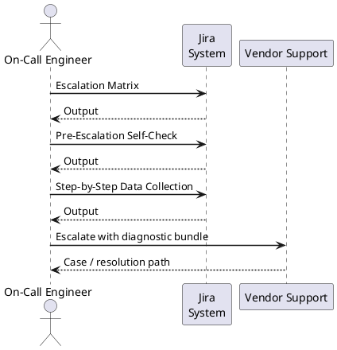

---
tags:
  - jira
  - troubleshooting
search:
  boost: 1.5
description: "Escalation reference covering Escalation Matrix, Emergency Contacts, Escalation Communication Template, Post-Incident Review (PIR) Checklist."
---
# Jira — Escalation

<div class="kb-summary">
Escalation reference covering Escalation Matrix, Emergency Contacts, Escalation Communication Template, Post-Incident Review (PIR) Checklist.

*Applies to: Jira 9.x / Cloud*
</div>



## Before you begin

- **Access:** Admin credentials on all affected systems
- **Gather first:** recent error message text, event timestamps, and affected object names
- **Scope:** confirm whether the issue affects a single object, host, cluster, or site
- **Escalation:** open a vendor support ticket before running any destructive step
- **Logging:** document each command and output — required if escalation is needed

---

## Escalation Matrix

```d2
direction: right

ISSUE: "Issue Reported" {shape: rectangle}
L1: "L1 — Operations / Service Desk\nFirst response, known issues,\npassword resets, basic config" {shape: rectangle}
L2_ESC: "Escalate to L2" {shape: rectangle}
L2: "L2 — Jira Administrator\nAdvanced config, integrations,\nlog analysis, plugin issues,\nperformance troubleshooting" {shape: rectangle}
L3_ESC: "Escalate to L3" {shape: rectangle}
L3: "L3 — Senior Engineer / Atlassian Support\nData corruption, code-level bugs,\nDB schema issues, cluster failures,\nAtlassian vendor engagement" {shape: rectangle}
VENDOR: "Escalate to Atlassian\nSupport / Emergency Hotline" {shape: rectangle}
DONE: "Resolved" {shape: rectangle}

ISSUE -> L1
L2_ESC -> L2
L3_ESC -> L3
VENDOR -> DONE
```

## Pre-Escalation Self-Check

Run this before opening a vendor ticket. Many Jira issues are resolvable without Atlassian.

| Check | What to do | Expected result |
|---|---|---|
| Jira application reachable | Browse to the Jira base URL | Login page loads |
| Jira services running | SSH → `systemctl status jira` (or check service in Windows) | `active (running)` |
| Database reachable | Check `atlassian-jira.log` for DB connection errors | No recent connection errors |
| Disk space | `df -h` on the Jira home and install directories | Both below 90% used |
| Recent plugin install/upgrade | Admin > Manage Apps — check install/update timestamps | None correlate with the incident start time |
| Known Error DB | Search support.atlassian.com for the exact error string | No matching known issue, or apply documented workaround |

---

## Step-by-Step Data Collection

Run all of these before opening the case.

### 1. Get the Jira version and build number

Admin > **Applications** > **Versions & Licenses**, or:

```bash
# From the Jira install directory
cat atlassian-jira-software-version.txt 2>/dev/null
grep -i "Build Number" atlassian-jira.log | tail -1
```


```text title="Expected output"
8.20.11
2024-01-15 09:47:32,156 INFO [main] [com.atlassian.jira.startup] Build Number: 820011
```

!!! warning "Common errors"
    | Error | Fix |
    |---|---|
    | `cat: atlassian-jira-software-version.txt: No such file or directory` | Ensure you are running the command from the correct Jira installation directory (typically `/opt/atlassian/jira` or `/var/atlassian/jira`). |
    | `grep: atlassian-jira.log: No such file or directory` | Check that the Jira logs directory exists at the expected path; if Jira uses a custom log location, adjust the grep command to point to the correct log file path. |
### 2. Create the support zip (takes 2–10 minutes)

Admin > **System** > **Troubleshooting and support tools** > **Create support zip**. Select the time window covering the incident.

### 3. Capture thread dumps (for hangs or slow performance)

```bash
# Take 3 dumps, 10 seconds apart, during the slow/hung period
jstack <jira_pid> > /tmp/jira-thread-1.txt; sleep 10
jstack <jira_pid> > /tmp/jira-thread-2.txt; sleep 10
jstack <jira_pid> > /tmp/jira-thread-3.txt
```


```text title="Expected output"
(no output — command completes silently)
```

!!! warning "Common errors"
    | Error | Fix |
    |---|---|
    | `jstack: command not found` | Ensure the JDK is installed and `jstack` is in your PATH, or use the full path `/usr/lib/jvm/java-11-openjdk/bin/jstack`. |
    | `<jira_pid>: No such process` | Replace `<jira_pid>` with the actual Jira process ID from `pgrep -f jira` or `ps aux | grep jira`. |
    | `Permission denied` | Run the command as the same user running Jira or use `sudo` to capture thread dumps with sufficient privileges. |
### 4. Capture a heap dump (for OutOfMemoryError)

```bash
jmap -dump:format=b,file=/tmp/jira-heap.hprof <jira_pid>
```


```text title="Expected output"
Dumping heap to /tmp/jira-heap.hprof ...
Heap dump file created [2847392512 bytes in 12.453 secs]
```

!!! warning "Common errors"
    | Error | Fix |
    |---|---|
    | `Error attaching to process: sun.jvm.attach.AttachNotSupportedException` | Ensure the JIRA process is running as the same user executing jmap, or run jmap with sudo. |
    | `Could not attach to <jira_pid>: No such process` | Verify the PID is correct by running `ps aux | grep jira` and use the actual Java process PID. |
    | `Permission denied (/tmp/jira-heap.hprof)` | Check that /tmp is writable and has sufficient free space (heap dumps can be several GB); consider using an alternate directory like `/var/tmp`. |
### 5. Write the timeline

```text
Jira version: 9.x.x build NNNNN
Issue first observed: YYYY-MM-DD HH:MM UTC
Last known good state: YYYY-MM-DD HH:MM UTC
Changes made in the 24h before the issue: [plugin install, upgrade, config change]
Steps already taken: [restarted service, checked logs, ran Known Error DB search]
Blast radius: [single project / all users / specific feature]
```

---

## How to Open the Case on Atlassian Support

1. Go to **support.atlassian.com** and sign in with your Atlassian account linked to your license.
2. Click **Get help** > **Create a support request**.
3. Select **Product**: Jira Software / Jira Service Management / Jira Core Data Center (match your deployment).
4. Select **Request type**: Technical issue for operational problems; use Licensing only for activation/billing problems.
5. Under **Priority**, select:
   - **Highest (P1)** — production down, no workaround, affects all or most users
   - **High (P2)** — major feature broken, workaround exists
   - **Medium (P3)** — degraded function, single project or limited user group affected
   - **Low (P4)** — cosmetic issue, how-to question, documentation request
6. In **Summary**, write product + symptom + scope in one line.
7. In **Description**, paste: Jira version/build, the timeline from Step 5 above, and what you have already tried.
8. Under **Attachments**, upload the support zip and any thread/heap dumps collected above.
9. Click **Submit** — you receive a case number by email immediately.
10. **P1 only:** request emergency escalation via the "Escalate to Critical" option in the portal, or your Premier Support hotline if contracted.

---

## What NOT to Do

| Do NOT do this | Why | What to do instead |
|---|---|---|
| Restart Jira repeatedly hoping it self-resolves | Repeated restarts can mask the real error and corrupt in-flight index state | Restart once, capture logs, then stop and collect diagnostics |
| Delete and recreate the Lucene index without a backup | If reindexing was not the actual problem, you lose the ability to compare before/after | Back up the index directory before reindexing |
| Apply a plugin update mid-incident | Adds a new variable to an already-broken system | Freeze all changes until the current incident is resolved |
| Run a full reindex during business hours on a large instance | Reindexing locks the instance and can take hours on large datasets | Schedule reindex for a maintenance window |
| Edit the database directly to "fix" data | Can violate referential integrity Jira expects; unsupported by Atlassian | Use Jira's own admin tools, or get guidance from Atlassian Support first |

---

### Resolution Notification

```text
[JIRA RESOLVED] — HH:MM UTC

ISSUE: [Brief description]
RESOLVED AT: HH:MM UTC (Duration: Xh Ym)
ROOT CAUSE: [One sentence]
FIX APPLIED: [What was done]
PREVENTIVE ACTION: [What will be done to prevent recurrence]

Post-mortem scheduled: [Date/time or "within 5 business days"]
```

---

## Post-Incident Review (PIR) Checklist

Complete within 5 business days for all P1 and P2 incidents.

- [ ] Incident timeline documented (minute by minute for P1)
- [ ] Root cause identified and confirmed
- [ ] Contributing factors listed
- [ ] Immediate fix documented
- [ ] Preventive actions agreed with owners and due dates set
- [ ] Monitoring gaps identified and addressed
- [ ] Documentation updated (runbooks, KB articles)
- [ ] SLA breach assessed — did response and resolution meet targets?
- [ ] PIR document published to Confluence incident space
- [ ] PIR shared with stakeholders

---

## Verify resolution

- Confirm the original symptom no longer occurs
- Check logs for any residual errors related to the issue
- Monitor for 10–15 minutes to confirm the fix is stable

---

## See also

- [Jira — Diagnostics](../diagnostics/)
- [Jira — Common Issues](../common-issues/)
