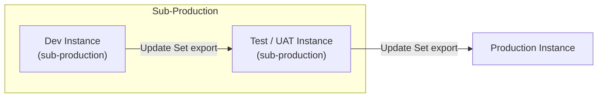

---
tags:
  - architecture
  - servicenow
---
# ServiceNow — How It Works


<div class="kb-summary">
ServiceNow is delivered as a multi-instance SaaS platform running on dedicated infrastructure per customer. Each customer receives isolated database, application, and storage layers — there is no shared compute between tenants.
</div>

---

## Multi-Instance Cloud Model

| Characteristic | Detail |
|---|---|
| Database engine | MariaDB (MySQL-compatible) |
| App server | Java / Jetty |
| Storage | SAN-backed, encrypted at rest |
| Redundancy | Active-active within a data center zone |
| Regions | Americas, EMEA, AP-Southeast, GovCloud |
| SLA | 99.8% uptime (standard), 99.95% (Hi) |

Each instance receives a URL in the form `https://<instance-name>.service-now.com`.

---

## Instance Hierarchy

Most enterprise deployments maintain a minimum of three instances arranged in a promotion pipeline:


```text
┌────────────────────────────────────── ServiceNow — How It Works ──────────────────────────────────────┐
│                                                                                                       │
│   ┌───────────────────────────────────────────────────────────────────────────────────────────────┐   │
│   │                             ServiceNow Request and Automation Flow                            │   │
│   │        User/API → HTTPS → Now Platform → GlideDB; Business Rules fire on record change        │   │
│   │            Incident: create → categorise → assign → resolve → close (ITIL workflow)           │   │
│   │           MID Server: ECC Queue poll → probe execution → result posted back to SNOW           │   │
│   │              Flow Designer: trigger (table record event) → actions → integrations             │   │
│   └───────────────────────────────────────────────────────────────────────────────────────────────┘   │
│                                                                                                       │
│    ServiceNow processes three parallel flows: ITSM, automation, and discovery                         │
│                                                                                                       │
│                  ▼                                ▼                                ▼                  │
│                                                                                                       │
│   ┌─────────────────────────────┐  ┌─────────────────────────────┐  ┌─────────────────────────────┐   │
│   │          ITSM Flow          │  │       Automation Flow       │  │        Discovery Flow       │   │
│   │     User submits ticket     │  │      Flow trigger fires     │  │        Schedule runs        │   │
│   │      Business Rule runs     │  │       Actions execute       │  │        ECC Queue item       │   │
│   │       Assignment rule       │  │        REST call out        │  │        MID probe runs       │   │
│   │       SLA clock starts      │  │       Response parsed       │  │        Result posted        │   │
│   │      Notification sent      │  │        Record updated       │  │         CMDB updated        │   │
│   │       Resolve / close       │  │      Log entry written      │  │        CI discovered        │   │
│   └─────────────────────────────┘  └─────────────────────────────┘  └─────────────────────────────┘   │
│                                                                                                       │
│  Physical Infrastructure (the hardware everything above runs on):                                     │
│  ServiceNow cloud infra · MID Server VM on-prem · SMTP relay · LDAP/AD DCs                            │
│                                                                                                       │
│  Key terms:                                                                                           │
│                                                                                                       │
│  Business Rule = server-side GlideScript triggered on DB insert/update/delete/query                   │
│  Assignment rule = auto-assigns incident to group based on category/subcategory                       │
│  SLA clock    = ServiceNow tracks breach time against SLA definition                                  │
│  Flow trigger  = event that starts a Flow Designer flow (e.g. record insert)                          │
│  Action        = Flow Designer step: REST call, approval, sub-flow, script                            │
│  ECC Queue     = ServiceNow table; MID Server polls for probe/sensor commands                         │
│  Discovery probe = MID Server script that probes target IP for CI data                                │
│  CI            = Configuration Item; managed in CMDB (server, app, service, etc.)                     │
│  GlideRecord   = JS API for DB access: gr.addQuery(); gr.query(); gr.next()                           │
│  Notification  = email/SMS/push triggered by SNOW event or Business Rule                              │
│  Resolve       = final active state before Close; SLA stops on resolve                                │
│  CMDB update   = Discovery writes CI attributes to CMDB after probe results                           │
│                                                                                                       │
└───────────────────────────────────────────────────────────────────────────────────────────────────────┘
```

| Phase | Owner | Duration |
|---|---|---|
| Release notes review | Platform team | 1 week |
| Dev upgrade + testing | Platform team + developers | 2–3 weeks |
| UAT upgrade + sign-off | Business stakeholders | 1–2 weeks |
| Production upgrade scheduling | ServiceNow + customer | 1 week |
| Production upgrade window | ServiceNow (automated) | 2–4 hours |
| Post-upgrade validation | Platform team | 1 day |
