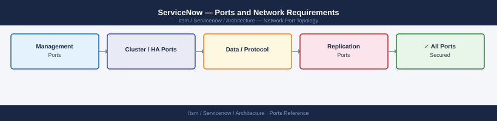

---
tags:
  - servicenow
  - itsm
  - networking
  - firewall
  - ports
---
# ServiceNow — Ports and Network Requirements

<div class="kb-summary">
Firewall port reference for ServiceNow. ServiceNow is a SaaS platform — the primary firewall concern is the MID Server (on-premise agent) which bridges the SaaS cloud to internal infrastructure, and webhook/integration receivers.

*Applies to: ServiceNow Washington DC / Xanadu release*
</div>



## Before you begin

- ServiceNow is SaaS — no on-premise server to configure for user access; browsers connect directly to `<instance>.service-now.com`
- The MID Server is an on-premise Java agent that connects **outbound** to ServiceNow — no inbound from ServiceNow to MID Server is required
- All MID Server connections to managed targets are outbound from the MID Server's IP — this IP must have the relevant network access

---

## Inbound — Users to ServiceNow (SaaS — No On-Prem Rules Needed)

| Port | Protocol | Destination | Purpose |
|---|---|---|---|
| 443 | TCP | `<instance>.service-now.com` | ServiceNow web UI, mobile apps, integrations |

No on-premise firewall rules are needed for user browser access — traffic goes directly to the SaaS cloud.

---

## MID Server — Outbound to ServiceNow Cloud

| Port | Protocol | Source | Destination | Purpose |
|---|---|---|---|---|
| 443 | TCP | MID Server | `*.service-now.com`, `*.servicenowservices.com` | MID Server ↔ ServiceNow SaaS — job polling, results, configuration |

---

## MID Server — Outbound to Managed Targets

MID Server connects to internal infrastructure on behalf of ServiceNow. Open these ports from the MID Server IP to each target type:

| Port | Protocol | Destination | Purpose |
|---|---|---|---|
| 22 | TCP | Linux / Unix servers | SSH — Discovery, Orchestration, event collection |
| 5985/5986 | TCP | Windows servers | WinRM — Discovery, Orchestration for Windows targets |
| 3389 | TCP | Windows servers | RDP (specific Orchestration workflows) |
| 161 | UDP | Network devices, servers | SNMP — Discovery polling |
| 162 | UDP (inbound to MID Server) | SNMP-enabled devices | SNMP traps inbound to MID Server |
| 443 | TCP | vCenter, NSX, cloud APIs, REST targets | REST-based Discovery and Orchestration |
| 1433 | TCP | SQL Server | MSSQL Discovery |
| 5432 | TCP | PostgreSQL | PostgreSQL Discovery |
| 3306 | TCP | MySQL | MySQL Discovery |

---

## MID Server — Outbound for CMDB / Event Sources

| Port | Protocol | Destination | Purpose |
|---|---|---|---|
| 443 | TCP | AWS, Azure, GCP APIs | Cloud Discovery (EC2, VMs, storage) |
| 443 | TCP | vCenter, NSX | VMware Discovery |

---

## ServiceNow Inbound Integrations (Webhooks)

When external systems push data into ServiceNow (e.g., Zabbix, monitoring tools, GitHub):

| Port | Protocol | Source | Destination | Purpose |
|---|---|---|---|---|
| 443 | TCP | External systems (monitoring, CICD, etc.) | `<instance>.service-now.com` | Inbound REST/SOAP webhooks to ServiceNow (SaaS — no on-prem firewall needed) |

---

## Firewall Zone Summary

| From | To | Ports | Notes |
|---|---|---|---|
| MID Server | *.service-now.com | 443 | Primary MID outbound — must be open |
| MID Server | Linux targets | 22 | Discovery and Orchestration |
| MID Server | Windows targets | 5985/5986 | WinRM for Windows |
| MID Server | Network devices | 161 UDP | SNMP Discovery |
| Network devices | MID Server | 162 UDP | SNMP trap ingest |
| MID Server | Cloud/platform APIs | 443 | REST Discovery |
| User browsers | *.service-now.com | 443 | SaaS access — no on-prem firewall needed |

---

## Verify

```bash
# From MID Server — test ServiceNow SaaS reachability
curl -sk -o /dev/null -w "%{http_code}" https://<instance>.service-now.com/api/now/table/sys_user?sysparm_limit=1

# From MID Server — test SSH to a Linux target
ssh -o BatchMode=yes discovery@<linux-target> echo ok

# From MID Server — test WinRM to a Windows target
nc -zv <windows-target> 5986

# From MID Server — test SNMP to a network device
snmpget -v2c -c <community> <device-ip> 1.3.6.1.2.1.1.1.0

# Check MID Server status in ServiceNow
# ServiceNow UI → MID Server → select MID Server → verify Status = Up
```

---

## See also

- [ServiceNow — Architecture](how-it-works/)
- [ServiceNow — Deploy](../deploy/)
- [ServiceNow — Operations](../operations/)
