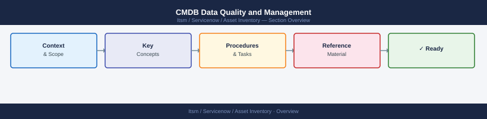

---
tags:
  - servicenow
---
# CMDB Data Quality and Management

CMDB Data Quality and Management reference covering Overview, Core Data Quality Dimensions, CI Relationships, Import Sources and Integration, ServiceNow Integration Notes and 1 more sections.

*Applies to: ServiceNow*

## Overview

A CMDB is only valuable if the data in it is trusted. Poor data quality leads to failed changes, missed impact assessments, and incorrect billing. This page covers the practices that keep CI records accurate, relationships meaningful, and import processes reliable.

---

## Core Data Quality Dimensions

Target these quality dimensions across all CI classes.

| Dimension      | Definition                                        | Target       |
|----------------|---------------------------------------------------|--------------|
| Completeness   | All mandatory fields populated                    | 100%         |
| Accuracy       | Attribute values match discovered/actual state    | > 95%        |
| Timeliness     | Records updated within 48h of change              | > 90%        |
| Consistency    | Naming and classification follows standards       | 100%         |
| Relationship   | CIs linked to upstream/downstream dependencies    | > 80%        |

Run a quality report monthly. Flag CIs scoring below threshold for remediation.

---

## CI Relationships

Relationships are what differentiate a CMDB from a flat asset spreadsheet. Common relationship types:

- **Hosted on** — Application CI hosted on a server CI
- **Depends on** — Service depends on a database CI
- **Connected to** — Network device connected to another device
- **Runs on** — Software running on an OS CI
- **Virtualised by** — VM virtualised by a hypervisor CI

When onboarding a new CI, always map at minimum one upstream and one downstream relationship before marking the record as active.

---

## Import Sources and Integration

CIs should be populated from authoritative sources, not entered manually where avoidable.

| Source                    | CI Classes                        | Method                        |
|---------------------------|-----------------------------------|-------------------------------|
| ServiceNow Discovery      | Servers, network devices, VMs     | Scheduled probe               |
| AWS Config                | EC2, RDS, S3, VPC                 | API integration               |
| Azure Resource Graph      | All Azure resource types          | API integration               |
| Ansible inventory         | Servers, containers               | Playbook fact export          |
| Manual import (CSV)       | Contracts, hardware not on-net    | Validated template import     |

Always validate imports against the CI naming standard before committing. Reject records with missing mandatory fields.

---

## ServiceNow Integration Notes

Key configuration items for ServiceNow CMDB integrations:

- [ ] Discovery schedules set per environment (not a single global sweep)
- [ ] Identification rules configured to prevent duplicate CI creation
- [ ] IRE (Identification and Reconciliation Engine) rules reviewed for each CI class
- [ ] Transform maps for CSV imports tested in dev before production
- [ ] Stale CI threshold set (e.g., flag CIs not discovered in 30 days)
- [ ] CMDB Health Dashboard reviewed weekly by Asset Manager

For reconciliation conflicts, prefer discovered data over manually entered data unless the CI is in a class excluded from discovery (e.g., third-party SaaS).

---

## Governance and Review Cadence

| Activity                     | Frequency  | Owner              |
|------------------------------|------------|--------------------|
| CMDB health report review    | Weekly     | Asset Manager      |
| Stale CI remediation sprint  | Monthly    | Infra team         |
| Relationship coverage review | Quarterly  | Architect / CMDB Admin |
| Full audit reconciliation    | Quarterly  | Asset Manager      |
| Naming standard review       | Annually   | Configuration Manager |
