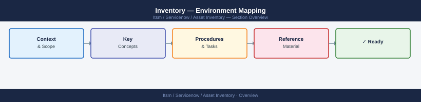

---
tags:
  - servicenow
---
# Inventory — Environment Mapping



```markdown

```d2
direction: right

center: "ServiceNow" {shape: hexagon}
application_payments_api: "Application: Payments API" {shape: rectangle}

center -> application_payments_api
```

## Application: Payments API

**Tier:** Production
**Hosts:** pay-api-01, pay-api-02, pay-api-03 (load balanced via alb-pay-prod)
**Owner:** Payments Team — payments-team@example.com

### Inbound Dependencies (who calls this service)
| Caller | Protocol | Port | Auth |
|---|---|---|---|
| Web frontend | HTTPS | 443 | JWT |
| Mobile app | HTTPS | 443 | JWT |
| Batch job (billing-cron) | HTTPS | 443 | mTLS |

### Outbound Dependencies (what this service calls)
| Target | Protocol | Port | Auth | Failure Impact |
|---|---|---|---|---|
| payments-db-primary | PostgreSQL | 5432 | DB user | Full outage |
| payments-db-replica | PostgreSQL | 5432 | DB user | Read-only degraded |
| fraud-detection-api | HTTPS | 443 | API key | Transactions blocked |
| vault | HTTPS | 8200 | AppRole | Auth fails; downtime |
| smtp-relay | SMTP | 25 | None | Email receipts fail only |

### Data Flows
- Payment transaction → payments-db → fraud-detection-api → response
- Audit log → kafka-payments-topic → SIEM

### Infrastructure
- Load Balancer: alb-pay-prod (AWS ALB)
- DNS: api.payments.example.com → alb-pay-prod CNAME
- TLS cert: *.payments.example.com — expires 2027-03-01
- Secrets: vault path `secret/payments/db_password`, `secret/payments/fraud_api_key`
```

```bash
# netstat — find connections on a host
ss -tnp    # established TCP connections and owning process
ss -tlnp   # listening ports

# Find which process owns a port
lsof -i :<port>

# Trace network path to a service
traceroute <target-host>
mtr --report <target-host>

# DNS record discovery
dig <hostname> ANY
dig -t SRV _service._proto.<domain>
```
