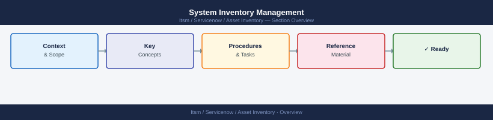

---
tags:
  - servicenow
---
# System Inventory Management


<div class="kb-summary">
System Inventory Management reference covering Overview, Required Fields, Daily Checks, Workflow.

*Applies to: ServiceNow*
</div>



```d2
direction: right

center: "ServiceNow" {shape: hexagon}
required_fields: "Required Fields" {shape: rectangle}
daily_checks: "Daily Checks" {shape: rectangle}
workflow: "Workflow" {shape: rectangle}

center -> required_fields
center -> daily_checks
center -> workflow
```

## Overview

System inventory management tracks servers, storage, network devices, and infrastructure components across environments.

## Required Fields

- Hostname
- IP address
- Operating system
- Environment
- Owner
- Location
- Support team

## Daily Checks

| Check | Command | Notes |
|---|---|---|
| Verify inventory records updated |  |  |
| Confirm new systems added |  |  |
| Validate decommissioned systems removed |  |  |

## Workflow

1. Identify new system
2. Record system details
3. Assign ownership
4. Update inventory database
