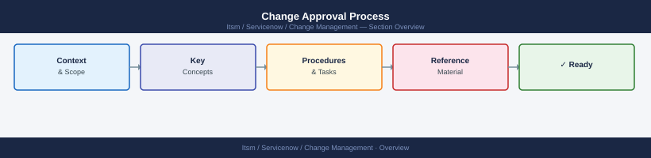

---
tags:
  - servicenow
---
# Change Approval Process

Change Approval Process reference covering Change Types and Approval Requirements, CAB Approval Workflow, Risk Classification Matrix, ITSM Approval Fields, Approval Checklist and 1 more sections.

*Applies to: ServiceNow*

## Risk Classification Matrix

| Impact ↓ / Likelihood → | Low | Medium | High |
|---|---|---|---|
| Low | Low | Low | Medium |
| Medium | Low | Medium | High |
| High | Medium | High | Critical |

- **Low / Medium**: Team lead approval
- **High**: CAB approval required
- **Critical**: CAB + service owner + management sign-off

## ITSM Approval Fields

Every RFC must include before approval:

| Field | Requirement |
|---|---|
| Business justification | Required |
| Rollback plan | Required (tested in non-prod for High/Critical) |
| Outage window | Required (start time, duration, affected services) |
| Test results | Required for High risk |
| Affected CIs | List all Configuration Items from CMDB |
| Communication plan | Required for user-impacting changes |

## Approval Checklist

- [ ] RFC fully completed (no blank required fields)
- [ ] Risk score calculated and documented
- [ ] Rollback procedure documented and tested
- [ ] Change window booked and communicated
- [ ] Service owner has reviewed and approved
- [ ] For High/Critical: CAB has reviewed in meeting (not async)
- [ ] Post-implementation review scheduled
- [ ] Related incidents/problems linked in ITSM

## Common Rejection Reasons

| Reason | Remediation |
|---|---|
| No rollback plan | Document step-by-step rollback procedure |
| Insufficient testing | Provide non-prod test evidence |
| Change window conflicts | Coordinate with affected teams; rebook window |
| Missing CMDB CIs | Update RFC with all affected configuration items |
| No stakeholder sign-off | Obtain written approval from service owner |

## Overview

The approval process ensures that changes are reviewed proportionally to their risk and impact before being implemented. Trivial changes should not require weeks of committee review; critical changes to production infrastructure should not be approved by a single engineer. The CAB (Change Advisory Board) and approval tiers below provide a framework for routing changes correctly.

---

## Approval Tiers

| Tier       | Change Type           | Approver(s)                  | Turnaround SLA  |
|------------|-----------------------|------------------------------|-----------------|
| Standard   | Pre-approved, low risk| Auto-approved (CAB pre-auth) | Same day        |
| Normal     | Moderate risk         | CAB (weekly meeting)         | 5 business days |
| Major      | High risk / wide impact | CAB + Senior Mgmt          | 10 business days|
| Emergency  | P1 incident response  | Emergency CAB (2 approvers)  | 2 hours         |

Changes must be submitted with a completed change record before approval is sought. Incomplete records will be returned without review.

---

## CAB Process

The CAB meets weekly (typically Thursday) to review Normal and Major changes scheduled for the following week.

- [ ] Submit change record at least 5 business days before the CAB meeting
- [ ] Include risk score, implementation plan, backout plan, and test results
- [ ] Confirm change window does not conflict with business freeze periods
- [ ] Attend CAB meeting or nominate a delegate who can answer technical questions
- [ ] Incorporate any CAB feedback before proceeding
- [ ] Obtain written approval (ticket update) before starting implementation

Minutes from each CAB meeting are stored in the change management log. Approval decisions are recorded directly on the change ticket.

---

## Risk Scoring

Each change is scored on impact and likelihood before submission to CAB.

| Score | Impact Description                         | Likelihood Description         |
|-------|--------------------------------------------|--------------------------------|
| 1     | Minimal — affects a single non-critical CI | Very unlikely — tested, routine|
| 2     | Low — affects a service with redundancy    | Unlikely — similar changes done|
| 3     | Medium — affects multiple users or services| Possible — some unknowns remain|
| 4     | High — affects critical service or data    | Likely — new territory         |
| 5     | Critical — potential for widespread outage | Near certain — high complexity |

`Risk Score = Impact × Likelihood`

- Score 1–4: Standard or Normal change
- Score 5–9: Normal change with enhanced review
- Score 10–25: Major change; Senior Mgmt approval required

---

## Emergency Change Process

Emergency changes are used only to resolve active P1/P2 incidents or prevent imminent outage.

- [ ] Confirm P1/P2 incident is open and linked to the change ticket
- [ ] Obtain approval from any two of: Change Manager, Infra Lead, CTO/VP Infra
- [ ] Document what will be done, estimated duration, and backout plan (even if brief)
- [ ] Implement with an engineer and an independent reviewer on the call
- [ ] Retrospectively complete full change record within 24 hours of resolution
- [ ] Emergency change reviewed at next CAB meeting for PIR

Emergency changes are audited monthly. Excessive use indicates inadequate normal-process capacity.

---

## Freeze Periods

No Normal or Major changes are approved during these periods without explicit executive sign-off:

| Period              | Dates (typical)             | Exception Process              |
|---------------------|-----------------------------|--------------------------------|
| Financial year-end  | Last 2 weeks of fiscal year | CTO + CFO approval required    |
| Major product launch| Defined per project         | Change Manager + Exec sign-off |
| Holiday period      | Dec 23 – Jan 3              | On-call team approval only     |
