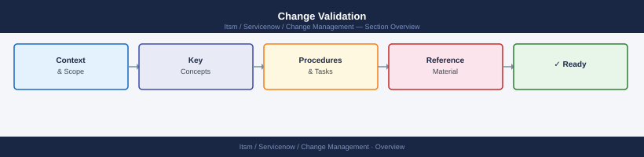

---
tags:
  - servicenow
---
# Change Validation



```bash
# Service running
systemctl status <service-name>

# Process exists
pgrep -a <process-name>

# Port listening
ss -tlnp | grep <port>

# Recent errors in logs
journalctl -u <service-name> --since "10 minutes ago" | grep -i error

# HTTP endpoint health
curl -sf http://localhost:<port>/health && echo "OK"
```

```bash
# Check no active alerts after change
# In Prometheus / Alertmanager:
curl -s http://alertmanager:9093/api/v2/alerts | jq '[.[] | select(.status.state=="firing")]'

# Check dashboard shows no anomalies — look for:
# - Error rate spike
# - Latency increase > 20% above baseline
# - Resource utilisation jump (CPU, memory, disk I/O)
```

```d2
direction: right

center: "ServiceNow" {shape: hexagon}
validation_principles: "Validation Principles" {shape: rectangle}
standard_validation_checklist: "Standard Validation Checklist" {shape: rectangle}
validation_by_change_type: "Validation by Change Type" {shape: rectangle}
monitoring_observation_period: "Monitoring Observation Period" {shape: rectangle}
signoff: "Sign-Off" {shape: rectangle}

center -> validation_principles
center -> standard_validation_checklist
center -> validation_by_change_type
center -> monitoring_observation_period
center -> signoff
```

## Overview

Validation confirms that a change achieved its intended outcome without introducing new problems. It is distinct from the implementation checklist — implementation confirms tasks were executed; validation confirms the service is healthy and behaving correctly. Both must be completed before a change is closed.

---

## Validation Principles

- Validate against the success criteria defined at the time of change approval — not a retrospective interpretation
- Always check both the directly changed component and its dependencies
- Validation must be performed by someone other than the sole implementer where possible
- Time-box the validation period: agree the duration before the change window starts

---

## Standard Validation Checklist

- [ ] Service health endpoint returns expected status
- [ ] Application logs show no new errors or exceptions introduced by the change
- [ ] Key user journeys tested (login, core function, data retrieval)
- [ ] Monitoring dashboards reviewed — no unexpected alerts firing
- [ ] Performance metrics within normal range (latency, error rate, queue depth)
- [ ] Downstream services confirmed unaffected
- [ ] Backup jobs still scheduled and functional
- [ ] DNS, load balancer, and certificate status verified if networking was touched

---

## Validation by Change Type

| Change Type              | Validation Focus                                          |
|--------------------------|-----------------------------------------------------------|
| OS patching              | Services restarted cleanly; no new errors in system logs  |
| Application deployment   | Smoke test; error rate; key API endpoints return 200      |
| Network change           | Connectivity between affected segments; routing correct   |
| Database change          | Query execution; row counts; replication lag (if clustered)|
| Certificate renewal      | TLS handshake succeeds; expiry date correct               |
| Firewall rule change      | Expected traffic permitted; blocked traffic still blocked |
| Storage change           | Read/write operations; capacity reported correctly        |

---

## Monitoring Observation Period

After validation, maintain an elevated monitoring period proportional to risk.

| Risk Level | Observation Period | Who Monitors               |
|------------|--------------------|-----------------------------|
| Low        | 1 hour             | Implementing engineer       |
| Medium     | 4 hours            | Implementing engineer       |
| High       | 24 hours           | Engineer + on-call team     |
| Critical   | 48–72 hours        | On-call team + management   |

During the observation period, agree on escalation criteria. If a new alert fires within the observation window that may be related to the change, treat it as a post-change issue and raise an incident.

---

## Sign-Off

Validation sign-off must be recorded in the change ticket before the change is closed.

- [ ] Implementer confirms all validation checks passed
- [ ] Change owner (or delegate) provides written sign-off in the ticket
- [ ] If any check failed, document what was done to resolve it or why risk is accepted
- [ ] Monitoring observation period confirmed active and owner assigned
- [ ] Change status updated to reflect validated outcome
