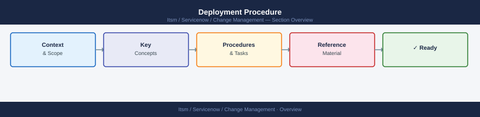

---
tags:
  - servicenow
---
# Deployment Procedure



```bash
# Snapshot / backup before change (example: VM snapshot)
# Azure
az snapshot create -g <rg> -n <snapshot-name> --source <disk-id>

# AWS
aws ec2 create-snapshot --volume-id <vol-id> --description "pre-change-ITSM-XXXX"

# Linux — configuration backup
tar czf /root/pre-change-config-$(date +%Y%m%d).tar.gz /etc/<service>/

# Verify service is healthy before starting
systemctl status <service>
curl -sf http://localhost:<port>/health
```

```bash
# Remove temporary files and pre-change backups (after soak period)
rm /etc/<service>.conf.pre-<date>   # only after validation passes

# Update ITSM ticket: outcome, duration, any deviations
```

```bash
# Restore config from backup
cp /etc/<service>.conf.pre-<date> /etc/<service>.conf
systemctl restart <service>

# Rollback package to previous version
apt-get install <package>=<prev-version>

# Rollback DB migration
psql -U <user> -d <db> -f migration_XXXX_down.sql

# Re-validate after rollback (same checks as Phase 3)
```
```markdown
Change:        ITSM-XXXX
Date/Time:     2026-05-06 22:00 UTC
Implementer:   <name>
Window:        22:00 – 23:00 UTC

Pre-change backup: Snapshot snap-abc123 created 21:55 UTC
Implementation:    Deployed package nginx=1.24.0-2 at 22:04 UTC
Restart:           Service restarted 22:05 UTC; came up in 8 seconds
Validation:        Health check OK; error rate 0%; latency normal
Monitoring soak:   22:05 – 22:40 UTC — no alerts fired
Outcome:           Success
Ticket closed:     22:42 UTC
```
