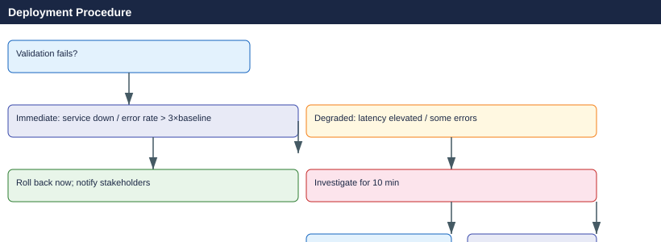

---
tags:
  - servicenow
---
# Deployment Procedure

```bash
# Snapshot / backup before change (example: VM snapshot)
# Azure
az snapshot create -g <rg> -n <snapshot-name> --source <disk-id>

# AWS
aws ec2 create-snapshot --volume-id <vol-id> --description "pre-change-ITSM-XXXX"

# Linux — configuration backup
tar czf /root/pre-change-config-$(date +%Y%m%d).tar.gz /etc/<service>/

# Verify service is healthy before starting
systemctl status <service>
curl -sf http://localhost:<port>/health
```


```text title="Expected output"
{
  "id": "/subscriptions/a1b2c3d4-e5f6-4g7h-8i9j-0k1l2m3n4o5p/resourceGroups/prod-rg-01/providers/Microsoft.Compute/snapshots/vm-app-pre-change-20240115",
  "name": "vm-app-pre-change-20240115",
  "resourceGroup": "prod-rg-01",
  "timeCreated": "2024-01-15T14:32:18.456789+00:00"
}
{
  "SnapshotIds": [
    "snap-0a1b2c3d4e5f6g7h8"
  ],
  "ResponseMetadata": {
    "RequestId": "a1b2c3d4-e5f6-4g7h-8i9j",
    "HTTPStatusCode": 200
  }
}
pre-change-config-20240115.tar.gz
● nginx.service - The NGINX HTTP and reverse proxy server
     Loaded: loaded (/usr/lib/systemd/system/nginx.service; enabled; vendor preset: enabled)
     Active: active (running) since Mon 2024-01-15 14:28:03 UTC; 4min 15s ago
       Docs: man:nginx(1)
   Main PID: 2847 (nginx)
      Tasks: 3 (limit: 4915)
     Memory: 12.4M
        CPU: 145ms
     CGroup: /system.slice/nginx.service
             ├─2847 nginx: master process /usr/sbin/nginx -g daemon on; master_process on;
             └─2851 nginx: worker process
{"status":"healthy","uptime":"14h23m","version":"1.24.0"}
```

!!! warning "Common errors"
    | Error | Fix |
    |---|---|
    | `error: The subscription 'xxxxxxxx-xxxx-xxxx-xxxx-xxxxxxxxxxxx' could not be found.` | Verify the correct Azure subscription is active with `az account show` and switch if needed using `az account set --subscription <subscription-id>`. |
    | `An error occurred (InvalidVolume.NotFound) when calling the CreateSnapshot operation: The volume 'vol-xxxxxxxx' does not exist` | Confirm the volume ID is correct and exists in the target AWS region with `aws ec2 describe-volumes --volume-ids <vol-id>`. |
    | `curl: (7) Failed to connect to localhost port 8080: Connection refused` | Verify the service is listening on the correct port with `netstat -tlnp | grep <service>` or check service logs with `journalctl -u <service> -n 20`. |
```bash
# Remove temporary files and pre-change backups (after soak period)
rm /etc/<service>.conf.pre-<date>   # only after validation passes

# Update ITSM ticket: outcome, duration, any deviations
```

```text title="Expected output"
(no output — command completes silently)
```

!!! warning "Common errors"
    | Error | Fix |
    |---|---|
    | `rm: cannot remove '/etc/<service>.conf.pre-<date>': No such file or directory` | Verify the exact filename and date format match what was created during the pre-change backup step. |
    | `rm: cannot remove '/etc/<service>.conf.pre-<date>': Permission denied` | Run the command with `sudo` or ensure the user has write permissions to the `/etc/` directory. |

```bash
# Restore config from backup
cp /etc/<service>.conf.pre-<date> /etc/<service>.conf
systemctl restart <service>

# Rollback package to previous version
apt-get install <package>=<prev-version>

# Rollback DB migration
psql -U <user> -d <db> -f migration_XXXX_down.sql

# Re-validate after rollback (same checks as Phase 3)
```
```markdown
Change:        ITSM-XXXX
Date/Time:     2026-05-06 22:00 UTC
Implementer:   <name>
Window:        22:00 – 23:00 UTC

Pre-change backup: Snapshot snap-abc123 created 21:55 UTC
Implementation:    Deployed package nginx=1.24.0-2 at 22:04 UTC
Restart:           Service restarted 22:05 UTC; came up in 8 seconds
Validation:        Health check OK; error rate 0%; latency normal
Monitoring soak:   22:05 – 22:40 UTC — no alerts fired
Outcome:           Success
Ticket closed:     22:42 UTC
```
