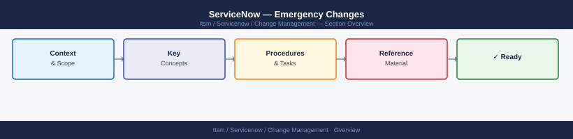

---
tags:
  - servicenow
---
# ServiceNow — Emergency Changes

Emergency change process — expedited approval path for urgent production fixes; CAB override criteria, evidence requirements, and post-implementation review.

*Applies to: ServiceNow*

