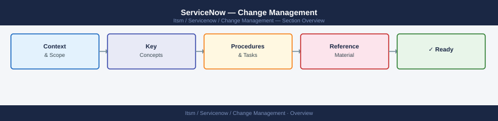

---
tags:
  - servicenow
---
# ServiceNow — Change Management

ServiceNow change management procedures — change request lifecycle, CAB process, standard changes, and post-implementation review.

*Applies to: ServiceNow*

<a class="kb-card" href="change-request/"><strong>Change Request (RFC)</strong>RFC creation, required fields, and submission workflow in ServiceNow.</a>
<a class="kb-card" href="change-approval/"><strong>Change Approval</strong>Approval requirements by change type — standard, normal, and emergency CAB paths.</a>
<a class="kb-card" href="change-communication/"><strong>Change Communication</strong>Stakeholder notification plan and communication templates for each change phase.</a>
<a class="kb-card" href="risk/"><strong>Risk Assessment</strong>Change risk scoring matrix — impact, likelihood, and mitigation requirements.</a>
<a class="kb-card" href="backout-plan/"><strong>Backout Plan</strong>Backout criteria, rollback decision tree, and plan template for every change.</a>
<a class="kb-card" href="deployment-procedure/"><strong>Deployment Procedure</strong>Deployment execution steps, go/no-go gates, and implementation checklist.</a>
<a class="kb-card" href="change-validation/"><strong>Change Validation</strong>Post-change validation steps, testing criteria, and sign-off requirements.</a>
<a class="kb-card" href="closeout/"><strong>Change Closeout</strong>Closeout checklist, outcome classification, and PIR scheduling.</a>
<a class="kb-card" href="procedures/"><strong>Procedures</strong>Change request lifecycle and full CAB procedures reference.</a>
<a class="kb-card" href="standard-changes/"><strong>Standard Changes</strong>Pre-approved standard change catalogue and registration process.</a>
<a class="kb-card" href="emergency-changes/"><strong>Emergency Changes</strong>Emergency change catalogue — pre-approved expedited changes.</a>
<a class="kb-card" href="emergency-change/"><strong>Emergency Change Procedure</strong>Emergency change execution procedure — CAB override, approvals during implementation.</a>
<a class="kb-card" href="release-management/"><strong>Release Management</strong>Release planning, scheduling, coordination, and go-live gate criteria.</a>

