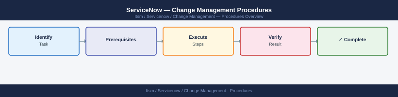

---
tags:
  - servicenow
---
# ServiceNow — Change Management Procedures

ServiceNow change request lifecycle — raising, categorising, routing for CAB approval, implementing, and closing change records.

*Applies to: ServiceNow*

## See also

- [ServiceNow — Overview](../../)
