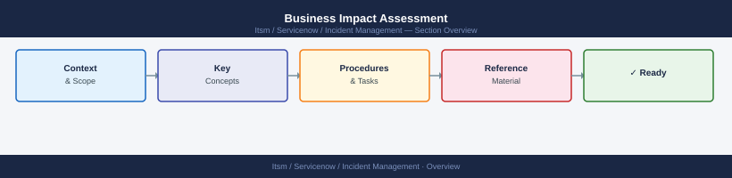

---
tags:
  - servicenow
---
# Business Impact Assessment

Business Impact Assessment reference covering Overview, Impact Dimensions, User Impact Categories, SLA Breach Assessment, Affected Services Inventory and 1 more sections.

*Applies to: ServiceNow*

## Overview

A business impact assessment during an incident quantifies who is affected, which business processes are disrupted, what the financial and reputational exposure is, and whether SLA commitments are at risk. This assessment drives priority setting, escalation decisions, and stakeholder communication.

---

## Impact Dimensions

Assess impact across four dimensions simultaneously.

| Dimension      | Questions to Answer                                              |
|----------------|------------------------------------------------------------------|
| User count     | How many users are affected? Internal only or external/customers? |
| Service scope  | Which specific services or features are unavailable?            |
| Business process | Which business workflows are blocked or degraded?              |
| Data risk      | Is there any risk of data loss, corruption, or exposure?        |

Complete this assessment within 15 minutes of incident declaration for P1s.

---

## User Impact Categories

| Category              | Definition                                         | Priority Indicator |
|-----------------------|----------------------------------------------------|--------------------|
| All external users    | Full customer-facing outage                        | P1 automatic       |
| Subset of customers   | Geographic, tier, or feature-based outage          | P1 or P2           |
| All internal users    | Full internal service outage (e.g., VPN, email)    | P1 or P2           |
| Specific teams only   | Isolated to one department or function             | P2 or P3           |
| Single user           | Individual fault, no wider impact                  | P3 or P4           |

---

## SLA Breach Assessment

Check SLA status early — a P2 becomes a P1 if you are 30 minutes away from an SLA breach.

- [ ] Identify which SLAs apply to affected services
- [ ] Calculate time elapsed since incident start
- [ ] Determine time remaining before SLA breach (if any)
- [ ] If breach is within 30 minutes, escalate priority and notify account/customer success team
- [ ] Document SLA breach or near-miss in the incident ticket for reporting

| SLA Metric            | Contracted Target | Current Status        |
|-----------------------|-------------------|-----------------------|
| Availability (monthly)| 99.9%             | (calculate from uptime)|
| Response time P1      | 15 minutes        | (from alert to response)|
| Resolution time P1    | 4 hours           | (from alert to resolved)|

---

## Affected Services Inventory

During the incident, maintain a live list of affected services. Update it as scope becomes clearer.

- [ ] Primary service confirmed affected
- [ ] Dependencies of the primary service assessed
- [ ] Services that depend on the primary service assessed
- [ ] Third-party integrations assessed
- [ ] Internal tools that rely on the affected service assessed

Record the list in the incident ticket. Use the CMDB CI relationships view to speed up the dependency sweep.

---

## Financial and Reputational Exposure

For major incidents, estimating financial impact helps leadership make resource decisions.

- **Revenue impact** — if the service is revenue-generating, estimate lost transactions per hour
- **Contractual penalties** — check customer contracts for SLA penalty clauses
- **Reputational risk** — is this incident publicly visible? Are customers posting on social media?
- **Regulatory exposure** — does the incident involve personal data (GDPR, HIPAA)?

If any regulatory exposure is identified, notify the Legal and Compliance team immediately — do not wait for the incident to be resolved.
