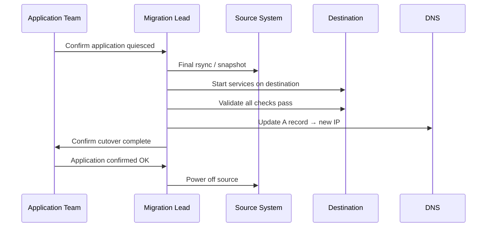

---
tags:
  - servicenow
---
# Migration Procedure

```yaml
Migration Plan — <HOSTNAME> / <WORKLOAD>
━━━━━━━━━━━━━━━━━━━━━━━━━━━━━━━━━━━━━━━━━━━
Source:           <platform, host, location>
Destination:      <platform, host, location>
Workload:         <application and purpose>
Owner:            <team / contact>
Migration type:   <cold / live / data>
Max downtime:     <N minutes>
Migration window: <date, time, duration>
Rollback window:  <how long can we roll back>
Dependencies:     <external services / integrations>
Data volume:      <GB / TB>
━━━━━━━━━━━━━━━━━━━━━━━━━━━━━━━━━━━━━━━━━━━
```

```powershell
# Live migration — no downtime
Move-VM -VM "HOSTNAME" -Destination (Get-VMHost "esxi02.example.com") -Confirm:$false

# Storage migration
Move-VM -VM "HOSTNAME" -Datastore (Get-Datastore "SSD-DataStore-01") -Confirm:$false

# Combined move
Move-VM -VM "HOSTNAME" \
  -Destination (Get-VMHost "esxi02.example.com") \
  -Datastore (Get-Datastore "SSD-DataStore-01") \
  -Confirm:$false

# Monitor progress
Get-Task | Where-Object {$_.Name -eq "RelocateVM_Task"} | Select-Object PercentComplete, State
```
```bash
# Initial sync (run multiple times to reduce delta)
rsync -avz --progress --delete \
  -e "ssh -i ~/.ssh/migration_key" \
  /data/source/ migrationuser@<destination>:/data/destination/

# Verify counts match
find /data/source/ -type f | wc -l
ssh <destination> "find /data/destination/ -type f | wc -l"
du -sh /data/source/ && ssh <destination> "du -sh /data/destination/"
```
```bash
# Quiesce and break SnapMirror relationship for cutover
snapmirror quiesce -destination-path <svm>:<vol-dest>
snapmirror break -destination-path <svm>:<vol-dest>
```

```bash
# 1. Quiesce application
systemctl stop myapp

# 2. Final sync
rsync -avz --checksum --delete /data/source/ user@destination:/data/

# 3. Start services on destination
ssh destination "systemctl start myapp"
ssh destination "curl -sk https://localhost/health"

# 4. Update DNS
nsupdate <<EOF
server dns.example.com
update delete <hostname>.example.com A
update add <hostname>.example.com 60 A <new-ip>
send
EOF

# Verify propagation
dig +short <hostname>.example.com @dns.example.com
```
```bash
# Platform health on destination
uptime; systemctl --failed
journalctl -p err -n 50 --no-pager

# Application health
curl -sk https://<hostname>/health
curl -sk -o /dev/null -w "%{time_total}" https://<hostname>/

# Confirm monitoring shows new host
curl -s "http://prometheus:9090/api/v1/query?query=up{instance='<new-ip>:9100'}"

# Add to backup job at destination and run first backup
Start-VBRJob -Job "Production VMs"
```
```bash
# Remove pre-migration snapshot (after 48h stability)
Get-VM -Name "HOSTNAME" | Get-Snapshot -Name "pre-migration-*" | Remove-Snapshot -Confirm:$false

# Remove old DNS entry
nsupdate <<EOF
server dns.example.com
update delete <old-hostname>.example.com A
send
EOF

# Decommission source (follow decommission procedure)
# Update CMDB — new host, IP, location, platform
```
