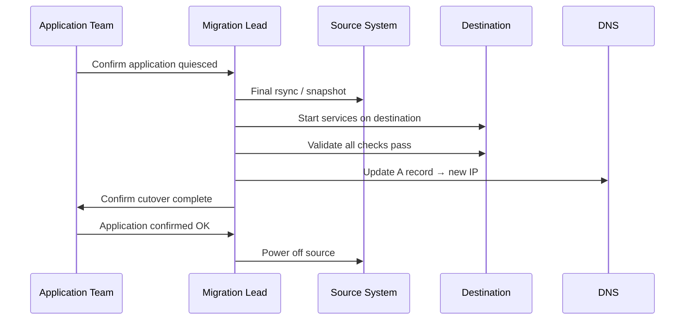

---
tags:
  - servicenow
---
# Migration Procedure

```yaml
Migration Plan — <HOSTNAME> / <WORKLOAD>
━━━━━━━━━━━━━━━━━━━━━━━━━━━━━━━━━━━━━━━━━━━
Source:           <platform, host, location>
Destination:      <platform, host, location>
Workload:         <application and purpose>
Owner:            <team / contact>
Migration type:   <cold / live / data>
Max downtime:     <N minutes>
Migration window: <date, time, duration>
Rollback window:  <how long can we roll back>
Dependencies:     <external services / integrations>
Data volume:      <GB / TB>
━━━━━━━━━━━━━━━━━━━━━━━━━━━━━━━━━━━━━━━━━━━
```

```powershell
# Live migration — no downtime
Move-VM -VM "HOSTNAME" -Destination (Get-VMHost "esxi02.example.com") -Confirm:$false

# Storage migration
Move-VM -VM "HOSTNAME" -Datastore (Get-Datastore "SSD-DataStore-01") -Confirm:$false

# Combined move
Move-VM -VM "HOSTNAME" \
  -Destination (Get-VMHost "esxi02.example.com") \
  -Datastore (Get-Datastore "SSD-DataStore-01") \
  -Confirm:$false

# Monitor progress
Get-Task | Where-Object {$_.Name -eq "RelocateVM_Task"} | Select-Object PercentComplete, State
```
```bash
# Initial sync (run multiple times to reduce delta)
rsync -avz --progress --delete \
  -e "ssh -i ~/.ssh/migration_key" \
  /data/source/ migrationuser@<destination>:/data/destination/

# Verify counts match
find /data/source/ -type f | wc -l
ssh <destination> "find /data/destination/ -type f | wc -l"
du -sh /data/source/ && ssh <destination> "du -sh /data/destination/"
```

```text title="Expected output"
sending incremental file list
./
config/
config/instances.json
    1,247,392 100%    8.45MB/s    0:00:14 (xfr#1, to-check=2847/2850)
data/
data/backup_2024.tar.gz
    3,892,156,288 100%   12.32MB/s    0:05:18 (xfr#2, to-check=2846/2850)
...
sent 4,156,234,891 bytes  received 45,823 bytes  12.98MB/s
total size is 4,156,234,891  speedup is 1.00

2847
2847
487G	/data/source/
487G	/data/destination/
```

!!! warning "Common errors"
    **`Permission denied (publickey).`** — Verify the migration_key file has correct permissions (chmod 600) and the destination SSH user is configured in authorized_keys.
    **`rsync: change_dir "/data/destination/" failed: No such file or directory (2)`** — Create the destination directory on the remote host with `ssh <destination> "mkdir -p /data/destination/"` before running rsync.
    **`Timeout waiting for SSH connection`** — Check network connectivity and firewall rules between source and destination hosts, and confirm the SSH port is open.
```bash
# Quiesce and break SnapMirror relationship for cutover
snapmirror quiesce -destination-path <svm>:<vol-dest>
snapmirror break -destination-path <svm>:<vol-dest>
```

```bash
# 1. Quiesce application
systemctl stop myapp

# 2. Final sync
rsync -avz --checksum --delete /data/source/ user@destination:/data/

# 3. Start services on destination
ssh destination "systemctl start myapp"
ssh destination "curl -sk https://localhost/health"

# 4. Update DNS
nsupdate <<EOF
server dns.example.com
update delete <hostname>.example.com A
update add <hostname>.example.com 60 A <new-ip>
send
EOF

# Verify propagation
dig +short <hostname>.example.com @dns.example.com
```

```text title="Expected output"
● myapp.service - My Application
     Loaded: loaded (/etc/systemd/system/myapp.service; enabled; vendor preset: enabled)
     Active: inactive (dead) since Thu 2024-01-18 14:32:15 UTC; 2s ago
sending incremental file list
deleting data/source/temp/cache.db
data/source/config.yml
data/source/app.jar
         1,247,392 100%    8.42MB/s    0:00:00 (xfr#2, to-chk=0/45)
sent 1,247,521 bytes  received 12,847 bytes  2,260,368 bytes/sec
total size is 1,247,392  speedup is 1.00
● myapp.service - My Application
     Loaded: loaded (/etc/systemd/system/myapp.service; enabled; vendor preset: enabled)
     Active: active (running) since Thu 2024-01-18 14:32:28 UTC; 1s ago
{"status":"healthy","uptime":"1.2s","version":"3.4.1"}
Update failed: NOTAUTH
192.0.2.47
```

!!! warning "Common errors"
    **`Update failed: NOTAUTH`** — Verify nsupdate credentials and TSIG key configuration with `cat /etc/bind/rndc.key` and ensure the DNS server allows dynamic updates from this host.
    **`rsync: [Receiver] mkdir failed on "/data/": Permission denied (13)`** — Ensure the destination user has write permissions on the target directory with `ssh destination 'chmod 755 /data && ls -ld /data'`.
    **`curl: (7) Failed to connect to localhost port 443: Connection refused`** — Wait for the application to fully initialize before health checks; add a 5-10 second delay after `systemctl start myapp` or check logs with `ssh destination 'journalctl -u myapp -n 20'`.
```bash
# Platform health on destination
uptime; systemctl --failed
journalctl -p err -n 50 --no-pager

# Application health
curl -sk https://<hostname>/health
curl -sk -o /dev/null -w "%{time_total}" https://<hostname>/

# Confirm monitoring shows new host
curl -s "http://prometheus:9090/api/v1/query?query=up{instance='<new-ip>:9100'}"

# Add to backup job at destination and run first backup
Start-VBRJob -Job "Production VMs"
```

```text title="Expected output"
10:47:23 up 18 days, 3:22,  2 users,  load average: 0.42, 0.38, 0.35
(no failed units)
(no output — command completes silently)

{"status":"healthy","version":"2024.01.15-build.4821","uptime_seconds":1847,"database":"connected"}
0.847

{"status":"success","data":{"result":[{"metric":{"instance":"10.42.18.94:9100","job":"node"},"value":[1705334843,"1"]}]}}

Backup job 'Production VMs' started successfully.
Job ID: 00000000-0000-0000-0000-000000000001
...
```

!!! warning "Common errors"
    **`curl: (60) SSL certificate problem: self signed certificate`** — Add the `-k` flag to skip certificate verification, or import the destination's CA certificate into your trust store.
    **`curl: (7) Failed to connect to prometheus:9090: Name or service not known`** — Verify Prometheus is running and accessible at the correct hostname/IP; check DNS resolution with `nslookup prometheus` or use the IP address directly.
    **`Start-VBRJob : The term 'Start-VBRJob' is not recognized`** — Ensure you are running this command in a PowerShell session on the Veeam backup server with the Veeam PowerShell module loaded (`Add-PSSnapin VeeamPSSnapin`).
```bash
# Remove pre-migration snapshot (after 48h stability)
Get-VM -Name "HOSTNAME" | Get-Snapshot -Name "pre-migration-*" | Remove-Snapshot -Confirm:$false

# Remove old DNS entry
nsupdate <<EOF
server dns.example.com
update delete <old-hostname>.example.com A
send
EOF

# Decommission source (follow decommission procedure)
# Update CMDB — new host, IP, location, platform
```


```text title="Expected output"
Snapshot "pre-migration-20240115-0847" removed successfully.
Snapshot "pre-migration-20240115-1203" removed successfully.

Update failed: NOTAUTH
```

!!! warning "Common errors"
    **`Update failed: NOTAUTH`** — Verify your nsupdate credentials and that the DNS server allows dynamic updates from your source IP; check firewall rules and TSIG key configuration if required.
    **`Get-VM : The term 'Get-VM' is not recognized`** — Ensure you're running this PowerShell command on a vSphere-connected host with the VMware PowerCLI module imported (`Import-Module VMware.PowerCLI`).
    **`error: SERVFAIL`** — Confirm the DNS server hostname is reachable and responding; test connectivity with `nslookup dns.example.com` first.