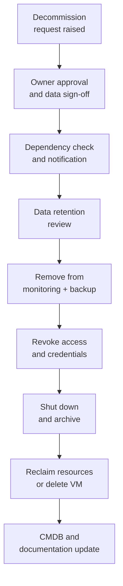

---
tags:
  - servicenow
---
# System Decommission Procedure


<div class="kb-summary">
Safely removes a server, VM, or cloud instance from production — preventing orphaned monitoring alerts, failed backup jobs, billing waste, and security exposure from unmanaged systems.

*Applies to: ServiceNow*
</div>

## Decommission Workflow


```text
┌───────────────────────────────────────── System Decommission ─────────────────────────────────────────┐
│                                                                                                       │
│   ┌───────────────────────────────────────────────────────────────────────────────────────────────┐   │
│   │      Decommission: retire system safely — migrate data, preserve backups, recover assets      │   │
│   │          No system retired without sign-off from business owner and storage/data team         │   │
│   └───────────────────────────────────────────────────────────────────────────────────────────────┘   │
│                                                                                                       │
│                  ▼                                ▼                                ▼                  │
│                                                                                                       │
│   ┌─────────────────────────────┐  ┌─────────────────────────────┐  ┌─────────────────────────────┐   │
│   │       Pre-Decommission      │  │          Execution          │  │          Close-out          │   │
│   │      ─────────────────      │  │      ─────────────────      │  │      ─────────────────      │   │
│   │   Business owner sign-off   │  │         Migrate data        │  │     CMDB retired status     │   │
│   │     Confirm no consumers    │  │         Final backup        │  │        Asset returned       │   │
│   │   Identify data retention   │  │        DNS/IP removed       │  │      License recovered      │   │
│   │  Data classification review │  │      Monitoring removed     │  │        Creds deleted        │   │
│   │    Backup retention check   │  │          Power off          │  │      Secure erase data      │   │
│   └─────────────────────────────┘  └─────────────────────────────┘  └─────────────────────────────┘   │
│                                                                                                       │
│   │       Step       │      Owner       │        Gate       │     Artefact     │      Notes       │   │
│   │ ──────────────── │ ──────────────── │ ───────────────── │ ──────────────── │──────────────────│   │
│   │   Biz sign-off   │    Biz owner     │   Email approval  │  Approval email  │    Mandatory     │   │
│   │   Data migrate   │    Infra team    │ Transfer verified │  Migration log   │ Integrity check  │   │
│   │   Secure erase   │    Infra team    │    Erasure cert   │   Certificate    │  Regulatory req  │   │
│   │   CMDB retire    │    Infra team    │   Status updated  │   CMDB record    │  End of process  │   │
│                                                                                                       │
│    Key terms:                                                                                         │
│                                                                                                       │
│    Secure erase   = DoD 7-pass or crypto erase of data before disposal; required by policy            │
│    Erasure cert   = Certificate from erase tool documenting that secure wipe completed                │
│    Consumer check = Confirm no active services, users, or applications depend on the system           │
│    Asset recovery = Return hardware to vendor, send to spare pool, or dispose per WEEE                │
│                                                                                                       │
└───────────────────────────────────────────────────────────────────────────────────────────────────────┘
```

| Data Category | Decision | Signed Off |
|---|---|---|
| Application data | Archive / Delete | ☐ |
| Log files | Archive / Delete | ☐ |
| Database data | Archive / Migrate | ☐ |
| SSL certificates | Revoke | ☐ |
| SSH keys | Rotate on dependents | ☐ |

## 4. Remove from Monitoring

```bash
# Prometheus — remove from scrape targets
# Edit prometheus/targets/linux_hosts.yml — delete host entry

# Verify no active alerts for this host
curl -s "http://prometheus:9090/api/v1/alerts" | \
  python3 -c "import sys,json; [print(a) for a in json.load(sys.stdin)['data']['alerts'] if '<hostname>' in str(a)]"

# Zabbix — disable host via API
curl -s -X POST http://zabbix.example.com/api_jsonrpc.php \
  -H "Content-Type: application/json" \
  -d '{"jsonrpc":"2.0","method":"host.update","params":{"hostid":"<id>","status":1},"auth":"<token>","id":1}'
```

## 5. Remove from Backup

```bash
# Veeam — remove from backup job
$job = Get-VBRJob -Name "Production VMs"
$vm = Get-VBRJobObject -Job $job | Where-Object Name -eq "<hostname>"
Remove-VBRJobObject -Job $job -Objects $vm

# Delete backup data (only after retention period confirmed)
# Veeam UI: Home → Backups → Disk → <hostname> → Delete from Disk

# Commvault — retire client
# CommCell Console: Client Computers → <hostname> → Retire Client
```

## 6. Revoke Access and Credentials

```bash
# Remove SSH authorized keys
ssh root@<hostname> "rm -f /home/ansible/.ssh/authorized_keys"

# CyberArk — remove managed account
# CyberArk UI: Accounts → search <hostname> → Delete

# Venafi — revoke SSL certificate
# Venafi TLS Protect: Certificates → <hostname> → Revoke and Delete

# Active Directory — disable computer account (disable first, delete after 30 days)
Disable-ADComputer -Identity "<HOSTNAME>" -Confirm:$false

# Remove DNS records
nsupdate <<EOF
server dns.example.com
update delete <hostname>.example.com A
update delete <reverse-ip>.in-addr.arpa. PTR
send
EOF

# Verify removal
nslookup <hostname>.example.com
```

## 7. Shutdown and Delete

### Virtual Machine

```powershell
# VMware — power off and delete
Stop-VM -VM "<hostname>" -Confirm:$false
Remove-VM -VM "<hostname>" -DeletePermanently -Confirm:$false

# Verify datastore space reclaimed
Get-Datastore -Name "Datastore-01" | Select-Object Name, FreeSpaceGB
```

### Physical Server

```bash
shutdown -h now
# DRAC: racadm serveraction powerdown
# iLO:  ilorest set PowerState=Off

# After physical removal:
# → Coordinate rack removal with data centre team
# → Complete hardware disposal form (WEEE compliance)
# → Update asset management with disposal method
```

### Cloud Instance

```bash
# AWS
aws ec2 terminate-instances --instance-ids i-1234567890abcdef0
aws ec2 release-address --allocation-id eipalloc-12345678

# Azure
az vm delete --resource-group prod-rg --name <hostname> --yes
az disk delete --resource-group prod-rg --name <hostname>-osDisk --yes

# GCP
gcloud compute instances delete <hostname> --zone=europe-west1-b
```

## 8. CMDB and Ansible Cleanup

```bash
# Ansible — remove from inventory
git rm -r inventory/production/host_vars/<hostname>.example.com/
# Remove host entry from hosts.yml
git commit -m "Decommission <hostname> — CHG-XXXX"
git push

# CMDB entry: Status → Retired, Decommission date → YYYY-MM-DD
```

## Decommission Checklist

| Step | Done |
|---|---|
| Owner sign-off obtained | ☐ |
| Change ticket approved | ☐ |
| All dependents notified | ☐ |
| Data retention review complete | ☐ |
| Archive transferred (if required) | ☐ |
| Removed from monitoring | ☐ |
| Removed from backup jobs | ☐ |
| SSH keys removed | ☐ |
| PAM accounts removed | ☐ |
| SSL certificates revoked | ☐ |
| AD computer account disabled | ☐ |
| DNS records removed | ☐ |
| Powered off | ☐ |
| VM deleted / hardware reclaimed | ☐ |
| CMDB status set to Retired | ☐ |
| Ansible inventory updated | ☐ |
| Change ticket closed | ☐ |
