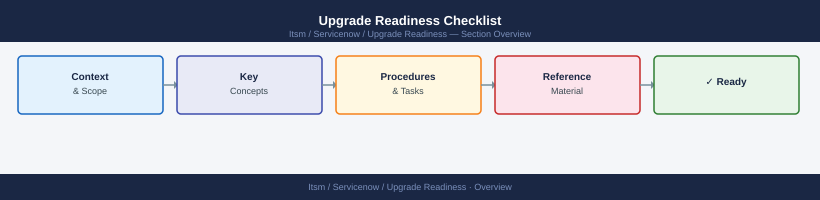
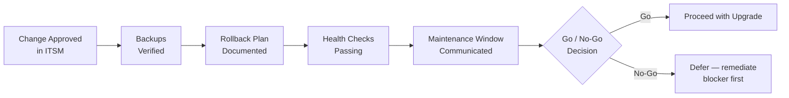

---
tags:
  - servicenow
---
# Upgrade Readiness Checklist


<div class="kb-summary">
Validates that infrastructure is in a safe state before any upgrade or patching activity begins. Complete all checks and obtain explicit go/no-go sign-off before proceeding.

*Applies to: ServiceNow*
</div>



## Pre-Upgrade Gate Criteria




| Health Check | Pass Criteria |
|---|---|
| CPU load | < 80% sustained |
| Memory free | > 20% |
| Disk free | > 20% on all volumes |
| Failed services | None |
| Error log (last 1h) | No critical / hardware errors |
| HW alarms | No active hardware alerts |
| Replication lag | Within SLA |

## 4. Network and Connectivity

```bash
ping -c 3 <gateway>
ping -c 3 <dns-server>
ping -c 3 <ntp-server>

# NTP sync (drift < 1s)
chronyc tracking | grep "System time"

# DNS resolution
nslookup <hostname>.example.com
```

## 5. Vendor Compatibility Matrix

```bash
# VMware HCL — check driver/firmware compatibility before ESXi upgrade
esxcli software vib list | grep -E "bnx|igb|i40e|lpfc|nfnic|enic"
esxcli hardware firmware get
```

| Dependency | Current Version | Compatible With Upgrade | Checked |
|---|---|---|---|
| Hypervisor version | | | ☐ |
| Driver versions | | | ☐ |
| Firmware versions | | | ☐ |
| Application compatibility | | | ☐ |
| Storage array interop | | | ☐ |

## 6. Pre-Upgrade Snapshot (VMs)

```bash
# Take quiesced snapshot immediately before change
New-Snapshot -VM "HOSTNAME" \
  -Name "pre-upgrade-CHG-XXXX-$(Get-Date -Format yyyyMMdd)" \
  -Description "Pre-upgrade snapshot — CHG-XXXX" \
  -Quiesce \
  -Memory:$false

# Verify
Get-VM -Name "HOSTNAME" | Get-Snapshot | Select-Object Name, Created, SizeMB
```

!!! note "Snapshot retention"
    Remove pre-upgrade snapshots within 48 hours of successful completion. Stale snapshots degrade VM performance and consume datastore space.

## 7. Rollback Plan

```text
Rollback Plan — CHG-XXXX
━━━━━━━━━━━━━━━━━━━━━━━━━━━━━━━━━━━
System:           <hostname>
Upgrade:          <from version> → <to version>
Rollback method:  [ ] Snapshot  [ ] Backup restore  [ ] Config revert
Snapshot name:    pre-upgrade-CHG-XXXX-YYYY-MM-DD
Estimated time:   <X> minutes
Rollback trigger: Service fails to start / error rate > 5% / app team reports failures
Decision authority: <name / role>
━━━━━━━━━━━━━━━━━━━━━━━━━━━━━━━━━━━
```

## Go / No-Go Sign-Off

| Category | Status | Signed Off By |
|---|---|---|
| Change approved | ☐ Go / ☐ No-Go | |
| Backup verified | ☐ Go / ☐ No-Go | |
| Rollback plan documented | ☐ Go / ☐ No-Go | |
| System health passing | ☐ Go / ☐ No-Go | |
| Vendor compatibility confirmed | ☐ Go / ☐ No-Go | |
| Maintenance window active | ☐ Go / ☐ No-Go | |
| **Final Decision** | ☐ **GO** / ☐ **NO-GO** | |
