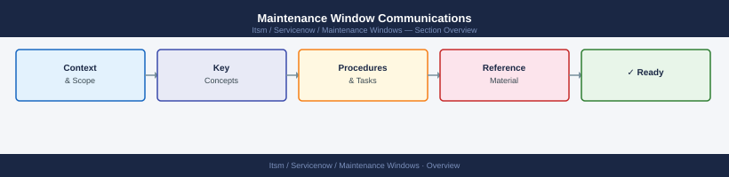

---
tags:
  - servicenow
---
# Maintenance Window Communications


<div class="kb-summary">
Maintenance Window Communications reference covering Overview, Communication Timeline, Stakeholder List, Notification Templates, Bridge and War Room Details and 1 more sections.

*Applies to: ServiceNow*
</div>



## Overview

Clear, timely communications are as important as the technical work in a maintenance window. Users and stakeholders who are surprised by downtime are frustrated even when the work goes perfectly. A well-managed comms process sets expectations, reduces inbound queries during the window, and builds trust in the infrastructure team.

---

## Communication Timeline

| Notification             | When to Send                    | Channel                      |
|--------------------------|---------------------------------|------------------------------|
| Initial advance notice   | 5–10 business days before       | Email + ticket + status page |
| Reminder                 | 48 hours before                 | Email + Slack                |
| Day-of confirmation      | Morning of maintenance day      | Slack + status page          |
| Window open notification | At the start of the window      | Slack + status page          |
| Progress update (if long)| Every 60 minutes for windows >2h| Slack                        |
| Completion notification  | Immediately on completion       | Email + Slack + status page  |

For emergency or short-notice maintenance, compress the timeline but keep all stages.

---

## Stakeholder List

Maintain a stakeholder list specific to each maintenance window. Review before sending any notification.

| Stakeholder Group      | Notify For                    | Channel            |
|------------------------|-------------------------------|--------------------|
| End users              | All service-affecting windows | Status page + email|
| Internal IT staff      | All windows                   | Slack + email      |
| Application owners     | Windows affecting their apps  | Direct email       |
| Management / Exec      | Major or high-risk windows    | Email              |
| Vendors / third parties| Windows affecting integrations| Email or portal    |
| On-call team           | All windows                   | PagerDuty + Slack  |

---

## Notification Templates

**Advance notice:**
```yaml
Subject: Scheduled Maintenance – <Service Name> – <Date> <Start Time> to <End Time> <TZ>

We are performing scheduled maintenance on <service/system>.

What:    <Brief description of work>
When:    <Date>, <Start Time> – <End Time> (<TZ>)
Impact:  <Expected user-facing impact, e.g., "Service unavailable for up to 2 hours">
Contact: <Bridge/Slack channel for queries>

If you have concerns about this window, please respond to this message by <date>.
```

**Completion notification:**
```yaml
Subject: Maintenance Complete – <Service Name>

Maintenance on <service/system> completed at <HH:MM TZ>.

Duration: <actual start> to <actual end>
Outcome: <Completed as planned / Partially completed — see notes>
Service status: Healthy

Please report any issues to <contact/channel>.
```

---

## Bridge and War Room Details

For windows lasting more than 1 hour or rated Medium risk and above, open a bridge/virtual room.

- [ ] Bridge link created and included in all notifications
- [ ] Bridge host assigned (separate from the lead engineer)
- [ ] Dial-in number provided for those without video access
- [ ] Roll call at bridge open; non-essential attendees asked to mute
- [ ] Updates pushed to the main Slack channel every 60 minutes from the bridge

---

## Status Page Updates

Keep the public or internal status page accurate throughout the window.

- [ ] Maintenance event created on status page in advance
- [ ] Status updated to "Under Maintenance" at window open
- [ ] Any unexpected issues updated on the status page promptly
- [ ] Status updated to "Operational" immediately on completion
- [ ] Post-maintenance note added if any impact occurred beyond the planned scope
