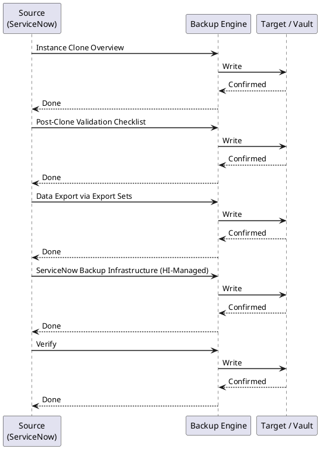

---
tags:
  - operations
  - servicenow
description: "ServiceNow cloud instances do not expose direct database backup access. The primary mechanisms for instance protection and data recovery are Instance..."
---
# ServiceNow — Backup & Restore

<div class="kb-summary">
ServiceNow cloud instances do not expose direct database backup access. The primary mechanisms for instance protection and data recovery are **Instance Cloning** (for sub-production refresh and disaster recovery testing) and **Export Sets** (for selective data export).

*Applies to: ServiceNow (Washington / Xanadu)*
</div>

 This page covers both in detail.

---



## Before you begin

- **Access:** Admin credentials on all affected systems
- **Timing:** safe to run during business hours unless a step is marked ⚠ (causes interruption)
- **Dependencies:** no active upgrades or migrations on the same infrastructure
- **Logging:** capture command output — paste into the change record on completion

---

## Instance Clone Overview

Instance cloning copies the full data and configuration of a source instance to a target instance. The most common use case is refreshing a sub-production instance with a recent production snapshot.

```d2
direction: right

PROD: "Production Instance\n(source" {shape: rectangle}
UAT: "UAT Instance\n(target" {shape: rectangle}
DEV: "Dev Instance\n(target" {shape: rectangle}

```

Typical schedule options: daily, weekly, bi-weekly, monthly.

---

## Post-Clone Validation Checklist

After a clone completes, validate the target instance before returning it to use:

### System Health

- [ ] Log in as admin — confirm no errors on homepage
- [ ] Navigate to **System Diagnostics > Stats** — confirm no critical alerts
- [ ] Check **MID Server > MID Servers** — MID Servers should auto-reconnect and show **Up** within 15 minutes
- [ ] Check **System Logs > All** — review for ERROR-level entries from the past hour

### Integration Validation

- [ ] Open **System Properties > Email** — confirm outbound email is **disabled** or pointing to a test mailbox
- [ ] Open each outbound REST Message and verify URLs point to non-production endpoints
- [ ] Review OAuth entity records — rotate or replace credentials as needed
- [ ] Verify LDAP server configuration points to the correct directory (production LDAP is usually acceptable for sub-production)

### Functional Validation

- [ ] Create a test incident and confirm assignment rules, notifications (to test mailbox), and SLA calculation work
- [ ] Run a Discovery scan against a test IP range and confirm CMDB population
- [ ] Execute a sample Flow Designer flow end-to-end
- [ ] Confirm Scheduled Jobs list matches expected configuration (not production)

### Data Integrity

- [ ] Spot-check record counts in key tables (incidents, changes, CIs) match expected production snapshot
- [ ] Confirm user list is current (LDAP import may need to be re-run)

---

## Data Export via Export Sets

For selective data backup or migration, use Export Sets rather than cloning.

### Creating an Export Set

1. Navigate to **System Import Sets > Export Sets**
2. Click **New**
3. Configure:

| Field | Value |
|---|---|
| Label | `Incident Export - 2026-Q2` |
| Table | `incident` |
| Filter | Encoded query (e.g., `active=true`) |
| Export columns | Select relevant fields |

4. Click **Export Now** or schedule via Export Schedule

### Export Formats

| Format | Use Case |
|---|---|
| XML | Full fidelity; reimportable via Import Sets |
| CSV | Analysis in Excel / data warehouse |
| JSON | REST consumer import |
| PDF | Audit evidence |
| Excel | Reporting |

### Reimporting from XML Export

1. Navigate to **System Import Sets > Load Data**
2. Choose **Import from XML file**
3. Upload the exported XML
4. Map to target table (usually auto-detected)
5. Run the Transform Map
6. Review import log for errors

---

## ServiceNow Backup Infrastructure (HI-Managed)

ServiceNow takes automated database snapshots of all customer instances at the infrastructure level. These are not directly accessible to customers but can be requested via the HI portal for specific point-in-time restores.

| Backup Type | Retention |
|---|---|
| Daily snapshots | 7 days |
| Weekly snapshots | 4 weeks |
| Monthly snapshots | 12 months |

**Requesting a HI-level restore:**

This is a last-resort option for catastrophic data loss. Raise a P1 case on the HI portal with:
- Instance name
- Target point-in-time (UTC)
- Description of the data loss event
- Business justification

ServiceNow SLA for restore initiation: 4 hours (P1 priority).

---

## Verify

- Confirm the operation completed without errors in the log or management UI
- Verify the expected state change is visible (service running, object created, config applied)
- Document the outcome in the change record

---

## See also

- [Servicenow — Procedures](../procedures/)
- [Servicenow — Health Checks](../health-checks/)
- [Servicenow — Common Issues](../../troubleshooting/common-issues/)
