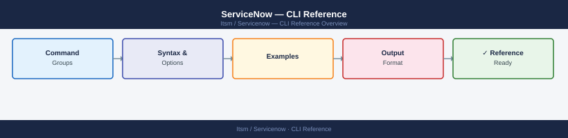

---
tags:
  - operations
  - servicenow
---
# ServiceNow — CLI Reference



```bash
export INSTANCE="https://mycompany.service-now.com"
export USER="api_user"
export PASS="your-password"
```

```bash
# Create an incident
curl -s -u "$USER:$PASS" \
  -X POST \
  "$INSTANCE/api/now/table/incident" \
  -H "Content-Type: application/json" \
  -H "Accept: application/json" \
  -d '{
    "short_description": "Database connectivity failure",
    "impact": "1",
    "urgency": "1",
    "category": "database",
    "assignment_group": "Database Operations",
    "caller_id": "john.doe@example.com"
  }' | jq '.result | {sys_id, number}'
```
```bash
# Assign an incident to a user and update state to In Progress
curl -s -u "$USER:$PASS" \
  -X PATCH \
  "$INSTANCE/api/now/table/incident/abc123def456abc123def456abc12345" \
  -H "Content-Type: application/json" \
  -H "Accept: application/json" \
  -d '{
    "state": "2",
    "assigned_to": "jane.smith",
    "work_notes": "Investigating database logs"
  }' | jq '.result.number'
```
```bash
# Delete a record (use with caution; prefer closing/cancelling)
curl -s -u "$USER:$PASS" \
  -X DELETE \
  "$INSTANCE/api/now/table/incident/abc123def456abc123def456abc12345" \
  -o /dev/null -w "%{http_code}"
# Expected: 204
```
```bash
# Count open incidents by priority
curl -s -u "$USER:$PASS" \
  "$INSTANCE/api/now/stats/incident?sysparm_query=active=true&sysparm_count=true&sysparm_group_by=priority" \
  -H "Accept: application/json" | jq '.result.stats'
```
```bash
# Average resolution time for P1 incidents closed this month
curl -s -u "$USER:$PASS" \
  "$INSTANCE/api/now/stats/incident?sysparm_query=priority=1^resolved_atONThis month@javascript:gs.beginningOfThisMonth()@javascript:gs.endOfThisMonth()&sysparm_avg_fields=resolve_time" \
  -H "Accept: application/json" | jq .
```
```bash
# Push a CI record to the import set staging table
curl -s -u "$USER:$PASS" \
  -X POST \
  "$INSTANCE/api/now/import/u_import_cmdb_server" \
  -H "Content-Type: application/json" \
  -H "Accept: application/json" \
  -d '{
    "u_name": "LON-SRV-WEB-01",
    "u_ip_address": "10.10.1.50",
    "u_os": "RHEL 9",
    "u_environment": "production",
    "u_support_group": "Linux Operations"
  }' | jq '.result | {status, sys_id}'
```
```python
import requests
from requests.auth import HTTPBasicAuth
import os

INSTANCE = os.environ["SN_INSTANCE"]  # https://mycompany.service-now.com
AUTH = HTTPBasicAuth(os.environ["SN_USER"], os.environ["SN_PASS"])
HEADERS = {"Content-Type": "application/json", "Accept": "application/json"}

session = requests.Session()
session.auth = AUTH
session.headers.update(HEADERS)
```
```python
def get_open_p1_incidents():
    url = f"{INSTANCE}/api/now/table/incident"
    params = {
        "sysparm_query": "priority=1^active=true",
        "sysparm_fields": "number,short_description,assigned_to,sys_created_on",
        "sysparm_display_value": "true",
        "sysparm_limit": 50,
    }
    response = session.get(url, params=params)
    response.raise_for_status()
    return response.json()["result"]

for inc in get_open_p1_incidents():
    print(f"{inc['number']}: {inc['short_description']} — {inc['assigned_to']['display_value']}")
```
```python
def create_change_request(short_desc: str, description: str, assignment_group: str) -> dict:
    url = f"{INSTANCE}/api/now/table/change_request"
    payload = {
        "short_description": short_desc,
        "description": description,
        "type": "normal",
        "category": "Infrastructure",
        "assignment_group": assignment_group,
        "risk": "2",       # Medium
        "impact": "2",     # Department
    }
    response = session.post(url, json=payload)
    response.raise_for_status()
    result = response.json()["result"]
    print(f"Created: {result['number']} ({result['sys_id']})")
    return result
```
```python
def get_all_records(table: str, query: str, fields: str) -> list:
    url = f"{INSTANCE}/api/now/table/{table}"
    limit = 100
    offset = 0
    all_records = []

    while True:
        params = {
            "sysparm_query": query,
            "sysparm_fields": fields,
            "sysparm_limit": limit,
            "sysparm_offset": offset,
            "sysparm_exclude_reference_link": "true",
        }
        response = session.get(url, params=params)
        response.raise_for_status()
        records = response.json()["result"]
        if not records:
            break
        all_records.extend(records)
        offset += limit

    return all_records
```
```javascript
// Example: custom endpoint that returns MID Server health
// GET /api/mycompany/operations/mid_health

(function process(/*RESTAPIRequest*/ request, /*RESTAPIResponse*/ response) {
    var gr = new GlideRecord('ecc_agent');
    gr.addQuery('status', 'Up');
    gr.query();

    var midServers = [];
    while (gr.next()) {
        midServers.push({
            name: gr.getDisplayValue('name'),
            status: gr.getDisplayValue('status'),
            version: gr.getDisplayValue('mid_version'),
            last_refreshed: gr.getDisplayValue('last_refreshed')
        });
    }

    response.setStatus(200);
    response.setBody({ mid_servers: midServers, count: midServers.length });
})(request, response);
```
```bash
curl -s -u "$USER:$PASS" \
  "$INSTANCE/api/mycompany/operations/mid_health" \
  -H "Accept: application/json" | jq .
```
```bash
# macOS via Homebrew
brew install servicenow-cli

# Or download from developer.servicenow.com/dev.do#!/downloads
```
```bash
snc configure profile set \
  --profile production \
  --url https://mycompany.service-now.com \
  --username api_user \
  --password "$SN_PASS"

snc configure profile activate --profile production
```
```bash
# Verify connectivity
snc instance info

# List available plugin versions
snc plugin list --available

# Install a plugin
snc plugin install com.snc.change_management

# Retrieve an Update Set
snc update-set retrieve --name "Sprint-2026-Q2"

# Export Update Set to XML
snc update-set export --name "Sprint-2026-Q2" --output ./exports/

# Import an Update Set XML to a target instance
snc update-set import --file ./exports/sprint-2026-q2.xml --profile dev

# Execute a background script
snc script run --file ./scripts/bulk_close_incidents.js

# ATF test suite execution
snc atf run --suite "ITSM Regression Suite"
```
```yaml
- name: Deploy Update Set to UAT
  run: |
    snc configure profile set \
      --profile uat \
      --url ${{ secrets.SN_UAT_URL }} \
      --username ${{ secrets.SN_USER }} \
      --password ${{ secrets.SN_PASS }}
    snc update-set import \
      --file ./exports/latest.xml \
      --profile uat \
      --preview-only false
```
```bash
# Obtain token
TOKEN=$(curl -s -X POST \
  "$INSTANCE/oauth_token.do" \
  -d "grant_type=password" \
  -d "client_id=$SN_CLIENT_ID" \
  -d "client_secret=$SN_CLIENT_SECRET" \
  -d "username=$USER" \
  -d "password=$PASS" | jq -r '.access_token')

# Use token
curl -s \
  -H "Authorization: Bearer $TOKEN" \
  -H "Accept: application/json" \
  "$INSTANCE/api/now/table/incident?sysparm_limit=5" | jq '.result[].number'
```

```d2
direction: right

center: "ServiceNow" {shape: rectangle}
verify: "Verify" {shape: rectangle}

center -> verify
```

## Before you begin

- **Access:** Admin credentials on all affected systems
- **Timing:** safe to run during business hours unless a step is marked ⚠ (causes interruption)
- **Dependencies:** no active upgrades or migrations on the same infrastructure
- **Logging:** capture command output — paste into the change record on completion

---

---

## Verify

- Confirm the operation completed without errors in the log or management UI
- Verify the expected state change is visible (service running, object created, config applied)
- Document the outcome in the change record

---

## See also

- [Servicenow — Procedures](../procedures/)
- [Servicenow — Scripts](../scripts/)
- [Servicenow — Health Checks](../health-checks/)
