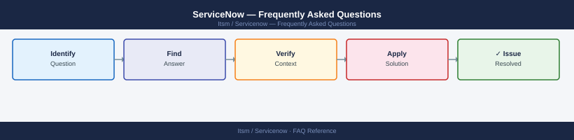

---
tags:
  - servicenow
  - faq
  - operations
---
# ServiceNow — Frequently Asked Questions

<div class="kb-summary">
Common questions about ServiceNow operations, configuration, and troubleshooting. For step-by-step procedures, see the <a href="index.md">Operations</a> section.
</div>



```d2
direction: right

hub: "ServiceNow\nOperations" {shape: hexagon}
general: "General" {shape: rectangle}
configuration: "Configuration" {shape: rectangle}
operations: "Operations" {shape: rectangle}
troubleshooting: "Troubleshooting" {shape: rectangle}
backup_and_recovery: "Backup and Recovery" {shape: rectangle}

hub -> general
hub -> configuration
hub -> operations
hub -> troubleshooting
hub -> backup_and_recovery
```

## General

**Q: How do I check which ServiceNow release is running?**
A: Navigate to System Diagnostics → Stats → Build Information, or check the browser URL for the instance version. Release names follow alphabetical convention (Xanadu, Yokohama, etc.). Check Xanadu = Nov 2024.

**Q: How do I check the current ServiceNow version?**
A: `System Diagnostics → Stats → Build Information`

## Configuration

**Q: What is the default incident assignment rule and when should it change?**
A: By default, incidents are unassigned unless auto-assignment rules are configured. Set up Assignment Rules (System Policy → Rules → Assignment) to route incidents based on category, CMDB CI, or other criteria.

**Q: How do I enable ServiceNow ITSM with CMDB auto-discovery?**
A: Enable the Discovery plugin (com.snc.discovery). Configure MID Servers for network access. Set up Discovery Schedules to scan IP ranges. Map discovered CIs to CMDB classes via Discovery Patterns.

## Operations

**Q: How do I manage a ServiceNow release upgrade?**
A: ServiceNow Cloud upgrades are managed by ServiceNow. Schedule via the Upgrade Centre. Test in sub-production (PDI) first. Review upgrade notes for skipped plugins. Complete upgrade tasks in the Upgrade Monitor post-upgrade.

**Q: What is the correct procedure to add a new CMDB CI class?**
A: Extend an existing CMDB table (e.g., `cmdb_ci_computer`) rather than creating from scratch. Add custom fields as dictionary extensions. Follow CSDM alignment for class placement. Test with Discovery before go-live.

## Troubleshooting

**Q: ServiceNow shows 'Workflow version out of date'. What does it mean?**
A: A workflow is running against an older checked-out version. Publish the current version under Workflow → Workflow Editor → Publish. Existing running instances continue on the old version; new activations use the published version.

**Q: ServiceNow portal is slow for users — where do I start?**
A: Check the System Diagnostics → Instance Health page. Review slow transactions in System Logs → Transactions. Check Business Rules for non-conditional scripts running on large tables. Review table indexes.

## Backup and Recovery

**Q: How often does ServiceNow back up data?**
A: ServiceNow SaaS instances are backed up daily by ServiceNow. You can export data via Data Export or use the Table API for custom extracts. Clone production to sub-production environments for additional safety.

**Q: Can I restore a single record that was accidentally deleted?**
A: If the Audit table captured the deletion, data can be reconstructed. Use the sys_audit table to retrieve field values at the time of deletion. ServiceNow does not have native single-record restore from backup.

## See Also

- [ServiceNow Operations](index.md)
- [ServiceNow Troubleshooting](../../troubleshooting/index.md)
