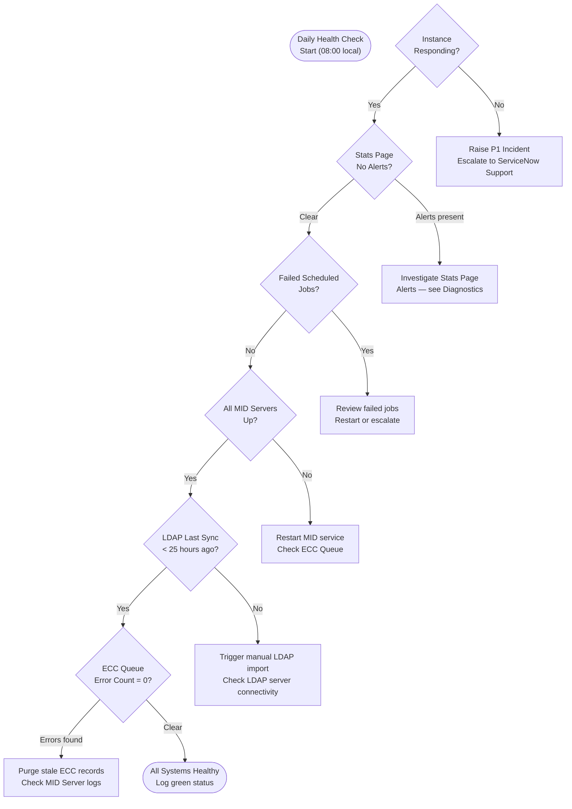

---
tags:
  - operations
  - servicenow
---
# ServiceNow — Health Checks


<div class="kb-summary">
Routine health checks detect degradation before users are impacted. This page defines the daily, weekly, and on-demand checks for a ServiceNow production instance, covering availability, performance, background processing, and MID Server health.

*Applies to: ServiceNow (Washington / Xanadu)*
</div>

---

## Before you begin

- **Access:** Admin credentials on all affected systems
- **Timing:** safe to run during business hours unless a step is marked ⚠ (causes interruption)
- **Dependencies:** no active upgrades or migrations on the same infrastructure
- **Logging:** capture command output — paste into the change record on completion

---

## Health Check Decision Flow


```text
┌───────────────────────────────────── ServiceNow — Health Checks ──────────────────────────────────────┐
│                                                                                                       │
│  Proactive health monitoring for instance performance, integrations, and ITSM data quality.           │
│                                                                                                       │
│   ┌──────────────────────────────────────────────┐  ┌─────────────────────────────────────────────┐   │
│   │             Instance Performance             │  │              Integration Health             │   │
│   │      Instance Stats: thread pool usage       │  │      MID server: connected + version OK     │   │
│   │        DB statistics: slow query log         │  │         ECC queue: no stuck messages        │   │
│   │         Memory: GC frequency + heap          │  │      REST: endpoint connectivity tests      │   │
│   │          Scheduled jobs: no backlog          │  │       LDAP: last sync timestamp < 24 h      │   │
│   └──────────────────────────────────────────────┘  └─────────────────────────────────────────────┘   │
│                                                                                                       │
│    Performance and integration checks → escalate to ServiceNow support if thresholds exceeded         │
│                                                                                                       │
│                          ▼                                                 ▼                          │
│                                                                                                       │
│   ┌──────────────────────────────────────────────┐  ┌─────────────────────────────────────────────┐   │
│   │              ITSM Data Quality               │  │               Security Posture              │   │
│   │         Open P1/P2 incidents: < SLA          │  │    ACL audit: no over-permissioned roles    │   │
│   │         SLA compliance rate: > 95 %          │  │     Login failures: review sys_log_auth     │   │
│   │       Stale changes: review RFC queue        │  │      Admin count: minimum required only     │   │
│   │        CMDB coverage: CI pop. > 90 %         │  │      MFA enforcement: all users enabled     │   │
│   └──────────────────────────────────────────────┘  └─────────────────────────────────────────────┘   │
│                                                                                                       │
│  Physical Infrastructure (the hardware everything above runs on):                                     │
│  ServiceNow SaaS nodes · MID server hosts · LDAP/AD · monitoring dashboard                            │
│                                                                                                       │
│  Key terms:                                                                                           │
│                                                                                                       │
│  Instance Stats  = stats.do page; shows node thread pool, DB pool, memory usage                       │
│  Slow query log  = DB performance log; identifies queries > threshold (default 5 s)                   │
│  GC frequency    = Java garbage collection rate; high frequency indicates memory pressure             │
│  ECC queue       = External Communication Channel; integration message buffer                         │
│  MID server      = on-prem agent for discovery/integrations; version must match instance              │
│  SLA compliance  = % of SLA goals met; breach indicates staffing or workflow issue                    │
│  RFC queue       = Request for Change queue; stale records indicate process gaps                      │
│  CMDB coverage   = % of expected CIs populated; low coverage weakens impact analysis                  │
│  sys_log_auth    = authentication log table; failed logins visible here                               │
│  ACL audit       = review of access control lists for over-permissioned roles                         │
│  Heap            = JVM memory space; approaching limit causes slowness before OOM                     │
│  Sched job backlog= queued jobs not yet executed; indicates thread starvation                         │
│                                                                                                       │
└───────────────────────────────────────────────────────────────────────────────────────────────────────┘
```

## Run This Routine

1. **Instance health** — Open `https://<instance>.service-now.com/api/now/stats` in a browser or run `curl -sk -u "$SN_USER:$SN_PASS" "https://<instance>.service-now.com/api/now/stats"`; confirm the instance is accessible and returns stats data; a login redirect or timeout indicates instance availability issues.
2. **MID Server status** — Navigate to **ServiceNow → MID Server → MID Servers**; all MID Servers must show **Status: Up** and **Validated: true**; a MID Server that is down will cause all associated discovery jobs and integration spokes to fail silently.
3. **Import and export jobs** — Navigate to **ServiceNow → System Import Sets → Import Sets**; review recent import set runs and check for any in a `Failed` or `Error` state; failed imports mean data from integrated sources (CMDB feeds, HR systems, monitoring tools) has not been ingested.
4. **Scheduled jobs** — Navigate to **ServiceNow → System Scheduler → Scheduled Jobs** and filter for `state = error`; review all jobs in error state and check the execution log for root cause; jobs most critical to check include LDAP Import, SLA Workflow, Email Reader, and any custom integrations.
5. **Integration health** — Navigate to **ServiceNow → Integration Hub → Spokes** or **IntegrationHub → Activity Stream**; confirm all active spoke connections show a healthy status and recent successful executions; a failed spoke may be silently dropping event data from monitored systems.
6. **Storage usage** — Navigate to **ServiceNow → System Diagnostics → Stats** or check with your ServiceNow administrator for database storage consumption; review the largest tables by row count to identify runaway growth from event logs or import staging tables that require archiving.
7. **Recent errors** — Navigate to **ServiceNow → System Logs → Application Log**; filter by `level = error` and `sys_created_on > last 24 hours`; review error patterns — repeated stack traces from the same script indicate a bug in a business rule or script include that should be raised as a defect.

Baseline your active session count over 2 weeks to establish normal business-hours peaks. An unexplained 3x spike often indicates a script loop or runaway REST integration.

---

## 4. Scheduled Job Health

Navigate to: **System Scheduler > Scheduled Jobs**

Filter for jobs in **Error** state:

```text
state = error
```

### Common Scheduled Jobs to Monitor

| Job Name | Expected Frequency | Impact if Failed |
|---|---|---|
| LDAP Import - Users | Daily | User accounts not synced |
| Discovery - Infrastructure | Daily / Weekly | CMDB stale |
| SLA Workflow | Every 5 minutes | SLA breach not escalated |
| Import Set Cleanup | Daily | Staging tables grow unbounded |
| Incident Inactivity Closer | Daily | Old incidents not auto-closed |
| Email Reader | Every 2 minutes | Inbound emails not processed |
| ATF Test Runner | On demand | Not applicable to production |

For any job in Error state:

1. Click the job to view the execution log
2. Check **System Logs > All** filtered to the job's last run time
3. Review the script for logic errors or external dependency failures
4. Manually trigger the job once the root cause is resolved

---

## 5. MID Server Health

Navigate to: **MID Server > MID Servers**

All production MID Servers should show **Status: Up** and **Validated: true**.

| Field | Healthy Value | Action if Not |
|---|---|---|
| Status | Up | Restart MID service on host |
| Validated | true | Check MID credentials; re-validate |
| Last refreshed | < 5 minutes ago | MID Server may be hung; restart |
| Version | Current or N-1 | Upgrade if two versions behind |

### MID Server Service Check (Linux)

```bash
# On the MID Server host
systemctl status mid-server

# Restart if needed
sudo systemctl restart mid-server

# Tail MID Server log
tail -f /opt/servicenow/mid/agent/logs/agent0.log.0
```

### MID Server Service Check (Windows)

```powershell
# Check service state
Get-Service -Name "ServiceNow MID Server_*"

# Restart
Restart-Service -Name "ServiceNow MID Server_myinstance"

# View log
Get-Content "C:\ServiceNow\MID Server\agent\logs\agent0.log.0" -Tail 50
```

---

## 6. ECC Queue Error Review

Navigate to: **MID Server > ECC Queue**

Filter: `state = error`

A healthy instance should have zero ECC queue errors. Errors indicate failed communication between the instance and MID Servers.

```bash
# Check ECC error count via API
curl -s -u "$SN_USER:$SN_PASS" \
  "$INSTANCE/api/now/stats/ecc_queue?sysparm_query=state=error&sysparm_count=true" \
  -H "Accept: application/json" | jq '.result.stats.count'
```

**Resolution steps:**

1. Identify the MID Server referenced in the error record
2. Check MID Server status (above)
3. If MID is Up but errors persist, check the **Error** field on the ECC record for the failure message
4. Stale error records older than 24 hours can be purged: change `state` to `processed` in bulk

---

## 7. LDAP / Directory Sync Status

Navigate to: **System LDAP > LDAP Listener Log**

Confirm the most recent successful run timestamp is within the last 25 hours (for daily sync schedules).

| Log Entry | Meaning |
|---|---|
| `Refreshed X users` | Successful import |
| `SSL handshake failed` | Certificate or connectivity issue |
| `Invalid credentials` | Service account password expired |
| `No records returned` | Base DN or filter misconfigured |

---

## 8. System Log Review

Navigate to: **System Logs > All**

Filter: `level = error`, `sys_created_on > last 1 hour`

Review for patterns:

- Repeated stack traces from the same script — indicates a bug in a business rule or script include
- Database timeout errors — high query load or missing index
- Outbound REST failures — external system unreachable
- Authentication failures — potential brute force or misconfigured integration account

---

## Health Check Log Template

Record daily health check results in a shared log (ticket, spreadsheet, or knowledge article):

```yaml
Date: 2026-05-08
Checked by: C. Anastasiadis
Instance: mycompany.service-now.com

Availability:       PASS  (HTTP 200, login OK)
Stats page:         PASS  (heap 62%, no thread alerts)
Active sessions:    PASS  (142 — within baseline 120-160)
Scheduled jobs:     WARN  (LDAP Import failed — investigating)
MID Server health:  PASS  (MID1: Up, MID2: Up)
ECC queue errors:   PASS  (0 errors)
LDAP sync:          FAIL  (Last sync: 30 hours ago — see above)
System log errors:  PASS  (2 errors — duplicate key, non-critical)

Actions:
- Triggered manual LDAP import at 08:15 — resolved
- Opened INC0042187 for LDAP import job failure root cause
```
