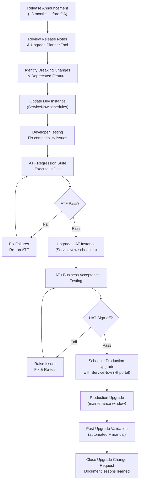

---
tags:
  - operations
  - servicenow
---
# ServiceNow — Install & Upgrade

<div class="kb-summary">
ServiceNow upgrade management: upgrade scheduling via Now Support, pre-upgrade instance clone and testing, plugin compatibility checks, and post-upgrade validation.

*Applies to: ServiceNow (Washington / Xanadu)*
</div>

---

```d2
direction: right

plan: "Plan" {shape: oval}
release_cadence: "Release Cadence" {shape: rectangle}
upgrade_lifecycle: "Upgrade Lifecycle" {shape: rectangle}
postupgrade_testing_checklist: "Post-Upgrade Testing Checklist" {shape: rectangle}
rollback_options: "Rollback Options" {shape: rectangle}
verify: "Verify" {shape: rectangle}
validate: "Validate" {shape: oval}

plan -> release_cadence
release_cadence -> upgrade_lifecycle
upgrade_lifecycle -> postupgrade_testing_checklist
postupgrade_testing_checklist -> rollback_options
rollback_options -> verify
verify -> validate
```

## Before you begin

- **Access:** Admin credentials on all affected systems
- **Timing:** safe to run during business hours unless a step is marked ⚠ (causes interruption)
- **Dependencies:** no active upgrades or migrations on the same infrastructure
- **Logging:** capture command output — paste into the change record on completion

---

## Release Cadence

ServiceNow releases two major platform versions per year, each named after a city in alphabetical order:

| Year | Releases (approximate) |
|---|---|
| 2024 | Washington DC (Q1), Xanadu (Q3) |
| 2025 | Yokohama (Q1), Zurich (Q3) |
| 2026 | Accelerate (Q1), Balboa (Q3) |

Each major release includes feature updates, security patches, and bug fixes. **Patch releases** (e.g., Xanadu Patch 3) are applied automatically by ServiceNow on a rolling basis and require no customer action.

---

## Upgrade Lifecycle



### Upgrading Plugins

Some plugins have their own release cycle independent of the platform. After a major platform upgrade:

1. Navigate to **System Definitions > Plugins**
2. Filter: **Upgrade Available = true**
3. Review each plugin's changelog
4. Upgrade in Dev first, validate, then promote to UAT and Production via the same change process

### Plugin Upgrade via CLI

```bash
snc plugin upgrade --id com.snc.itsm.workspace --profile dev
snc plugin upgrade --id com.snc.discovery --profile dev
```

---

## Post-Upgrade Testing Checklist

### Automated

- [ ] ATF Core Regression Suite passes (0 failures)
- [ ] API availability check returns HTTP 200
- [ ] MID Servers reconnect and show **Up** within 15 minutes

### ITSM Process Validation

- [ ] Create test incident — confirm priority calculation, assignment, SLA start
- [ ] Escalate test incident — confirm SLA breach notification fires
- [ ] Resolve test incident — confirm resolution workflow completes
- [ ] Create test change request — confirm approval workflow routes correctly
- [ ] Submit test service catalog request — confirm fulfillment flow

### Integrations

- [ ] LDAP import runs successfully
- [ ] Outbound REST messages reach test endpoints (use test webhooks)
- [ ] PagerDuty test event creates and resolves incident
- [ ] Discovery scan completes and populates CMDB
- [ ] Email: send test notification; confirm receipt at test mailbox

### Performance

- [ ] `stats.do` — no new heap or thread alerts post-upgrade
- [ ] Homepage load time < 3 seconds (compare to pre-upgrade baseline)
- [ ] Run at least 2 business days before declaring the upgrade stable

---

## Rollback Options

ServiceNow cloud upgrades are **not directly reversible** by the customer. Rollback options are:

| Scenario | Option | Timeframe |
|---|---|---|
| Critical defect within 4 hours | Request ServiceNow emergency rollback (HI P1) | 4–8 hours |
| Defect discovered after 4 hours | ServiceNow may restore from pre-upgrade snapshot (HI P1) | 8–24 hours |
| Non-critical issue | Fix forward via hotfix Update Set | Days |
| Plugin-specific issue | Deactivate plugin (if possible) | Minutes |

**Pre-upgrade snapshot:** ServiceNow automatically takes a snapshot before each upgrade. Request restoration via a P1 HI case within 72 hours. After 72 hours, the snapshot may be overwritten.

**Recommendation:** Plan to fix forward for non-P1 issues. The rollback window is narrow and the process disruptive. Thorough pre-upgrade testing is the primary risk mitigation.

---

## Verify

- Confirm the operation completed without errors in the log or management UI
- Verify the expected state change is visible (service running, object created, config applied)
- Document the outcome in the change record

---

## See also

- [Servicenow — Deploy](../../deploy/)
