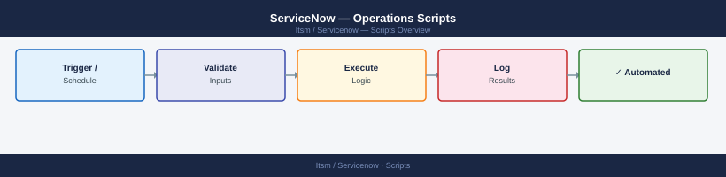

---
tags:
  - operations
  - servicenow
---
# ServiceNow — Operations Scripts



```bash
# Set environment variables before running any script
export SN_INSTANCE="https://mycompany.service-now.com"
export SN_USER="api_svc_account"
export SN_PASS="your-password"
```

```csv
username,first_name,last_name,email,title,department,roles
jdoe,John,Doe,jdoe@example.com,Senior Engineer,Infrastructure,itil|catalog
asmith,Alice,Smith,asmith@example.com,Manager,Operations,itil|change_manager
```
```python
#!/usr/bin/env python3
# sn_import_cis.py
# Usage: python3 sn_import_cis.py servers.json

import json
import sys
import os
import requests
from requests.auth import HTTPBasicAuth

INSTANCE = os.environ["SN_INSTANCE"]
AUTH = HTTPBasicAuth(os.environ["SN_USER"], os.environ["SN_PASS"])
HEADERS = {"Content-Type": "application/json", "Accept": "application/json"}

# Staging table name — must have a Transform Map configured in ServiceNow
STAGING_TABLE = "u_import_cmdb_server"

def import_ci(ci: dict) -> dict:
    payload = {
        "u_name":          ci["name"],
        "u_ip_address":    ci.get("ip", ""),
        "u_os":            ci.get("os", ""),
        "u_environment":   ci.get("environment", "production"),
        "u_support_group": ci.get("support_group", ""),
        "u_location":      ci.get("location", ""),
        "u_serial_number": ci.get("serial", ""),
        "u_source":        "external_cmdb_sync",
    }
    r = requests.post(
        f"{INSTANCE}/api/now/import/{STAGING_TABLE}",
        json=payload, auth=AUTH, headers=HEADERS
    )
    r.raise_for_status()
    return r.json()["result"]

def main(json_path: str) -> None:
    with open(json_path) as f:
        servers = json.load(f)

    success, failed = 0, 0
    for ci in servers:
        try:
            result = import_ci(ci)
            status = result.get("status", "unknown")
            print(f"  {ci['name']}: {status}")
            if status == "error":
                print(f"    Error: {result.get('error_message', 'unknown')}")
                failed += 1
            else:
                success += 1
        except Exception as e:
            print(f"  {ci['name']}: EXCEPTION — {e}")
            failed += 1

    print(f"\nSummary: {success} imported, {failed} failed")

if __name__ == "__main__":
    if len(sys.argv) != 2:
        print(f"Usage: {sys.argv[0]} <servers.json>")
        sys.exit(1)
    main(sys.argv[1])
```
```bash
#!/bin/bash
# sn_export_report.sh
# Exports incident data for the past 7 days to CSV

INSTANCE="$SN_INSTANCE"
OUTDIR="/var/exports/servicenow"
DATE=$(date +%Y%m%d)
OUTFILE="$OUTDIR/incidents_${DATE}.csv"

mkdir -p "$OUTDIR"

# Build encoded query: closed in last 7 days
QUERY="state=6^resolved_atONLast%207%20days@javascript:gs.beginningOfLast7Days()@javascript:gs.endOfLast7Days()"

curl -s -u "$SN_USER:$SN_PASS" \
  "$INSTANCE/api/now/table/incident" \
  -G \
  --data-urlencode "sysparm_query=state=6^resolved_atONLast 7 days@javascript:gs.beginningOfLast7Days()@javascript:gs.endOfLast7Days()" \
  --data "sysparm_limit=10000" \
  --data "sysparm_fields=number,short_description,priority,state,resolved_by,resolved_at,assignment_group,category" \
  --data "sysparm_display_value=true" \
  --data "sysparm_exclude_reference_link=true" \
  -H "Accept: text/csv" \
  -o "$OUTFILE"

if [[ $? -eq 0 ]]; then
  LINES=$(wc -l < "$OUTFILE")
  echo "Exported $((LINES - 1)) records to $OUTFILE"
else
  echo "ERROR: Export failed" >&2
  exit 1
fi
```
```python
#!/usr/bin/env python3
# sn_bulk_close_incidents.py

import os
import requests
from requests.auth import HTTPBasicAuth

INSTANCE = os.environ["SN_INSTANCE"]
AUTH = HTTPBasicAuth(os.environ["SN_USER"], os.environ["SN_PASS"])
HEADERS = {"Content-Type": "application/json", "Accept": "application/json"}

CLOSE_QUERY = (
    "priority=4"
    "^active=true"
    "^sys_created_onRELATIVELT@dayofweek@last90days"  # created > 90 days ago
    "^assigned_toISEMPTY"  # unassigned only
)

CLOSE_PAYLOAD = {
    "state": "7",          # Closed
    "close_code": "Closed/Resolved by Other Means",
    "close_notes": "Auto-closed: P4 incident unassigned for >90 days. "
                   "Raised via bulk closure script on behalf of Service Desk operations.",
}

DRY_RUN = True  # Set to False to actually update records

def get_incidents_to_close() -> list:
    records, offset, limit = [], 0, 100
    while True:
        r = requests.get(
            f"{INSTANCE}/api/now/table/incident",
            params={
                "sysparm_query": CLOSE_QUERY,
                "sysparm_fields": "sys_id,number,short_description",
                "sysparm_limit": limit,
                "sysparm_offset": offset,
                "sysparm_display_value": "true",
            },
            auth=AUTH, headers=HEADERS
        )
        r.raise_for_status()
        batch = r.json()["result"]
        if not batch:
            break
        records.extend(batch)
        offset += limit
    return records

def close_incident(sys_id: str) -> None:
    r = requests.patch(
        f"{INSTANCE}/api/now/table/incident/{sys_id}",
        json=CLOSE_PAYLOAD, auth=AUTH, headers=HEADERS
    )
    r.raise_for_status()

def main() -> None:
    incidents = get_incidents_to_close()
    print(f"Found {len(incidents)} incidents to close")
    if DRY_RUN:
        print("DRY RUN — no changes made. Set DRY_RUN=False to execute.")
        for inc in incidents[:20]:
            print(f"  Would close: {inc['number']} — {inc['short_description']}")
        return

    closed, failed = 0, 0
    for inc in incidents:
        try:
            close_incident(inc["sys_id"])
            print(f"  Closed: {inc['number']}")
            closed += 1
        except Exception as e:
            print(f"  FAILED: {inc['number']} — {e}")
            failed += 1

    print(f"\nSummary: {closed} closed, {failed} failed")

if __name__ == "__main__":
    main()
```
```bash
#!/bin/bash
# sn_mid_status.sh
# Reports MID Server health from ServiceNow instance

INSTANCE="$SN_INSTANCE"

echo "MID Server Status Report — $(date -u '+%Y-%m-%d %H:%M UTC')"
echo "================================================================"

curl -s -u "$SN_USER:$SN_PASS" \
  "$INSTANCE/api/now/table/ecc_agent" \
  -G \
  --data "sysparm_fields=name,status,validated,mid_version,last_refreshed,ip_address" \
  --data "sysparm_display_value=true" \
  --data "sysparm_limit=100" \
  --data "sysparm_exclude_reference_link=true" \
  -H "Accept: application/json" | \
  python3 -c "
import sys, json
from datetime import datetime, timezone

data = json.load(sys.stdin)
mids = data.get('result', [])

issues = 0
for m in mids:
    status = m.get('status', 'unknown')
    validated = m.get('validated', 'false')
    name = m.get('name', 'unknown')
    version = m.get('mid_version', 'unknown')
    last_refresh = m.get('last_refreshed', '')
    ip = m.get('ip_address', '')

    flag = ''
    if status != 'Up':
        flag = '  <<< STATUS NOT UP'
        issues += 1
    elif validated == 'false':
        flag = '  <<< NOT VALIDATED'
        issues += 1

    print(f'  {name:<30} {status:<10} validated={validated:<5} v={version:<15} ip={ip}{flag}')

print()
print(f'Total MID Servers: {len(mids)} | Issues: {issues}')
sys.exit(1 if issues > 0 else 0)
"
```
```text
MID Server Status Report — 2026-05-08 08:00 UTC
================================================================
  mid-lon-prod-01                Up         validated=true  v=8.4.0.123      ip=10.10.1.200
  mid-lon-prod-02                Up         validated=true  v=8.4.0.123      ip=10.10.1.201
  mid-nyc-prod-01                Down       validated=true  v=8.4.0.100      ip=10.20.1.200  <<< STATUS NOT UP

Total MID Servers: 3 | Issues: 1
```

## Before you begin

- **Access:** Admin credentials on all affected systems
- **Timing:** safe to run during business hours unless a step is marked ⚠ (causes interruption)
- **Dependencies:** no active upgrades or migrations on the same infrastructure
- **Logging:** capture command output — paste into the change record on completion

---

---

## Verify

- Confirm the operation completed without errors in the log or management UI
- Verify the expected state change is visible (service running, object created, config applied)
- Document the outcome in the change record

---

## See also

- [Servicenow — Procedures](../procedures/)
- [Servicenow — CLI Reference](../cli-reference/)
- [Servicenow — Health Checks](../health-checks/)
