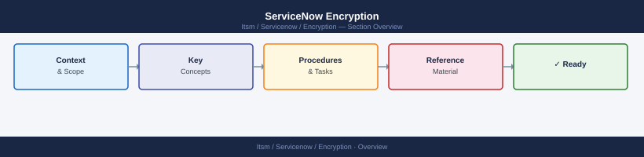

---
tags:
  - security
  - servicenow
---
# ServiceNow Encryption



```javascript
// Verify TLS certificate validation is enforced for outbound calls
// System Properties → glide.http.ssl_check_cert = true (default)

gs.getProperty('glide.http.ssl_check_cert')  // Should return 'true'

// For a specific REST message — verify SSL is enforced
// System Web Services → Outbound → REST Messages
// Open REST Message → HTTP Methods → SSL enforcement: Enforce SSL/TLS
```

```javascript
// Enable field encryption on a specific field
// Navigate to: Dictionary Entry for the field
// System Definition → Dictionary → find table/field
// Set: Encryption context = Default Encryption Context

// Example: encrypt the 'password' field on an integration table
// Table: u_integration_credentials
// Field: u_password
// In Dictionary: Encryption context → select encryption context
```
```javascript
// Script to list fields with encryption enabled
var dictRec = new GlideRecord('sys_dictionary');
dictRec.addQuery('encryption_type', 'ENCRYPT');
dictRec.query();
while (dictRec.next()) {
    gs.info('Table: ' + dictRec.name + ' | Field: ' + dictRec.element);
}
```
```javascript
// Retrieve a credential programmatically (Script Include)
var credMgr = new CredentialResolver();
var creds = credMgr.getCredentials('basic', 'target-host.corp.example.com');
// Returns: {user_name: '...', password: '...'}  — encrypted in transit within the instance
```
```bash
# List all discovery credentials via REST API
curl -u "admin:TOKEN" \
  -H "Accept: application/json" \
  "https://<instance>.service-now.com/api/now/table/discovery_credentials" \
  | jq '.result[] | {name: .name, type: .type, active: .active}'
```
```javascript
// External credential resolver — CyberArk integration
// Plugin: com.snc.integration.credential_resolver.cyberark

// System Properties:
// credential_resolver.cyberark.url = https://cyberark.corp.example.com
// credential_resolver.cyberark.app_id = SNOW-Integration
// credential_resolver.cyberark.safe = SNOW-Credentials
// credential_resolver.cyberark.certificate = <path to cert>
```
```javascript
// Enforce per REST message via script
var sm = new sn_ws.RESTMessageV2('MyIntegration', 'get_data');
sm.setEndpoint('https://api.corp.example.com/data');
sm.setHttpMethod('GET');

// These are set in the UI on the REST Message record:
// Authentication Type: Basic | OAuth 2.0 | Mutual Authentication
// Mutual Authentication: Select certificate alias
// Enforce SSL: true

var response = sm.execute();
gs.info('Status: ' + response.getStatusCode());
```
```bash
# Import a CA certificate into ServiceNow trust store
# Navigate to: System Definition → Certificates → New
# Type: CA certificate
# PEM certificate: paste CA certificate PEM

# Import a client certificate for mTLS
# Navigate to: System Definition → Certificates → New
# Type: Client certificate
# PEM certificate: paste client cert
# PEM private key: paste private key (stored encrypted)
```
```javascript
// Test SMTP configuration
var mailer = new GlideEmailOutbound();
mailer.setSubject('Test email from ServiceNow');
mailer.setBody('TLS connectivity test');
mailer.addAddress('to', 'admin@corp.example.com', 'Admin');
mailer.send();
```
```javascript
// ACL preventing export of sensitive tables
// Name: read_sc_request.export
// Operation: export (custom operation)
// Condition:
gs.hasRole('report_admin') || gs.hasRole('admin')
```

## Before you begin

- **Access:** Admin credentials on all affected systems
- **Change management:** security changes require CAB approval in most environments
- **Rollback plan:** document current state before any security control change
- **Testing:** validate in a non-production environment first where possible

---

---

## See also

- [Servicenow — Hardening](../hardening/)
- [Servicenow — Authentication](../authentication/)
- [Servicenow — Access Control](../access-control/)
