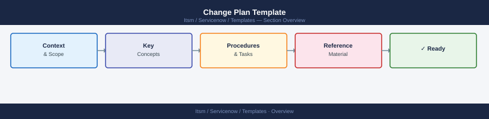

---
tags:
  - servicenow
---
# Change Plan Template


<div class="kb-summary">
Change Plan Template reference covering Overview, Change Summary, Pre-Change Checklist, Implementation Steps, Validation Steps and 1 more sections.

*Applies to: ServiceNow*
</div>



```d2
direction: right

center: "ServiceNow" {shape: hexagon}
change_summary: "Change Summary" {shape: rectangle}
prechange_checklist: "Pre-Change Checklist" {shape: rectangle}
implementation_steps: "Implementation Steps" {shape: rectangle}
validation_steps: "Validation Steps" {shape: rectangle}
rollback_plan: "Rollback Plan" {shape: rectangle}

center -> change_summary
center -> prechange_checklist
center -> implementation_steps
center -> validation_steps
center -> rollback_plan
```

## Overview

This template provides a structured format for planning infrastructure or application changes in production environments.

## Change Summary

- Change description
- Systems affected
- Business justification
- Maintenance window

## Pre-Change Checklist

- Confirm approvals
- Verify backups
- Validate rollback plan
- Notify stakeholders

## Implementation Steps

1. Execute planned change
2. Monitor system behavior
3. Document results

## Validation Steps

- Confirm services running
- Verify monitoring alerts clear
- Validate user access

## Rollback Plan

- Restore previous configuration
- Restart services
- Validate system stability
