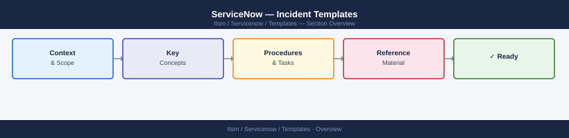

---
tags:
  - servicenow
---
# ServiceNow — Incident Templates

Incident record templates for common failure types — P1 outage, service degradation, security incident, and infrastructure failure templates.

*Applies to: ServiceNow*

