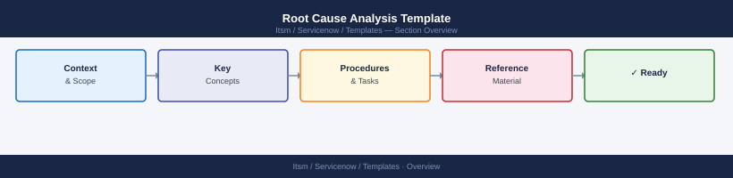

# Root Cause Analysis Template


<div class="kb-summary">
Root Cause Analysis Template reference covering Overview, Incident Summary, Timeline, Root Cause, Corrective Actions and 1 more sections.

*Applies to: ServiceNow*
</div>



```d2
direction: right

center: "ServiceNow" {shape: hexagon}
incident_summary: "Incident Summary" {shape: rectangle}
timeline: "Timeline" {shape: rectangle}
root_cause: "Root Cause" {shape: rectangle}
corrective_actions: "Corrective Actions" {shape: rectangle}
preventive_actions: "Preventive Actions" {shape: rectangle}

center -> incident_summary
center -> timeline
center -> root_cause
center -> corrective_actions
center -> preventive_actions
```

## Overview

This template documents incidents, root causes, corrective actions, and prevention strategies.

## Incident Summary

- Incident date and time
- Systems affected
- Duration of outage
- Impact description

## Timeline

- Detection
- Response
- Recovery

## Root Cause

- Primary failure
- Contributing factors

## Corrective Actions

- Immediate fix applied
- Validation performed

## Preventive Actions

- Monitoring improvements
- Process updates
- Training requirements
