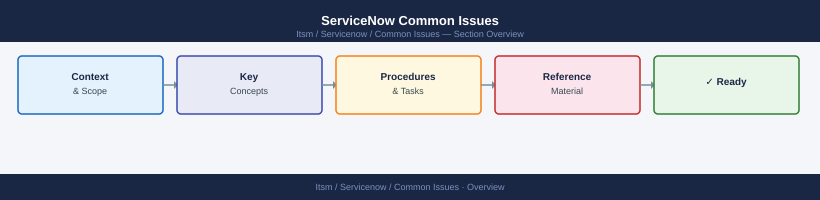
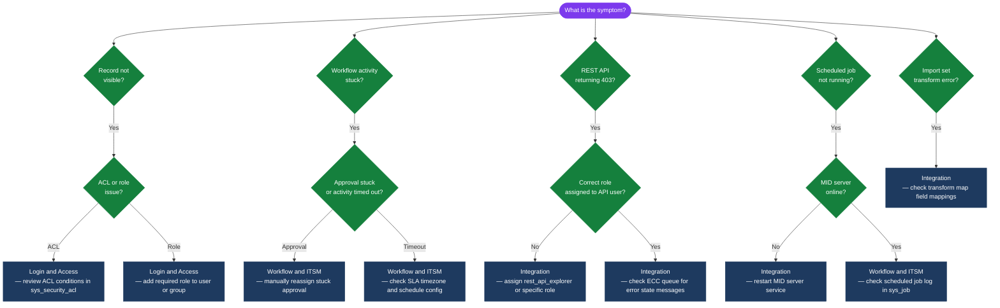

---
tags:
  - servicenow
  - troubleshooting
search:
  boost: 1.5
---
# ServiceNow Common Issues



```javascript
// To find long-running transactions, run in Background Scripts:
var gr = new GlideRecord('sys_running_transaction');
gr.query();
while (gr.next()) {
    gs.print(gr.getValue('name') + ' | ' + gr.getValue('duration') + ' | ' + gr.getValue('thread'));
}
```

```bash
# Linux — check if MID service is running
systemctl status mid-server
journalctl -u mid-server -n 50

# Check wrapper.log for auth or connectivity errors
tail -100 /opt/servicenow/mid/agent/logs/wrapper.log | grep -i "error\|warn\|401\|connect"

# Verify connectivity to instance
curl -sk https://<instance>.service-now.com/api/now/table/sys_user?sysparm_limit=1 -o /dev/null -w "%{http_code}\n"
```
```powershell
# Windows — check service
Get-Service -Name "snc_mid" | Select-Object Status, StartType
Start-Service -Name "snc_mid"

# View recent log lines
Get-Content "C:\ServiceNow\MID Server\agent\logs\wrapper.log" -Tail 50 | Select-String "ERROR|WARN|401"
```

## Diagnostic Flow



---

## Before you begin

- **Access:** Admin credentials on all affected systems
- **Gather first:** recent error message text, event timestamps, and affected object names
- **Scope:** confirm whether the issue affects a single object, host, cluster, or site
- **Escalation:** open a vendor support ticket before running any destructive step
- **Logging:** document each command and output — required if escalation is needed

---

---

## Verify resolution

- Confirm the original symptom no longer occurs
- Check logs for any residual errors related to the issue
- Monitor for 10–15 minutes to confirm the fix is stable

---

## See also

- [Servicenow — Diagnostics](../diagnostics/)
- [Servicenow — Escalation](../escalation/)
- [Servicenow — Health Checks](../../operations/health-checks/)
