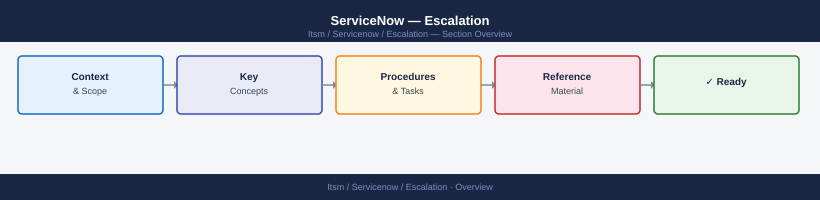

---
tags:
  - servicenow
  - troubleshooting
search:
  boost: 1.5
---
# ServiceNow — Escalation

<div class="kb-summary">
ServiceNow escalation: how to collect stats.do output and sys_log entries, open a case on the HI support portal, set severity, and follow the escalation path for instance unavailability, upgrade failures, and integration errors.

*Applies to: ServiceNow (SaaS — any release)*
</div>



## Before you begin

- **Access:** System Administrator role on the ServiceNow instance; HI portal account with access to your instance
- **Gather first:** instance name (e.g., `mycompany.service-now.com`), exact error message, and whether the issue is in production or sub-production
- **Status check:** check `status.servicenow.com` before escalating — platform-wide incidents are tracked there
- **Sub-production:** always try to reproduce on a non-production instance first; if you can reproduce there, it is a configuration or upgrade issue, not a platform incident
- **Logging:** always export `sys_log` filtered to error level and the time window before creating the case

---

## Severity Levels

| Severity | Definition | Response SLA |
|---|---|---|
| P1 — Critical | Production instance completely unavailable; all users blocked; no workaround | 1 hour (24×7) — call ServiceNow support phone |
| P2 — High | Major function broken (ITSM incident management down, critical integration failing); workaround unavailable | 4 hours (business hours + on-call) |
| P3 — Medium | Non-critical function impaired; workaround available; sub-production only | 1 business day |
| P4 — Low | General guidance; feature question; configuration how-to | 2 business days |

## Pre-Escalation Triage Checklist

| Check | Where to check | Expected |
|---|---|---|
| Instance accessible | Browse to `https://<instance>.service-now.com` | Login page loads |
| ServiceNow status page | `status.servicenow.com` | No active incidents for your region |
| stats.do shows JVM healthy | `https://<instance>.service-now.com/stats.do` | JVM uptime > 0; no OutOfMemoryError |
| Database connections adequate | `stats.do` → DB connection pool | Not exhausted (fewer than max connections) |
| Scheduler running | `stats.do` → Scheduler status | `Running` |
| ECC queue activity | sys_ecc_queue list filtered by `state=error` | No persistent errors in the ECC queue |
| MID Server heartbeat (if integration issue) | MID Server → Status | Agent is "UP"; last heartbeat < 5 min ago |
| Recent upgrade | `sys_upgrade_history` list | Last upgrade completed without errors |

---

## Step-by-Step Data Collection

### 1. Capture stats.do output

```text
1. Navigate to: https://<instance>.service-now.com/stats.do
2. Use Ctrl+A and Ctrl+C to copy the entire page content
3. Paste into a text file: stats-<date>-<time>.txt
4. Key items to note from stats.do:
   - Java version and uptime
   - Number of database connections (current vs max)
   - Scheduler state
   - Any WARN or ERROR messages at the top
   - Memory usage (heap used / heap max)
```

### 2. Export sys_log entries

```javascript
// From ServiceNow Navigator, go to: System Log > All
// Apply these filters:
//   Level = error
//   Created > [start time of issue - 1 hour]
// Export: right-click column header → Export → CSV

// Or use the REST API:
// GET /api/now/table/sys_log?sysparm_query=level=error^sys_created_on>2026-06-15 09:00:00&sysparm_limit=200&sysparm_fields=sys_created_on,level,source,message
```

### 3. Collect a thread dump (for hangs or slow performance)

```text
1. Navigate to: https://<instance>.service-now.com/thread_dump.do
   (requires System Administrator role)
2. Click "Get Thread Dump"
3. Save the output to: thread-dump-<date>-<time>.txt
4. Repeat 3 times, 60 seconds apart, to capture thread state over time
```

### 4. Collect the diagnostics archive

```text
1. Navigate to: https://<instance>.service-now.com/diag_stats.do
2. Click "Download Diagnostics" (creates a ZIP of stats, logs, and configuration)
3. Save: diagnostics-<instance>-<date>.zip

Alternatively, for a full support bundle:
1. Navigate to: System Diagnostics > Support Bundle
2. Click "Create Bundle" — may take 3–5 minutes
3. Download the resulting ZIP when complete
```

### 5. Collect integration-specific data (if the issue is in an integration)

```text
For MID Server issues:
  - MID Server logs: <mid-server-install-dir>/logs/agent0.log
  - MID Server status: https://<instance>.service-now.com/mid_server.do

For REST/SOAP integration issues:
  - Outbound REST log: System Log > Outbound REST Messages
  - Filter by: Response Status != 200, Created > [issue start time]

For email issues:
  - Email log: System Mailboxes > Email Logs
  - ECC queue errors: sys_ecc_queue filtered by state=error
```

### 6. Write the timeline and case template

```text
INSTANCE: mycompany.service-now.com
VERSION: Yokohama Patch 5 (from stats.do)
PRIORITY REQUESTED: P1 Critical

ISSUE START TIME: 2026-06-15 09:00 UTC

ISSUE DESCRIPTION:
Production instance returning HTTP 503 for all requests since 09:00 UTC.
Users cannot log in. All ITSM operations affected.

IMPACT:
- 500+ users unable to access ServiceNow
- ITSM incident management unavailable
- Critical integrations (Jira, Splunk) not able to call ServiceNow APIs

STEPS TO REPRODUCE:
1. Navigate to https://mycompany.service-now.com
2. Observe HTTP 503 response (confirmed via curl from multiple locations)

WHAT HAS BEEN CHECKED:
- status.servicenow.com: No active incidents for EMEA at 09:00 UTC
- stats.do: Unreachable (503)
- Network: Outbound from user locations confirmed working via alternate SaaS tools

CHANGES IN PRIOR 24H:
- No administrative changes made to the instance
- No scheduled upgrades

CONTACT:
Primary: <name>, <email>, <phone>
Secondary: <name>, <email>
```

---

## How to Open a HI Support Case

1. Go to **hi.service-now.com** and sign in with your ServiceNow support account.
   - If no account: contact your ServiceNow account team to create credentials for your company's HI account.

2. Click **Create Case** (top navigation).

3. Under **Instance**, enter your instance name (`mycompany.service-now.com`).

4. Under **Category**, select:
   - **Platform / Application Availability** — for instance down or unreachable
   - **Upgrade / Patch** — for upgrade failures or regression after patching
   - **Integration** — for MID Server, REST, or SOAP issues
   - **Performance** — for slow response times or timeouts

5. Under **Priority**, select:
   - **P1 — Critical**: Instance completely unavailable; no users can access
   - **P2 — High**: Major function broken; significant business impact
   - **P3 — Moderate**: Non-critical issue; workaround available
   - **P4 — Low**: General question or feature request

6. In the **Short Description**: `[PROD] P1 — Instance unavailable — HTTP 503 since 09:00 UTC 2026-06-15`.

7. In the **Description**, paste the timeline and template from step 6 above.

8. Upload attachments:
   - `stats-<date>.txt` — stats.do output
   - `thread-dump-*.txt` — three thread dumps (if performance/hang issue)
   - `sys_log-export.csv` — sys_log error entries
   - `diagnostics-<instance>-<date>.zip` — full diagnostics bundle
   - MID Server `agent0.log` (if MID Server issue)

9. Click **Submit**. Case number arrives by email immediately.

10. **P1 only:** The case confirmation page shows the ServiceNow support phone number for your region (NA, EMEA, APAC). Call it immediately — do not wait for an email response.

---

## Escalation Path

```text
Step 1 — Open HI portal case with stats.do output and sys_log export
         ↓
Step 2 — For P1: call ServiceNow support phone immediately after opening the case
         (number on case confirmation page; 24×7 for P1)
         ↓
Step 3 — ServiceNow NOC confirms instance state and triage begins (typically < 1 hour for P1)
         ↓
Step 4 — If no meaningful progress in 2 hours for P1 / 1 business day for P2:
         → Add a case update: "Requesting escalation to Senior Support Engineer"
         → State business impact: "[n] users blocked; [process/service] offline since [time]"
         ↓
Step 5 — For a confirmed platform defect (hotfix needed):
         → ServiceNow engineering creates an emergency patch
         → You will be asked to apply it during a maintenance window
         ↓
Step 6 — For data integrity or security incidents (accidental data deletion, ACL bypass):
         → Engage ServiceNow Trust and Reliability team through your account manager
         → ServiceNow retains backups for 7 days; request restore must go through the account team
```

---

## What NOT to Do

| Do NOT do this | Why | What to do instead |
|---|---|---|
| Restart the MID Server repeatedly during a P1 incident | Clears the ECC queue and loses in-flight messages that ServiceNow support needs | Stop the MID Server once; capture `agent0.log`; restart only after ServiceNow guidance |
| Apply a ServiceNow upgrade during an active incident | Upgrades modify system tables and can mask or worsen the root cause | Freeze all upgrades until P1 is resolved |
| Roll back a customisation by deactivating all business rules | Can break dependent processes across the platform | Identify the specific customisation that changed; revert only that record |
| Export sys_log to a public file share for attachment | sys_log may contain sensitive data (user names, API keys in error messages) | Export to a secured location; upload directly to HI portal case only |
| Open multiple P1 cases for the same instance issue | Splits the engineering team's focus | Add updates to the original case; reference the case ID in all communications |

---

## Useful Commands for Case Updates

```javascript
// REST API calls — run from a browser or curl with your ServiceNow credentials

// Get recent error log count (include in every case update)
// GET https://<instance>.service-now.com/api/now/stats/sys_log?sysparm_query=level=error^sys_created_onONLast 1 hours@javascript:gs.beginningOfLast1Hours()@javascript:gs.endOfLast1Hours()&sysparm_count=true
// → Returns total count of error log entries in the last hour

// Check scheduler is running
// GET https://<instance>.service-now.com/api/now/table/sys_trigger?sysparm_query=claim^sys_updated_onONToday@javascript:gs.beginningOfToday()@javascript:gs.endOfToday()&sysparm_limit=1

// Check active user sessions count
// GET https://<instance>.service-now.com/api/now/stats/sys_user_session?sysparm_count=true&sysparm_query=active=true
```

```bash
# From CLI — check instance availability
curl -s -o /dev/null -w "%{http_code}" https://<instance>.service-now.com/

# Check MID Server log for connection errors (on MID Server host)
grep -i "error\|exception\|fail" <mid-install-dir>/logs/agent0.log | tail -50

# Test outbound connectivity from MID Server
curl -sk -o /dev/null -w "%{http_code}" https://<instance>.service-now.com/api/now/table/incident?sysparm_limit=1
```

---

## See also

- [ServiceNow — Diagnostics](../diagnostics/)
- [ServiceNow — Common Issues](../common-issues/)

---

## Verify resolution

- Confirm `https://<instance>.service-now.com` loads the login page and users can authenticate
- Check `stats.do` for healthy JVM uptime, adequate database connections, and scheduler in Running state
- Verify the specific function that was broken (ITSM incident creation, integration, upgrade) works end-to-end
- Monitor `sys_log` error count for 30 minutes after resolution before closing the case
