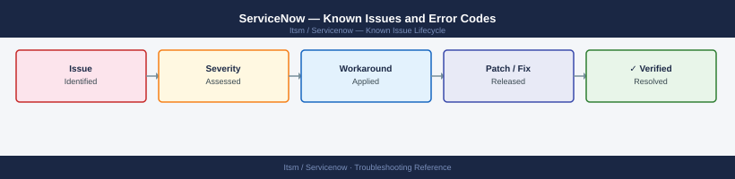

---
tags:
  - troubleshooting
  - servicenow
  - itsm
  - known-issues
---
# ServiceNow — Known Issues and Error Codes

<div class="kb-summary">
Catalog of known ServiceNow bugs, error codes, and workarounds covering MID Server, integrations, and instance performance.

*Applies to: ServiceNow Washington DC / Xanadu releases*
</div>



```d2
direction: down

symptom: Identify Symptom {shape: diamond}
mid_server: "MID Server" {shape: rectangle}
integrations: "Integrations" {shape: rectangle}
performance: "Performance" {shape: rectangle}
resolution: Resolve or Escalate {shape: oval}

symptom -> mid_server: investigate
symptom -> integrations: investigate
symptom -> performance: investigate
mid_server -> resolution
integrations -> resolution
performance -> resolution
```

## Before you begin

- ServiceNow errors appear in `System Log → All` in the instance UI.
- MID Server logs: `<mid-server-install>\logs\agent0.log.0`.
- Most MID Server issues are outbound connectivity (TCP 443 to instance URL).

## MID Server

| Error / Symptom | Affected Versions | Cause | Workaround / Fix | Fixed In |
|---|---|---|---|---|
| MID Server `Down` in ServiceNow | Any | MID Server service stopped or TCP 443 blocked | Restart MID Server: `service mid-server restart`; verify TCP 443 to `<instance>.service-now.com` | N/A |
| `MID Server validation failed` | Any | MID Server version incompatible with instance version | Upgrade MID Server to version matching instance release | N/A |
| Discovery not finding targets | Any | MID Server cannot reach targets on required ports (22/5985/161) | Verify MID Server network access to target IPs on required ports | N/A |

## Integrations

| Error / Symptom | Affected Versions | Cause | Workaround / Fix | Fixed In |
|---|---|---|---|---|
| `REST API integration returning 403` | Any | Integration service account lacks API access role | Assign `web_service_admin` or specific API role to integration user | N/A |
| Inbound email action not triggering | Any | Email inbound action rule condition not matching | Check inbound action rule condition in `System Policy → Inbound Actions` | N/A |

## Performance

| Error / Symptom | Affected Versions | Cause | Workaround / Fix | Fixed In |
|---|---|---|---|---|
| Slow list views with many records | Any | Missing index on filtered column | Add ServiceNow index via `sys_db_object`; contact ServiceNow support for large deployments | N/A |
| Background jobs backlogged | Any | Too many concurrent scheduled jobs | Stagger job schedules; increase worker thread pool in instance settings | N/A |

## See also

- [ServiceNow — Common Issues](common-issues/)
- [Ansible — Known Issues](../../../automation/ansible/troubleshooting/known-issues.md)
