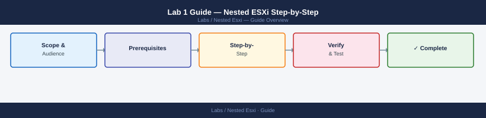

---
tags:
  - esxi
  - vsphere
  - compute
---
# Lab 1 Guide — Nested ESXi Step-by-Step

<div class="kb-summary">
Complete procedure for Lab 1: configure the physical host, create nested ESXi VMs, install ESXi, deploy vCenter, and build a basic cluster.
</div>


---

## Phase 1 — Prepare the Physical Host

**1.1 Verify nested virtualisation support**

```bash
# On the physical ESXi host — confirm VT-x / EPT is exposed
grep -i "vmx\|ept\|svm\|npt" /proc/cpuinfo | head -5
# Or check in vSphere client: Host > Manage > Hardware > CPU > Virtualisation
```

**1.2 Enable promiscuous mode on the management portgroup**

In vSphere client on the physical host:

1. Go to **Networking > Virtual Switches (or vDS) > Management portgroup > Edit settings**
2. Under **Security**, set all three options to **Accept**:
   - Promiscuous Mode → Accept
   - MAC Address Changes → Accept
   - Forged Transmits → Accept

This allows nested VMs to send and receive frames with different MAC addresses, which is required for nested ESXi vmkernel traffic.

**1.3 (Optional) Create a dedicated portgroup for nested management**

If you want to isolate nested VMs from physical management traffic, create a second portgroup on the same vSwitch assigned to a separate VLAN or the same VLAN as management. Apply the same security policy (Promiscuous + Forged Transmits).

---

## Phase 2 — Create Nested ESXi VMs

Create two VMs with these exact settings. Repeat for ESXi-01 and ESXi-02.

**VM configuration**

| Setting | Value |
|---|---|
| Guest OS | VMware ESXi 7.x or later |
| vCPU | 4 (minimum 2) |
| RAM | 12 GB (minimum 8 GB) |
| Network adapter | VMXNET3 × 2 (management + optional vSAN/vMotion) |
| SCSI controller | VMware Paravirtual (PVSCSI) |
| Boot disk | 32 GB thin provisioned |
| CD/DVD | Mount ESXi ISO |

**Critical VM advanced settings** — add these to each nested ESXi VM's `.vmx` file or via Edit Settings > VM Options > Advanced > Edit Configuration:

```text
vhv.enable = TRUE
disk.EnableUUID = TRUE
```

`vhv.enable` exposes CPU virtualisation extensions to the nested guest. `disk.EnableUUID` ensures virtual disks get a unique ID — required for vSAN and the vSphere CSI driver.

**Add the settings via vSphere client:**

1. Right-click VM > **Edit Settings**
2. **VM Options** tab > **Advanced** > **Edit Configuration...**
3. Add parameter: `vhv.enable` = `TRUE`
4. Add parameter: `disk.EnableUUID` = `TRUE`

---

## Phase 3 — Install ESXi in Nested VMs

Power on each nested ESXi VM and boot from the ISO.

**3.1 Run the ESXi installer**

1. Accept the EULA
2. Select the 32 GB boot disk
3. Set keyboard layout and root password
4. Confirm and allow the installer to reformat the disk

**3.2 Configure management network (DCUI)**

After reboot, press **F2** at the DCUI and log in as `root`:

1. **Configure Management Network > Network Adapters** — select `vmnic0`
2. **IPv4 Configuration** — set static IP (e.g., 192.168.1.11 for ESXi-01)
3. **DNS Configuration** — set DNS server IP and hostname (`esxi-01.lab.local`)
4. Press **Escape** and confirm restart of management network

**3.3 Verify connectivity**

```bash
# From your workstation or physical host
ping 192.168.1.11
# Access ESXi host client: https://192.168.1.11
```

Repeat Phase 3 for ESXi-02 (use IP 192.168.1.12, hostname `esxi-02.lab.local`).

---

## Phase 4 — Deploy vCenter (VCSA)

**4.1 Run the VCSA installer**

The VCSA OVA is deployed from the vSphere client on the physical host (or from a workstation using the VCSA installer GUI).

From the VCSA installer (Windows/Mac/Linux):

1. Launch `vcsa-ui-installer` → **Install**
2. **Stage 1 — Deploy appliance:**
   - Target: physical ESXi host IP, credentials
   - Deployment size: **Tiny** (sufficient for lab: 4 vCPU, 19 GB RAM, 415 GB disk — use thin provisioning)
   - Network: management portgroup, static IP `192.168.1.10`, gateway, DNS
   - FQDN: `vcenter.lab.local`
3. Wait for Stage 1 to complete (~15 min)
4. **Stage 2 — Configure appliance:**
   - NTP server: your gateway or `pool.ntp.org`
   - SSO domain: `vsphere.local`, choose SSO password
   - SSO username default: `administrator@vsphere.local`
5. Wait for Stage 2 (~15 min)

**4.2 Add nested ESXi hosts to vCenter**

1. Log in to vCenter: `https://192.168.1.10`
2. **Hosts and Clusters** > Right-click vCenter > **New Datacenter** → name: `Lab-DC`
3. Right-click `Lab-DC` > **Add Host**
4. Enter `192.168.1.11`, root credentials → accept certificate → Finish
5. Repeat for `192.168.1.12`

---

## Phase 5 — Create a Cluster

**5.1 Create a cluster in vCenter**

1. Right-click `Lab-DC` > **New Cluster** → name: `Lab-Cluster`
2. Enable **DRS** (set to Manual for lab — avoids unintended vMotions)
3. Enable **HA** (optional for lab — requires shared storage or vSAN)
4. Finish without enabling vSAN (that is Lab 2)

**5.2 Move hosts into the cluster**

Drag both nested ESXi hosts from the datacenter into `Lab-Cluster`.

**5.3 (Optional) Add a vMotion VMkernel**

On each nested ESXi host in vCenter:

1. **Configure > Networking > VMkernel adapters > Add**
2. Use management portgroup or a separate portgroup
3. Tag the VMkernel for **vMotion**
4. Set a static IP in the same subnet (e.g., 192.168.1.21, .22)

**5.4 Verify cluster**

- vCenter > `Lab-Cluster` > **Summary** — both hosts should show green
- Right-click a nested host > **Maintenance Mode** to confirm DRS/vMotion works (if vMotion VMkernel is configured)

---

## Known Issues in Nested Environments

| Issue | Cause | Fix |
|---|---|---|
| `vhv.enable` setting ignored | VM powered on when setting was added | Power off the VM, add the setting, then power on |
| Nested ESXi won't boot (EFI) | EFI firmware incompatible on some nested setups | Change VM firmware to **BIOS** in VM Options |
| High CPU Ready latency | Nested scheduling overhead | Expected in nested; reduce vCPU count to lower overhead |
| VMXNET3 driver missing in ESXi | Rare; older ISO | Use E1000 as a fallback NIC type for the nested VM |
| vSAN disks not detected | `disk.EnableUUID` not set | Set `disk.EnableUUID = TRUE`, power cycle the VM |
| vCenter deploy fails DNS | No forward/reverse DNS for VCSA FQDN | Add hosts-file entries on physical host and use IP for install |

---

## Next Steps

- [Lab 2 — vSAN 2-node + Witness](../../vsan-2node/) — add shared storage to this cluster
- [Lab 3 — NSX-T in Nested ESXi](../../nsx-nested/) — add software-defined networking
- [vCenter Cheat Sheet](../../../reference/cheat-sheets/vcenter/)
- [ESXi Cheat Sheet](../../../reference/cheat-sheets/esxi/)
