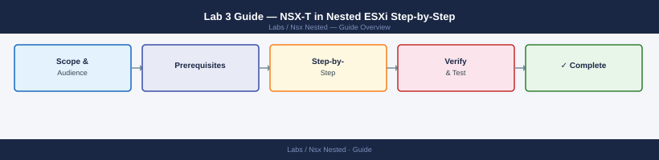

---
tags:
  - nsx
  - networking
  - vsphere
description: "Deploy NSX Manager, register vCenter as a compute manager, prepare ESXi transport nodes, create overlay segments, and write a basic DFW allow/deny rule."
---
# Lab 3 Guide — NSX-T in Nested ESXi Step-by-Step

*Applies to: Lab / Nested Environment*

<div class="kb-summary">
Deploy NSX Manager, register vCenter as a compute manager, prepare ESXi transport nodes, create overlay segments, and write a basic DFW allow/deny rule.
</div>


---

## Phase 1 — Deploy NSX Manager

**1.1 Download NSX Manager OVA**

From VMware Customer Connect: search **NSX-T Data Center** → download the NSX Unified Appliance OVA (same OVA for Manager and combined roles).

**1.2 Deploy via vSphere Client**

1. In vCenter: right-click a host or cluster > **Deploy OVF Template**
2. Upload the NSX Manager OVA
3. **Configuration**: select **NSX Manager** role
4. **Deployment size**: **Small** for lab (4 vCPU, 16 GB RAM, 300 GB disk)
5. **Network mapping**: map to the management portgroup
6. **Customize template**:
   - Hostname (FQDN): `nsx-mgr.lab.local`
   - Management IP: 192.168.1.20
   - Gateway, DNS, NTP: match your lab environment
   - Admin password (must meet complexity requirements: 8+ chars, upper, lower, digit, special)
7. Complete and power on

**1.3 Verify NSX Manager is up**

```bash
# Wait ~5-10 min, then test from workstation
curl -k https://192.168.1.20/api/v1/cluster/status
# Expect: {"mgmt_cluster_status":{"status":"STABLE"}}
```


```text title="Expected output"
{
  "mgmt_cluster_status": {
    "status": "STABLE",
    "node_count": 3,
    "healthy_nodes": 3,
    "last_update": "2024-01-15T14:32:18Z"
  }
}
```

!!! warning "Common errors"
    | Error | Fix |
    |---|---|
    | `curl: (7) Failed to connect to 192.168.1.20 port 443: Connection refused` | Verify the NSX Manager VM is powered on and has finished booting by checking vCenter; wait additional 2-3 minutes if still initializing. |
    | `curl: (60) SSL certificate problem: self signed certificate` | The `-k` flag is already present in the command; if still failing, verify you're using the correct IP address and that the management cluster initialization completed. |
    | `{"error":"Unauthorized","code":401}` | Provide credentials using `-u admin:password` flag or configure API authentication token in the request header. |
Access the NSX Manager UI: `https://192.168.1.20` → login as `admin`.

**1.4 Apply NSX license**

NSX Manager UI > **System > Licenses > Add License**. A free trial license (60-day) is available on VMware Customer Connect.

---

## Phase 2 — Add vCenter as Compute Manager

NSX Manager must discover your vCenter inventory to prepare hosts as transport nodes.

1. NSX Manager UI > **System > Fabric > Compute Managers > Add**
2. **Display name**: `vCenter-Lab`
3. **Type**: vCenter Server
4. **IP / FQDN**: `192.168.1.10` (or `vcenter.lab.local`)
5. **Username**: `administrator@vsphere.local`, password
6. Accept the certificate thumbprint
7. Status should change to **Registered** within 1–2 min

---

## Phase 3 — Prepare Transport Nodes

Preparing a host as a transport node installs NSX VIBs, creates an N-VDS (or VDS-integrated switch), and adds a Geneve TEP VMkernel.

**3.1 Create an uplink profile**

NSX Manager UI > **System > Fabric > Profiles > Uplink Profiles > Add**:

- Name: `lab-uplink-profile`
- Teaming: **Failover Order** — Active: `uplink-1` (single NIC for lab)
- Transport VLAN: `0` (no VLAN tagging for lab)
- MTU: `1600` (minimum for Geneve; lab switches typically support this on management VLAN)

**3.2 Create an IP pool for TEP addresses**

NSX Manager UI > **Networking > IP Address Pools > Add**:

- Name: `tep-pool`
- Range: `192.168.1.100–192.168.1.110`
- Gateway: `192.168.1.1`
- Prefix: `/24`

**3.3 Create transport zones**

NSX Manager UI > **System > Fabric > Transport Zones > Add**:

1. **Overlay TZ**: name `overlay-tz`, type **Overlay**, N-VDS name `nsxvswitch` (or select the existing vDS for VDS-integrated mode)
2. **VLAN TZ**: name `vlan-tz`, type **VLAN** (used for Edge uplinks and VLAN-backed segments)

**3.4 Prepare ESXi hosts as transport nodes**

NSX Manager UI > **System > Fabric > Hosts**:

1. Click **Configure NSX** on the cluster (`Lab-Cluster`)
2. **Host switch**: select overlay-tz, use uplink profile `lab-uplink-profile`
3. **TEP IP assignment**: IP pool `tep-pool`
4. **Physical NICs**: map `uplink-1` to `vmnic1` (the second VMXNET3 NIC on the nested ESXi VM)
5. Click **Apply**

NSX installs VIBs and reboots management agents on each host. Status changes to **Success** after 3–5 min per host. Verify:

```bash
# SSH into a nested ESXi host
esxcli software vib list | grep nsx   # confirm NSX VIBs are installed
nsxdp-cli ens stats get               # confirm data plane is active
```


```text title="Expected output"
Name                           Version                Install Date
nsx-vib                        3.2.1.0-21150471       2024-01-15
nsx-container-plugin           3.2.1.0-21150471       2024-01-15
nsx-esx-dataplane              3.2.1.0-21150471       2024-01-15

Port: ens192
  RX packets: 2847392
  TX packets: 1923847
  RX bytes: 1847362918
  TX bytes: 923847291
  RX errors: 0
  TX errors: 0
```

!!! warning "Common errors"
    | Error | Fix |
    |---|---|
    | `grep: command not found` | Ensure you are running this command directly on the ESXi host via SSH, not from a remote shell where grep is unavailable. |
    | `nsxdp-cli: command not found` | Verify NSX data plane VIBs are installed by running `esxcli software vib list | grep nsx-esx-dataplane` and reinstall if missing. |
---

## Phase 4 — Create an Overlay Segment

**4.1 Create the segment**

NSX Manager UI > **Networking > Segments > Add**:

- Name: `lab-segment-01`
- Connectivity: **None** (no T1 attached — pure L2 lab)
- Transport Zone: `overlay-tz`
- Subnets: `10.10.10.1/24` (optional — only needed if a T1 is attached)

**4.2 Connect VMs to the segment**

In vCenter, change two test VMs' network adapters to use the NSX overlay segment as their port group. NSX Segments appear as distributed port groups in vCenter after transport node prep.

---

## Phase 5 — Write a Basic DFW Rule

**5.1 Create security groups**

NSX Manager UI > **Security > Groups > Add**:

- Group A: name `web-vms` — criteria: **VM Name contains "web"**
- Group B: name `db-vms` — criteria: **VM Name contains "db"**

**5.2 Create a DFW policy**

NSX Manager UI > **Security > Distributed Firewall > Add Policy**:

- Name: `lab-microseg`
- Add rule:
  - **Name**: `deny-web-to-db`
  - Source: `web-vms`
  - Destination: `db-vms`
  - Service: Any
  - Action: **Reject**
- Add a second rule:
  - Source: Any, Destination: Any, Action: **Allow** (default allow — keeps everything else working)
- Click **Publish**

**5.3 Test the rule**

From a `web-*` VM, try to ping a `db-*` VM — should be rejected. Traffic between two `web-*` VMs should still work.

---

## Optional: Deploy Edge VM and T0 Gateway

An Edge VM is required for north-south routing (traffic leaving the overlay to the physical network). For a pure east-west DFW lab, the Edge is not needed.

**Edge VM requirements (Small size)**

| Resource | Value |
|---|---|
| vCPU | 2 |
| RAM | 4 GB |
| NIC 1 (management) | Management portgroup, static IP 192.168.1.21 |
| NIC 2 (uplink) | VLAN-backed portgroup for T0 uplink |
| NIC 3 (overlay TEP) | Management portgroup (can share for lab) |

Deploy from NSX Manager UI > **System > Fabric > Nodes > Edge Transport Nodes > Add Edge VM**.

After Edge deployment, create a T0 Gateway with Active/Standby HA using the Edge cluster, then attach a T1 Gateway and the overlay segment to the T1.

---

## Known Issues in Nested Environments

| Issue | Cause | Fix |
|---|---|---|
| Transport node prep fails: "VIB install error" | ESXi not accepting VIBs | Set ESXi acceptance level: `esxcli software acceptance set --level CommunitySupported` |
| TEP VMkernel not created | IP pool exhausted or wrong subnet | Verify `tep-pool` range is reachable from both hosts |
| Overlay VMs cannot ping each other | Geneve MTU too low | Set vSwitch/vDS MTU to 1600+ on physical host portgroup |
| Edge VM uplink VLAN tags dropped | Nested vSwitch strips tags | Use a VLAN trunk portgroup on the physical host with VLAN ID 4095 (pass-all) |
| NSX Manager RAM warning | Deployed as Small (16 GB) | Acceptable for lab; production requires 24 GB per node |
| N-VDS conflicts with existing vDS | Both assigned the same pNIC | Assign pNIC 1 to vDS (management), pNIC 2 to N-VDS (NSX) |

---

## Next Steps

- [Lab 4 — VCF on Nested ESXi](../../vcf-nested/)
- [NSX Topology Decision Tree](../../../reference/decision-trees/nsx-topology/)
- [NSX Cheat Sheet](../../../reference/cheat-sheets/nsx/)
- [NSX Architecture](../../../virtualization/vmware/products/nsx/architecture/)
