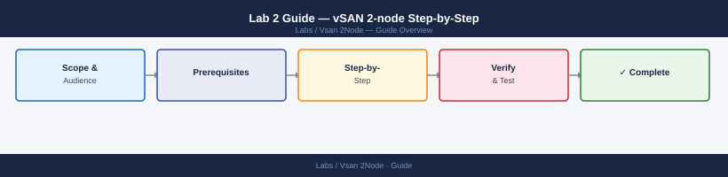

---
tags:
  - vsan
  - storage
  - vsphere
---
# Lab 2 Guide — vSAN 2-node Step-by-Step

*Applies to: Lab / Nested Environment*

<div class="kb-summary">
Complete procedure: add virtual disks to nested ESXi VMs, mark disks as SSD, deploy the witness appliance, enable vSAN, create a storage policy, and verify cluster health.
</div>


---

## Phase 1 — Add Virtual Disks to Nested ESXi VMs

On the **physical host's vSphere client**, add virtual disks to each nested ESXi VM. Do this for both ESXi-01 and ESXi-02.

**1.1 Power off the nested ESXi VM**

vSAN disk configuration changes require the VM to be off.

**1.2 Add a cache disk (simulated SSD)**

1. Right-click nested ESXi VM > **Edit Settings**
2. **Add New Device > Hard Disk**
3. Size: **10–20 GB**, thin provisioned
4. Note the new disk's SCSI ID (e.g., SCSI 0:1)

**1.3 Add a capacity disk**

1. Repeat: **Add New Device > Hard Disk**
2. Size: **50–100 GB**, thin provisioned
3. Note SCSI ID (e.g., SCSI 0:2)

**1.4 Power on the nested ESXi VM**

**1.5 Tag the cache disk as SSD inside nested ESXi**

vSAN requires at least one disk per disk group to be tagged as a flash cache device. Nested VMDKs appear as HDDs by default — force the SSD tag via ESXCLI:

```bash
# SSH into the nested ESXi host
esxcli storage core device list | grep -i naa   # find the disk NAA IDs

# Mark the 10 GB disk (SCSI 0:1) as SSD — replace naa.xxxx with actual ID
esxcli storage nmp satp rule add \
  --satp VMW_SATP_LOCAL \
  --device naa.xxxx \
  --option "enable_ssd"

# Rescan storage to apply
esxcli storage core adapter rescan --all
esxcli storage core device list | grep -A2 naa.xxxx   # confirm IsSSD: true
```


```text title="Expected output"
naa.60000000000000000000000000000001
naa.60000000000000000000000000000002
naa.60000000000000000000000000000003

Rule added successfully.

Rescanning adapter vmhba0...
Rescanning adapter vmhba1...
Rescanning adapter vmhba2...

Device Display Name: Local SSD (naa.60000000000000000000000000000002)
  Device: naa.60000000000000000000000000000002
  IsSSD: true
  Multipath Plugin: NMP
  Paths: 1
```

!!! warning "Common errors"
    **`Error: Unknown device naa.xxxx`** — Replace `naa.xxxx` with an actual NAA ID from the `esxcli storage core device list` output.
    **`Error: Unknown SATP VMW_SATP_LOCAL`** — Use the correct SATP name (typically `VMW_SATP_LOCAL` for local disks, or verify with `esxcli storage nmp satp list`).
    **`IsSSD: false`** — The rule may not have applied; run `esxcli storage core adapter rescan --all` again and verify the device NAA ID matches exactly.
Repeat on ESXi-02 for its cache disk.

---

## Phase 2 — Deploy the Witness Appliance

The witness VM is deployed on the physical host's management cluster (or any host **outside** the 2-node vSAN cluster).

**2.1 Download the vSAN Witness Appliance OVA**

From VMware Customer Connect: search **"vSAN Witness Appliance"** and download the version matching your vSAN release.

**2.2 Deploy the OVA**

In vCenter on the physical host:

1. Right-click the physical datacenter > **Deploy OVF Template**
2. Upload the witness OVA file
3. **Deployment size**: Tiny (2 vCPU, 8 GB RAM, 350 GB disk)
4. **Network mapping**: map to the management portgroup (witness only needs management connectivity to both data nodes)
5. **Customize template**: set a static IP (e.g., 192.168.1.13), gateway, DNS
6. Complete the deployment wizard

**2.3 Power on the witness VM**

Verify it gets its management IP and is reachable by both nested ESXi hosts.

---

## Phase 3 — Enable vSAN on the 2-node Cluster

**3.1 Configure vSAN VMkernel adapters**

On each nested ESXi host, vSAN traffic needs a dedicated VMkernel. For a lab, the management VMkernel (vmk0) can be used for vSAN, but a separate one is cleaner:

In vCenter: **Nested ESXi host > Configure > Networking > VMkernel adapters > Add**

- Portgroup: same management portgroup (or a dedicated vSAN portgroup)
- Tag: **vSAN**
- IP: 192.168.1.31 (ESXi-01), 192.168.1.32 (ESXi-02)

**3.2 Enable vSAN on the cluster**

1. vCenter > `Lab-Cluster` > **Configure > vSAN > Services**
2. Click **Enable vSAN**
3. **Cluster type**: Two-host vSAN cluster
4. **Disk claim mode**: Manual (recommended for lab)
5. Click **Next**

**3.3 Claim disks on each data node**

1. For ESXi-01: select the 10 GB disk as **Cache tier**, the 50 GB disk as **Capacity tier**
2. For ESXi-02: same selection
3. Click **Next**

**3.4 Select the witness host**

1. Click **Add witness host**
2. Enter the witness VM IP: `192.168.1.13`, root credentials
3. Accept certificate

**3.5 Complete and wait**

vSAN builds the cluster (≈5 min). Monitor: `Lab-Cluster > Monitor > vSAN > Virtual Objects`.

---

## Phase 4 — Create a vSAN Storage Policy

The default vSAN policy uses FTT=1 RAID-1, which is correct for a 2-node cluster. Confirm it exists:

1. vCenter > **Policies and Profiles > VM Storage Policies**
2. Look for **vSAN Default Storage Policy** — FTT=1, RAID-1
3. Optionally create a custom policy: **Create** → vSAN rules → FTT=1, RAID-1 Mirror, no compression

**4.1 Apply the policy to a test VM**

Create or clone a small test VM onto the vSAN datastore and verify it uses the policy:
- Right-click VM > **VM Policies > Edit VM Storage Policies**
- Assign the vSAN policy to the VM home and all disks

---

## Phase 5 — Verify vSAN Health

1. vCenter > `Lab-Cluster` > **Monitor > vSAN > Health**
2. Expand all health checks — most should be green
3. Common lab warnings (safe to ignore):
   - **Controller firmware** — expected in nested (no real HBA)
   - **Advanced vSAN configuration in sync** — ignore in lab
   - **vSAN HCL** — ignore in nested

**5.1 Run a proactive test**

vCenter > `Lab-Cluster` > **Monitor > vSAN > Proactive Tests**

- Run **Data integrity** test — confirms RAID-1 writes are being mirrored
- Run **Virtual machine creation** test — confirms policy compliance end-to-end

---

## Known Issues in Nested Environments

| Issue | Cause | Fix |
|---|---|---|
| Disk not detected after adding to VM | `disk.EnableUUID = FALSE` | Set TRUE in VM advanced config, power cycle |
| Cache disk not recognised as SSD | SATP rule not applied | Run `esxcli storage nmp satp rule add --option enable_ssd`, rescan |
| Witness connectivity fails | Witness on same portgroup but promiscuous not enabled | Enable Promiscuous Mode on portgroup; confirm ping from both data nodes |
| vSAN health shows HCL failures | No HBA in nested env | Safe to ignore; vSAN still functions |
| Performance is very low | Nested disk I/O overhead | Expected — use for feature testing only, not benchmarking |
| vSAN won't form — "Unhealthy" | NTP drift between hosts | Sync all hosts to same NTP source; verify with `esxcli system time get` |

---

## Next Steps

- [Lab 3 — NSX-T in Nested ESXi](../../nsx-nested/)
- [Lab 4 — VCF on Nested ESXi](../../vcf-nested/)
- [vSAN Storage Policy Decision Tree](../../../reference/decision-trees/vsan-policy/)
- [vSAN Cheat Sheet](../../reference/cheat-sheets/vsan/)
