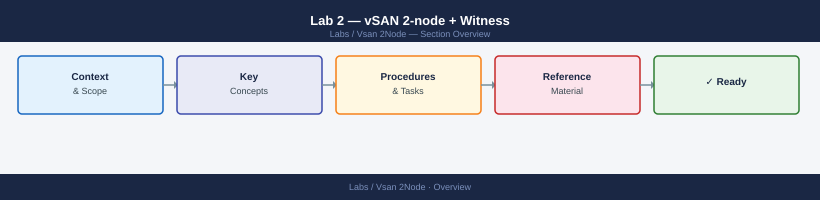

---
tags:
  - vsan
  - storage
  - vsphere
---
# Lab 2 — vSAN 2-node + Witness

Add vSAN shared storage to the Lab 1 cluster. Configures a 2-node vSAN cluster with a witness VM — the minimum production-supportable vSAN topology. Estimated time: 1–2 hours.

## Prerequisites

| Requirement | Value |
|---|---|
| Lab 1 | Completed: 2 nested ESXi hosts + vCenter in a cluster |
| Physical host RAM | 48 GB+ (extra for witness VM: 8 GB) |
| Per data node: cache disk | 1 virtual SSD, ≥ 10 GB (added to nested ESXi VM) |
| Per data node: capacity disk | 1 virtual HDD/SSD, ≥ 50 GB (added to nested ESXi VM) |
| Witness appliance OVA | Download from VMware Customer Connect |
| `disk.EnableUUID` | TRUE on all nested ESXi VMs (set in Lab 1) |

## How vSAN 2-node works

A 2-node cluster writes all VM data synchronously to **both** data nodes (RAID-1, FTT=1). A **witness VM** hosted at a third location (or the management cluster) holds only metadata — it does not store VM data. The witness provides the quorum vote needed to maintain availability when one data node loses connectivity.

## Phases

<a class="kb-card" href="guide/">
<strong>Full Step-by-Step Guide</strong> 
Add virtual disks, mark as SSD, deploy the witness, enable vSAN, create storage policy, and verify health.
</a>

## See also

- [Lab 1 — Nested ESXi Homelab](../nested-esxi/) — prerequisite
- [Lab 3 — NSX-T in Nested ESXi](../nsx-nested/)
- [vSAN Cheat Sheet](../../reference/cheat-sheets/vsan/)
- [vSAN Storage Policy Decision Tree](../../reference/decision-trees/vsan-policy/)
