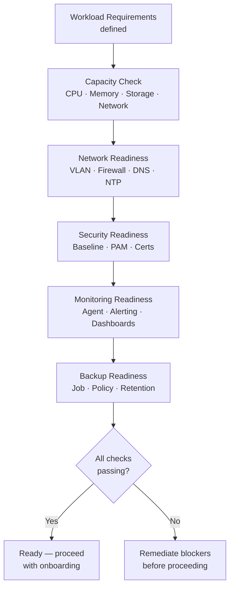

# Environment Readiness Checklist


<div class="kb-summary">
Validates that infrastructure is prepared to receive a new workload, application deployment, or system migration. Complete before any provisioning begins.
</div>

## Readiness Assessment Flow


┌──────────────────────────────────────── Environment Readiness ────────────────────────────────────────┐
│                                                                                                       │
│   ┌───────────────────────────────────────────────────────────────────────────────────────────────┐   │
│   │      Environment readiness: verify capacity, connectivity, dependencies, and credentials      │   │
│   │           Complete readiness checklist before any deployment or major change starts           │   │
│   └───────────────────────────────────────────────────────────────────────────────────────────────┘   │
│                                                                                                       │
│                          ▼                                                 ▼                          │
│                                                                                                       │
│   ┌──────────────────────────────────────────────┐  ┌─────────────────────────────────────────────┐   │
│   │           Infrastructure Readiness           │  │             Dependency Readiness            │   │
│   │      ─────────────────────────────────       │  │      ─────────────────────────────────      │   │
│   │         Storage: capacity available          │  │            DNS resolves correctly           │   │
│   │          Compute: CPU/RAM headroom           │  │            Network paths verified           │   │
│   │          No active alarms on target          │  │            Auth/credentials ready           │   │
│   │         Backup current before deploy         │  │           Downstream deps notified          │   │
│   │            Monitoring configured             │  │           Firewall rules in place           │   │
│   └──────────────────────────────────────────────┘  └─────────────────────────────────────────────┘   │
│                                                                                                       │
│   │      Check       │      Method      │        Pass       │   Fail action    │      Owner       │   │
│   │ ──────────────── │ ──────────────── │ ───────────────── │ ──────────────── │──────────────────│   │
│   │   Storage cap    │    Array GUI     │     > 20% free    │   Expand first   │      Infra       │   │
│   │   Compute cap    │  vCenter/Hyp-V   │     > 20% free    │   Resize first   │      Infra       │   │
│   │   Network conn   │   Ping + trace   │    All paths OK   │   Fix network    │   Network team   │   │
│   │       Auth       │    Test login    │      Success      │    Fix creds     │      Infra       │   │
│                                                                                                       │
│    Key terms:                                                                                         │
│                                                                                                       │
│    Headroom      = Free compute/storage capacity above the deployment requirement; 20% minimum        │
│    Downstream deps= Services or systems that depend on the environment being deployed to              │
│    Pre-deploy backup= Snapshot/config backup taken immediately before any change starts               │
│                                                                                                       │
└───────────────────────────────────────────────────────────────────────────────────────────────────────┘
```powershell

## 2. Network Readiness

```bash
# Confirm VLAN exists on target switch/fabric
show vlan id <vlan_id>                 # Cisco
Get-VDPortgroup -VDSwitch vDS-Prod     # VMware distributed switch

# Confirm IP address allocated and not in use
ping -c 1 <planned-ip> && echo "IP IN USE" || echo "IP available"
nmap -sn <planned-ip>

# DNS A record created
nslookup <planned-hostname>.example.com
dig +short <planned-hostname>.example.com

# Firewall rules in place (test from source to destination)
nc -zv <destination-ip> <port>
curl -sk --connect-timeout 5 https://<destination>:<port>/

# NTP reachability
chronyc sources -v | grep "^*"        # confirm preferred source
ntpdate -q ntp.example.com
```

| Network Check | Status |
|---|---|
| VLAN provisioned | ☐ |
| IP address reserved | ☐ |
| DNS A record created | ☐ |
| DNS PTR record created | ☐ |
| Firewall rules approved and active | ☐ |
| NTP server reachable | ☐ |
| Load balancer VIP configured (if needed) | ☐ |
| SSL certificate issued / ready | ☐ |

## 3. Security Readiness

```bash
# Confirm CyberArk PAM account created for server
# CyberArk: Accounts → Add Account → Managed System: <hostname>

# Check SSH hardening baseline
sshd -T | grep -E "PermitRootLogin|PasswordAuthentication|MaxAuthTries|Protocol"

# SELinux / AppArmor enforcing
getenforce                         # should return "Enforcing"
aa-status | grep "profiles in enforce"

# Check OS baseline applied
oscap xccdf eval \
  --profile xccdf_org.ssgproject.content_profile_cis_server_l1 \
  --results /tmp/oscap-results.xml \
  /usr/share/xml/scap/ssg/content/ssg-rhel9-ds.xml
```

| Security Check | Status |
|---|---|
| PAM / CyberArk account created | ☐ |
| SSH key-based auth only | ☐ |
| OS security baseline applied | ☐ |
| Host-based firewall configured | ☐ |
| Antivirus / EDR agent installed | ☐ |
| Vulnerability scan clean | ☐ |
| TLS certificate valid and trusted | ☐ |

## 4. Monitoring Readiness

```bash
# Install and verify Prometheus node_exporter
systemctl is-active node_exporter
curl -s http://localhost:9100/metrics | grep "node_uname_info"

# Confirm host visible in Prometheus/Grafana
curl -s "http://prometheus:9090/api/v1/query?query=up{instance='<host>:9100'}" \
  | python3 -c "import sys,json; print(json.load(sys.stdin)['data']['result'])"

# Windows — confirm monitoring agent
Get-Service "Prometheus Windows Exporter" | Select-Object Status
# or for Zabbix / SCOM
Get-Service "Zabbix Agent" | Select-Object Status
```

| Monitoring Check | Status |
|---|---|
| Monitoring agent installed and running | ☐ |
| Host visible in monitoring platform | ☐ |
| Alerting rules configured | ☐ |
| Dashboard available | ☐ |
| Log forwarding configured (syslog/Splunk) | ☐ |
| On-call escalation configured | ☐ |

## 5. Backup Readiness

```bash
# Veeam — confirm backup job exists and targets new VM
Get-VBRJob | Where-Object {$_.GetObjectsInJob().Name -like "*HOSTNAME*"}

# Commvault — confirm client registered
qlist client -name HOSTNAME

# Run first backup and verify
Start-VBRJob -Job "Production VMs"
Get-VBRSession | Where-Object JobName -like "*Production VMs*" | Select-Object -Last 1
```

| Backup Check | Status |
|---|---|
| Backup job includes new system | ☐ |
| Backup policy meets RPO requirement | ☐ |
| Retention period configured | ☐ |
| First backup completed successfully | ☐ |
| Restore test performed | ☐ |

## 6. Documentation and CMDB

```bash
# Items to complete before handover
# → CMDB entry created with: hostname, IP, owner, location, specs, environment
# → Run book / system overview doc drafted
# → Support contact assigned
# → Patch schedule assigned
```

| Documentation | Status |
|---|---|
| CMDB entry created | ☐ |
| System owner assigned | ☐ |
| Patch schedule set | ☐ |
| Runbook / system doc available | ☐ |
| DR/recovery procedure documented | ☐ |

## Readiness Sign-Off

| Domain | Status | Signed Off By |
|---|---|---|
| Capacity | ☐ Ready / ☐ Blocked | |
| Network | ☐ Ready / ☐ Blocked | |
| Security | ☐ Ready / ☐ Blocked | |
| Monitoring | ☐ Ready / ☐ Blocked | |
| Backup | ☐ Ready / ☐ Blocked | |
| Documentation | ☐ Ready / ☐ Blocked | |
| **Overall** | ☐ **Ready** / ☐ **Not Ready** | |
