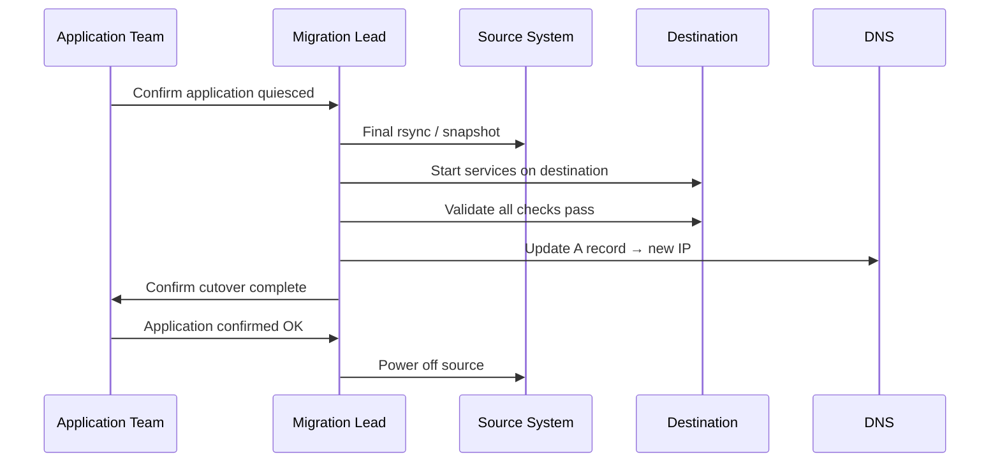

# System Migration Procedure


<div class="kb-summary">
Structured procedure for migrating workloads between platforms, hypervisors, data centres, or cloud environments — covering planning through post-migration validation and cleanup.
</div>

## Migration Types

| Type | Examples | Downtime |
|---|---|---|
| Cold migration | VM moved while powered off | Yes — minutes to hours |
| Live migration (vMotion) | VM moved between ESXi hosts | None |
| Storage migration (svMotion) | VM disks moved between datastores | None |
| P2V | Physical server → VM | Hours — OS conversion required |
| V2V | VMware → Hyper-V or KVM | Hours — driver conversion |
| Data migration | Storage array replication cutover | Minimal — flash cutover |
| Lift and shift | On-premises → cloud | Hours — varies by size |

## Phase 1 — Planning

```yaml
Migration Plan — <HOSTNAME> / <WORKLOAD>
━━━━━━━━━━━━━━━━━━━━━━━━━━━━━━━━━━━━━━━━━━━
Source:           <platform, host, location>
Destination:      <platform, host, location>
Workload:         <application and purpose>
Owner:            <team / contact>
Migration type:   <cold / live / data>
Max downtime:     <N minutes>
Migration window: <date, time, duration>
Rollback window:  <how long can we roll back>
Dependencies:     <external services / integrations>
Data volume:      <GB / TB>
━━━━━━━━━━━━━━━━━━━━━━━━━━━━━━━━━━━━━━━━━━━
```
```text
┌───────────────────────────────────────── Migration Procedure ─────────────────────────────────────────┐
│                                                                                                       │
│   ┌───────────────────────────────────────────────────────────────────────────────────────────────┐   │
│   │          Migration: move workload/data from source to destination with cutover window         │   │
│   │      Phases: plan → pre-migrate (bulk) → cutover (delta) → validate → decommission source     │   │
│   └───────────────────────────────────────────────────────────────────────────────────────────────┘   │
│                                                                                                       │
│    Plan → pre-migrate bulk data → cutover window → delta sync → validate → retire source              │
│                                                                                                       │
│                  ▼                                ▼                                ▼                  │
│                                                                                                       │
│   ┌─────────────────────────────┐  ┌─────────────────────────────┐  ┌─────────────────────────────┐   │
│   │        Pre-Migration        │  │           Cutover           │  │        Post-Migration       │   │
│   │      ─────────────────      │  │      ─────────────────      │  │      ─────────────────      │   │
│   │       Inventory source      │  │        Quiesce source       │  │        Validate dest        │   │
│   │        Bulk data copy       │  │       Final delta sync      │  │        Test workload        │   │
│   │       Test destination      │  │        DNS/IP cutover       │  │       Monitor 24–72 hr      │   │
│   │       Size validation       │  │         Update CMDB         │  │       Decommission src      │   │
│   │     Application mapping     │  │     Notify stakeholders     │  │        Confirm backup       │   │
│   └─────────────────────────────┘  └─────────────────────────────┘  └─────────────────────────────┘   │
│                                                                                                       │
│   │      Phase       │     Duration     │     RPO during    │     Rollback     │    Key check     │   │
│   │ ──────────────── │ ──────────────── │ ───────────────── │ ──────────────── │──────────────────│   │
│   │    Bulk copy     │    Days/hours    │  Source stays up  │   Cancel copy    │  Data integrity  │   │
│   │     Cutover      │  Minutes/hours   │   Outage window   │   Re-point DNS   │    Service up    │   │
│   │    Validation    │     24–72 hr     │     Dest only     │  Re-point back   │   No data loss   │   │
│   │   Decommission   │   After stable   │         —         │  Restore backup  │   CMDB updated   │   │
│                                                                                                       │
│    Key terms:                                                                                         │
│                                                                                                       │
│    Bulk copy      = Initial large data transfer before cutover; source remains live                   │
│    Delta sync     = Final sync of changes made during bulk copy; minimises cutover downtime           │
│    DNS cutover    = Update DNS to point clients to new destination; fast client redirect              │
│    Quiesce source = Stop writes to source for delta sync; creates RPO = zero at cutover               │
│                                                                                                       │
└───────────────────────────────────────────────────────────────────────────────────────────────────────┘
```

## Phase 3 — Data Synchronisation

### VMware vMotion / svMotion

```powershell
# Live migration — no downtime
Move-VM -VM "HOSTNAME" -Destination (Get-VMHost "esxi02.example.com") -Confirm:$false

# Storage migration
Move-VM -VM "HOSTNAME" -Datastore (Get-Datastore "SSD-DataStore-01") -Confirm:$false

# Combined move
Move-VM -VM "HOSTNAME" \
  -Destination (Get-VMHost "esxi02.example.com") \
  -Datastore (Get-Datastore "SSD-DataStore-01") \
  -Confirm:$false

# Monitor progress
Get-Task | Where-Object {$_.Name -eq "RelocateVM_Task"} | Select-Object PercentComplete, State
```

### rsync-Based File Migration

```bash
# Initial sync (run multiple times to reduce delta)
rsync -avz --progress --delete \
  -e "ssh -i ~/.ssh/migration_key" \
  /data/source/ migrationuser@<destination>:/data/destination/

# Verify counts match
find /data/source/ -type f | wc -l
ssh <destination> "find /data/destination/ -type f | wc -l"
du -sh /data/source/ && ssh <destination> "du -sh /data/destination/"
```

### Storage Array Cutover (NetApp SnapMirror)

```bash
# Quiesce and break SnapMirror relationship for cutover
snapmirror quiesce -destination-path <svm>:<vol-dest>
snapmirror break -destination-path <svm>:<vol-dest>
```

## Phase 4 — Cutover



```bash
# 1. Quiesce application
systemctl stop myapp

# 2. Final sync
rsync -avz --checksum --delete /data/source/ user@destination:/data/

# 3. Start services on destination
ssh destination "systemctl start myapp"
ssh destination "curl -sk https://localhost/health"

# 4. Update DNS
nsupdate <<EOF
server dns.example.com
update delete <hostname>.example.com A
update add <hostname>.example.com 60 A <new-ip>
send
EOF

# Verify propagation
dig +short <hostname>.example.com @dns.example.com
```

## Phase 5 — Post-Migration Validation

```bash
# Platform health on destination
uptime; systemctl --failed
journalctl -p err -n 50 --no-pager

# Application health
curl -sk https://<hostname>/health
curl -sk -o /dev/null -w "%{time_total}" https://<hostname>/

# Confirm monitoring shows new host
curl -s "http://prometheus:9090/api/v1/query?query=up{instance='<new-ip>:9100'}"

# Add to backup job at destination and run first backup
Start-VBRJob -Job "Production VMs"
```

## Phase 6 — Cleanup

```bash
# Remove pre-migration snapshot (after 48h stability)
Get-VM -Name "HOSTNAME" | Get-Snapshot -Name "pre-migration-*" | Remove-Snapshot -Confirm:$false

# Remove old DNS entry
nsupdate <<EOF
server dns.example.com
update delete <old-hostname>.example.com A
send
EOF

# Decommission source (follow decommission procedure)
# Update CMDB — new host, IP, location, platform
```

## Migration Checklist

| Phase | Step | Status |
|---|---|---|
| Planning | Requirements documented | ☐ |
| Planning | Dependencies mapped | ☐ |
| Planning | Change approved | ☐ |
| Pre-migration | Backup taken | ☐ |
| Pre-migration | Snapshot taken | ☐ |
| Pre-migration | Destination ready | ☐ |
| Pre-migration | DNS TTL reduced | ☐ |
| Cutover | Application quiesced | ☐ |
| Cutover | Final sync complete | ☐ |
| Cutover | DNS updated | ☐ |
| Validation | Application health confirmed | ☐ |
| Validation | Monitoring shows new host | ☐ |
| Validation | Dependent systems confirmed OK | ☐ |
| Cleanup | Snapshot removed | ☐ |
| Cleanup | Source decommissioned | ☐ |
| Cleanup | CMDB updated | ☐ |
| Cleanup | Change ticket closed | ☐ |
