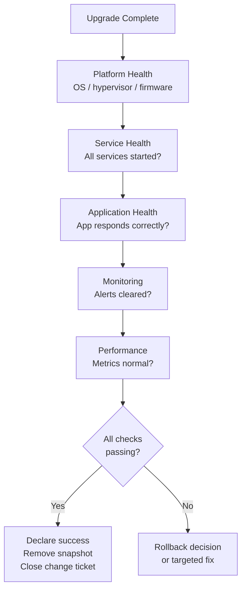

# Post-Upgrade Validation


<div class="kb-summary">
Structured validation procedure to confirm system health and application functionality after any upgrade, patch, or configuration change. Complete within the maintenance window before declaring success.
</div>

## Validation Flow


```
┌─────────────────────────────────────── Post-Upgrade Validation ───────────────────────────────────────┐
│                                                                                                       │
│   ┌───────────────────────────────────────────────────────────────────────────────────────────────┐   │
│   │       Post-upgrade: verify service health, performance baseline, monitoring alerts clear      │   │
│   │         Monitor for 24–72 hours post-change; keep rollback path available until stable        │   │
│   └───────────────────────────────────────────────────────────────────────────────────────────────┘   │
│                                                                                                       │
│                          ▼                                                 ▼                          │
│                                                                                                       │
│   ┌──────────────────────────────────────────────┐  ┌─────────────────────────────────────────────┐   │
│   │             Immediate (0–30 min)             │  │            Soak Period (24–72 hr)           │   │
│   │      ─────────────────────────────────       │  │      ─────────────────────────────────      │   │
│   │              Version confirmed               │  │            No error rate increase           │   │
│   │             Services all running             │  │             Latency at baseline             │   │
│   │                No new alerts                 │  │             Backup job completes            │   │
│   │             Basic function test              │  │             Replication in sync             │   │
│   │            Log review for errors             │  │              Monitoring stable              │   │
│   └──────────────────────────────────────────────┘  └─────────────────────────────────────────────┘   │
│                                                                                                       │
│   │      Check       │      Method      │        Pass       │   Fail action    │      Window      │   │
│   │ ──────────────── │ ──────────────── │ ───────────────── │ ──────────────── │──────────────────│   │
│   │     Version      │     CLI/GUI      │    Expected ver   │     Rollback     │    Immediate     │   │
│   │     Services     │   systemctl/SC   │    All running    │     Rollback     │    Immediate     │   │
│   │    Monitoring    │  Alert console   │   No new alerts   │   Investigate    │  Ongoing 72 hr   │   │
│   │  Perf baseline   │    Dashboard     │     Within 5%     │   Investigate    │  Ongoing 72 hr   │   │
│                                                                                                       │
│    Key terms:                                                                                         │
│                                                                                                       │
│    Soak period    = Extended monitoring after change; typically 24–72 hours for major upgrades        │
│    Version confirm= Verify upgrade completed to expected target version; not partial                  │
│    Error rate     = Application error rate; an increase post-upgrade indicates regression             │
│                                                                                                       │
└───────────────────────────────────────────────────────────────────────────────────────────────────────┘
```

### VMware ESXi

```bash
# Host health
esxcli system health status get
vim-cmd hostsvc/hostsummary | grep -E "powerState|connectionState"

# Confirm expected version
vmware -v
esxcli system version get

# All VMs running (check no VMs failed to power on after host reboot)
vim-cmd vmsvc/getallvms | wc -l
esxcli vm process list | wc -l

# Storage paths healthy
esxcli storage core path list | grep -c "Active (I/O)"
esxcli storage core path list | grep "Dead\|Standby" | wc -l
```

## 2. Service Health

```bash
# Linux — check all expected services are running
for svc in nginx postgresql haproxy; do
  systemctl is-active $svc && echo "$svc: OK" || echo "$svc: FAILED"
done

# Generic — check listening ports
ss -tlnp | grep -E "80|443|5432|6379|9200"
netstat -tulnp

# Windows — check services
Get-Service | Where-Object {$_.StartType -eq 'Automatic' -and $_.Status -ne 'Running'}
```

| Service | Expected Port | Check Command | Status |
|---|---|---|---|
| Web / App | 443, 80 | `curl -sk https://localhost/health` | ☐ |
| Database | 5432 / 1433 | `pg_isready` / `sqlcmd -Q "SELECT 1"` | ☐ |
| Monitoring agent | 9100 / 12489 | `systemctl is-active node_exporter` | ☐ |
| Backup agent | varies | Check Veeam/Commvault agent status | ☐ |

## 3. Application Health

```bash
# HTTP health endpoint
curl -sk https://<app-url>/health | python3 -m json.tool

# Check response time (< 2s expected)
curl -sk -o /dev/null -w "%{time_total}" https://<app-url>/

# Database connectivity from app
psql -h <db-host> -U appuser -d appdb -c "SELECT version();"

# Check application logs for errors post-upgrade
journalctl -u myapp --since "1 hour ago" | grep -iE "error|exception|fatal"
tail -200 /var/log/myapp/app.log | grep -iE "error|exception"
```

## 4. Monitoring Validation

```bash
# Confirm no new alerts fired post-upgrade
# Check Prometheus alerts
curl -s http://prometheus:9090/api/v1/alerts | \
  python3 -c "import sys,json; [print(a['labels']['alertname']) for a in json.load(sys.stdin)['data']['alerts'] if a['state']=='firing']"

# Confirm metrics are flowing (not stale)
curl -s http://prometheus:9090/api/v1/query?query=up | \
  python3 -m json.tool | grep '"value"'

# Check node_exporter last scrape
curl -s http://<host>:9100/metrics | grep "node_time_seconds"
```

## 5. Performance Baseline Comparison

```bash
# CPU — compare to pre-upgrade baseline
mpstat 1 10 | tail -1

# Memory
free -h

# Disk I/O
iostat -x 1 5 | tail -10

# Network
sar -n DEV 1 5 | grep -v lo

# Application response time (compare to pre-upgrade SLA)
for i in {1..10}; do
  curl -sk -o /dev/null -w "%{time_total}\n" https://<app-url>/
done | awk '{sum+=$1; count++} END {printf "Avg: %.3fs\n", sum/count}'
```

## 6. Replication and Data Integrity

```bash
# VMware vSphere Replication / SRM
Get-SpbmReplicationGroup | Select-Object Name, State, RPO, LatestRpo

# NetApp SnapMirror
snapmirror show -destination-path <svm:vol> -fields state,lag-time

# Dell RecoverPoint
# Check via UNISPHERE: verify consistency groups healthy, lag within SLA

# Database replication
# PostgreSQL streaming replication
psql -c "SELECT client_addr, state, sent_lsn, replay_lsn, write_lag, flush_lag FROM pg_stat_replication;"
```

## 7. Post-Upgrade Cleanup

```bash
# Remove pre-upgrade snapshot (after 24h stability confirmation)
Get-VM -Name "HOSTNAME" | Get-Snapshot -Name "pre-upgrade-*" | Remove-Snapshot -Confirm:$false

# Remove temp files
rm -f /tmp/upgrade-*.log /tmp/pre-upgrade-backup-*.tar.gz

# Update CMDB / inventory
# → Update firmware/OS version in asset management system

# Close change ticket
# → Set status to "Implemented" with validation notes
```

## Validation Sign-Off

| Check | Result | Notes |
|---|---|---|
| Platform health (OS/HW) | ☐ Pass / ☐ Fail | |
| All services running | ☐ Pass / ☐ Fail | |
| Application responding | ☐ Pass / ☐ Fail | |
| No new monitoring alerts | ☐ Pass / ☐ Fail | |
| Performance within baseline | ☐ Pass / ☐ Fail | |
| Replication healthy | ☐ Pass / ☐ Fail | |
| Snapshot removed | ☐ Done / ☐ Pending | Remove within 48h |
| CMDB updated | ☐ Done | |
| Change ticket closed | ☐ Done | |
| **Overall outcome** | ☐ **Success** / ☐ **Rolled back** | |
