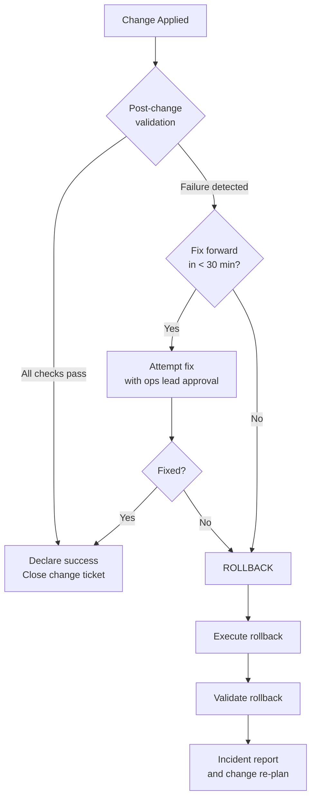

# Rollback Procedure


<div class="kb-summary">
Restores a system to its last known-good state when a change produces failures, instability, or unacceptable risk. Rollback must be faster and safer than attempting to fix the issue forward during an incident.
</div>

## Decision Framework


```
┌───────────────────────────────────────── Rollback Procedure ──────────────────────────────────────────┐
│                                                                                                       │
│   ┌───────────────────────────────────────────────────────────────────────────────────────────────┐   │
│   │           Rollback: revert change to pre-change state when success criteria not met           │   │
│   │              Trigger rollback at defined criteria; do not wait — sooner is safer              │   │
│   └───────────────────────────────────────────────────────────────────────────────────────────────┘   │
│                                                                                                       │
│                          ▼                                                 ▼                          │
│                                                                                                       │
│   ┌──────────────────────────────────────────────┐  ┌─────────────────────────────────────────────┐   │
│   │              Rollback Triggers               │  │              Rollback Execution             │   │
│   │      ─────────────────────────────────       │  │      ─────────────────────────────────      │   │
│   │             Service unavailable              │  │          Declare rollback on bridge         │   │
│   │            Error rate > threshold            │  │            Execute backout steps            │   │
│   │            Validation test fails             │  │          Restore from config backup         │   │
│   │            Maintenance window end            │  │           Verify service restored           │   │
│   │                Team consensus                │  │             Notify stakeholders             │   │
│   │              Time overrun + P1               │  │            Raise P1 if unresolved           │   │
│   └──────────────────────────────────────────────┘  └─────────────────────────────────────────────┘   │
│                                                                                                       │
│   │     Trigger      │     Decision     │       Action      │     Timeline     │   Escalate if    │   │
│   │ ──────────────── │ ──────────────── │ ───────────────── │ ──────────────── │──────────────────│   │
│   │   Service down   │   Auto trigger   │  Execute backout  │    Immediate     │  Backout fails   │   │
│   │    Test fails    │   Lead decides   │  Execute backout  │     < 15 min     │    P1 if down    │   │
│   │    Window end    │   Team decides   │  Execute backout  │  At window end   │    P1 if down    │   │
│   │   Partial fail   │   Lead decides   │    Assess risk    │   Context dep    │  If no backout   │   │
│                                                                                                       │
│    Key terms:                                                                                         │
│                                                                                                       │
│    Auto trigger  = Pre-defined condition that initiates rollback without manual decision              │
│    Config backup = Saved configuration state from before change; used to restore previous state       │
│    Backout steps = Documented reversal steps from RFC; must be tested before change execution         │
│    Partial fail  = Some components succeeded, others failed; assess risk vs completing rollback       │
│                                                                                                       │
└───────────────────────────────────────────────────────────────────────────────────────────────────────┘
```

# Windows — uninstall cumulative update
wusa /uninstall /kb:<KBnumber> /quiet /norestart
```

## Method 3 — Configuration Revert

```bash
# Ansible — revert to previous playbook version
git checkout <previous-commit> -- playbooks/site.yml
ansible-playbook -i inventory/production/ playbooks/site.yml --limit <hostname>

# Manual file revert from backup copy
cp /etc/nginx/nginx.conf.bak.$(date +%F) /etc/nginx/nginx.conf
nginx -t && systemctl reload nginx

# Cisco IOS — revert to startup config
copy startup-config running-config

# Arista EOS
configure replace checkpoint://pre-change-<hostname>
```

## Method 4 — Database Rollback

```bash
# PostgreSQL — restore from pre-change dump
pg_restore -h <host> -U postgres -d <db> --clean /backups/<db>-pre-change-$(date +%F).dump

# SQL Server
RESTORE DATABASE [dbname] FROM DISK = 'D:\Backups\dbname_pre_change.bak'
  WITH REPLACE, RECOVERY, STATS=10;

# PostgreSQL PITR
# In recovery.conf:
# recovery_target_time = '2026-05-10 02:00:00'
```

## Method 5 — Full Backup Restore

```bash
# Veeam — restore entire VM from backup
$backup = Get-VBRBackup -Name "Production VMs"
$restorePoint = Get-VBRRestorePoint -Backup $backup -Name "HOSTNAME" | Select-Object -Last 1
Start-VBRRestoreVM -RestorePoint $restorePoint -PowerState PowerOn
```

**Expected time:** 30–120 minutes depending on backup size.

## Post-Rollback Validation

```bash
systemctl --failed
journalctl -p err -n 50 --no-pager
curl -sk https://<app-url>/health

# Confirm the specific change is reverted
<version-check-command>   # e.g. rpm -q nginx, vmware -v
```

## Rollback Checklist

| Step | Done |
|---|---|
| Decision made by on-call lead or change manager | ☐ |
| Rollback method selected | ☐ |
| Stakeholders notified of rollback | ☐ |
| Rollback executed | ☐ |
| Post-rollback validation complete | ☐ |
| Services confirmed stable | ☐ |
| Application team confirmed OK | ☐ |
| Monitoring alerts cleared | ☐ |
| Pre-change snapshot removed (if reverted) | ☐ |
| Change ticket updated to "Rolled Back" | ☐ |
| Incident / PIR ticket opened | ☐ |

## Post-Rollback Actions

1. **Incident ticket** — document what failed and the timeline
2. **Root cause analysis** — identify why the change caused failure
3. **Re-plan the change** — fix the root cause before re-scheduling
4. **PIR** — for Sev1/Sev2 impact events
5. **Test in staging** — validate the fix in non-production first
