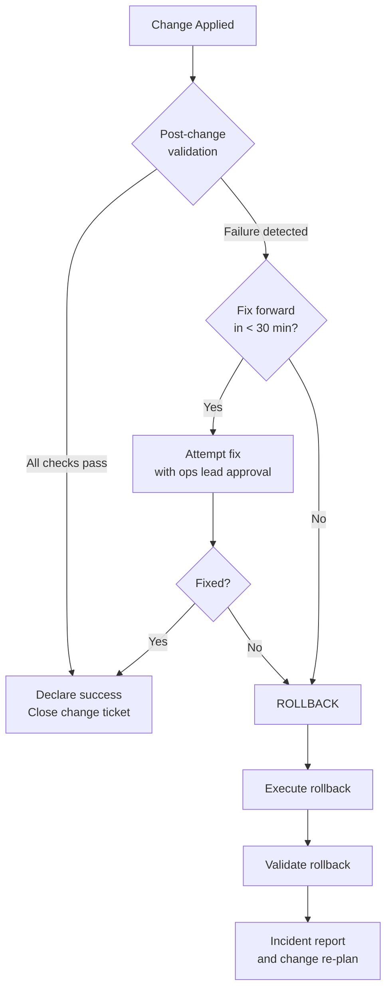

# Rollback Procedure

Restores a system to its last known-good state when a change produces failures, instability, or unacceptable risk. Rollback must be faster and safer than attempting to fix the issue forward during an incident.

## Decision Framework



**Rollback trigger** — any one is sufficient:
- Services fail to start after change
- Application error rate increases > 5% vs baseline
- Replication lag exceeds SLA
- Application team reports user-facing failures
- On-call engineer cannot identify root cause within agreed time

## Method 1 — VM Snapshot Revert

Fastest rollback for VM workloads. Requires a pre-change snapshot.

```powershell
# Find pre-change snapshot
Get-VM -Name "HOSTNAME" | Get-Snapshot | Select-Object Name, Created, SizeMB

# Revert (powers off VM and restores state)
Set-VM -VM "HOSTNAME" \
  -Snapshot (Get-Snapshot -VM "HOSTNAME" -Name "pre-upgrade-CHG-XXXX*") \
  -Confirm:$false

# Power on after revert
Start-VM -VM "HOSTNAME"

# Verify from host
uname -r                         # should show old kernel version
rpm -q <upgraded-package>        # should show old version
systemctl is-active <service>
```

**Expected time:** 5–15 minutes

!!! warning "Data written after snapshot is lost"
    If the application wrote to a database since the snapshot was taken, coordinate with the database team — a DB restore may also be required.

## Method 2 — Package / Patch Rollback (Linux)

```bash
# RHEL / Rocky — undo last dnf transaction
dnf history list
dnf history undo <transaction-id>

# Roll back to previous kernel
grubby --default-kernel
grubby --set-default /boot/vmlinuz-<old-version>
reboot

# Downgrade a specific package
dnf downgrade <package-name>

# Ubuntu
apt install <package>=<previous-version>
```

```powershell
# Windows — uninstall cumulative update
wusa /uninstall /kb:<KBnumber> /quiet /norestart
```

## Method 3 — Configuration Revert

```bash
# Ansible — revert to previous playbook version
git checkout <previous-commit> -- playbooks/site.yml
ansible-playbook -i inventory/production/ playbooks/site.yml --limit <hostname>

# Manual file revert from backup copy
cp /etc/nginx/nginx.conf.bak.$(date +%F) /etc/nginx/nginx.conf
nginx -t && systemctl reload nginx

# Cisco IOS — revert to startup config
copy startup-config running-config

# Arista EOS
configure replace checkpoint://pre-change-<hostname>
```

## Method 4 — Database Rollback

```bash
# PostgreSQL — restore from pre-change dump
pg_restore -h <host> -U postgres -d <db> --clean /backups/<db>-pre-change-$(date +%F).dump

# SQL Server
RESTORE DATABASE [dbname] FROM DISK = 'D:\Backups\dbname_pre_change.bak'
  WITH REPLACE, RECOVERY, STATS=10;

# PostgreSQL PITR
# In recovery.conf:
# recovery_target_time = '2026-05-10 02:00:00'
```

## Method 5 — Full Backup Restore

```bash
# Veeam — restore entire VM from backup
$backup = Get-VBRBackup -Name "Production VMs"
$restorePoint = Get-VBRRestorePoint -Backup $backup -Name "HOSTNAME" | Select-Object -Last 1
Start-VBRRestoreVM -RestorePoint $restorePoint -PowerState PowerOn
```

**Expected time:** 30–120 minutes depending on backup size.

## Post-Rollback Validation

```bash
systemctl --failed
journalctl -p err -n 50 --no-pager
curl -sk https://<app-url>/health

# Confirm the specific change is reverted
<version-check-command>   # e.g. rpm -q nginx, vmware -v
```

## Rollback Checklist

| Step | Done |
|---|---|
| Decision made by on-call lead or change manager | ☐ |
| Rollback method selected | ☐ |
| Stakeholders notified of rollback | ☐ |
| Rollback executed | ☐ |
| Post-rollback validation complete | ☐ |
| Services confirmed stable | ☐ |
| Application team confirmed OK | ☐ |
| Monitoring alerts cleared | ☐ |
| Pre-change snapshot removed (if reverted) | ☐ |
| Change ticket updated to "Rolled Back" | ☐ |
| Incident / PIR ticket opened | ☐ |

## Post-Rollback Actions

1. **Incident ticket** — document what failed and the timeline
2. **Root cause analysis** — identify why the change caused failure
3. **Re-plan the change** — fix the root cause before re-scheduling
4. **PIR** — for Sev1/Sev2 impact events
5. **Test in staging** — validate the fix in non-production first
