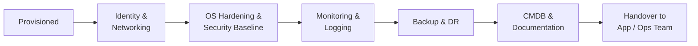

# System Onboarding Procedure


<div class="kb-summary">
Brings a new physical server, VM, or cloud instance into full production management — covering identity, networking, security, monitoring, backup, and documentation.
</div>

## Onboarding Stages


┌────────────────────────────────────────── System Onboarding ──────────────────────────────────────────┐
│                                                                                                       │
│   ┌───────────────────────────────────────────────────────────────────────────────────────────────┐   │
│   │         Onboarding: register new system in CMDB, configure monitoring, create runbooks        │   │
│   │           Gate: system not in BAU until all checklist items complete and signed off           │   │
│   └───────────────────────────────────────────────────────────────────────────────────────────────┘   │
│                                                                                                       │
│                          ▼                                                 ▼                          │
│                                                                                                       │
│   ┌──────────────────────────────────────────────┐  ┌─────────────────────────────────────────────┐   │
│   │             Technical Checklist              │  │            Operational Checklist            │   │
│   │      ─────────────────────────────────       │  │      ─────────────────────────────────      │   │
│   │              CMDB entry created              │  │               Runbook created               │   │
│   │            Monitoring configured             │  │           On-call schedule updated          │   │
│   │              Backup configured               │  │           Support contract linked           │   │
│   │            Patching schedule set             │  │          Admin credentials in vault         │   │
│   │            Network/DNS configured            │  │           Team training completed           │   │
│   └──────────────────────────────────────────────┘  └─────────────────────────────────────────────┘   │
│                                                                                                       │
│   │       Item       │      Owner       │        Tool       │  Pass criteria   │     Sign-off     │   │
│   │ ──────────────── │ ──────────────── │ ───────────────── │ ──────────────── │──────────────────│   │
│   │       CMDB       │    Infra team    │     CMDB tool     │    All fields    │    Infra lead    │   │
│   │    Monitoring    │     Ops team     │     Zabbix/etc    │  Alerts active   │     Ops lead     │   │
│   │      Backup      │   Backup team    │     Backup app    │   Job verified   │   Backup lead    │   │
│   │     Runbook      │    Infra team    │         KB        │    Published     │   Peer review    │   │
│                                                                                                       │
│    Key terms:                                                                                         │
│                                                                                                       │
│    BAU gate      = System accepted into Business As Usual operations only after all items complete    │
│    Onboarding doc= System record: owner, contacts, dependencies, SLA, backup, change history          │
│    Vault entry   = Admin credentials stored in CyberArk/vault; no shared spreadsheet creds            │
│                                                                                                       │
└───────────────────────────────────────────────────────────────────────────────────────────────────────┘
```
┌────────────────────────────────────────── System Onboarding ──────────────────────────────────────────┐
│                                                                                                       │
│   ┌───────────────────────────────────────────────────────────────────────────────────────────────┐   │
│   │         Onboarding: register new system in CMDB, configure monitoring, create runbooks        │   │
│   │           Gate: system not in BAU until all checklist items complete and signed off           │   │
│   └───────────────────────────────────────────────────────────────────────────────────────────────┘   │
│                                                                                                       │
│                          ▼                                                 ▼                          │
│                                                                                                       │
│   ┌──────────────────────────────────────────────┐  ┌─────────────────────────────────────────────┐   │
│   │             Technical Checklist              │  │            Operational Checklist            │   │
│   │      ─────────────────────────────────       │  │      ─────────────────────────────────      │   │
│   │              CMDB entry created              │  │               Runbook created               │   │
│   │            Monitoring configured             │  │           On-call schedule updated          │   │
│   │              Backup configured               │  │           Support contract linked           │   │
│   │            Patching schedule set             │  │          Admin credentials in vault         │   │
│   │            Network/DNS configured            │  │           Team training completed           │   │
│   └──────────────────────────────────────────────┘  └─────────────────────────────────────────────┘   │
│                                                                                                       │
│   │       Item       │      Owner       │        Tool       │  Pass criteria   │     Sign-off     │   │
│   │ ──────────────── │ ──────────────── │ ───────────────── │ ──────────────── │──────────────────│   │
│   │       CMDB       │    Infra team    │     CMDB tool     │    All fields    │    Infra lead    │   │
│   │    Monitoring    │     Ops team     │     Zabbix/etc    │  Alerts active   │     Ops lead     │   │
│   │      Backup      │   Backup team    │     Backup app    │   Job verified   │   Backup lead    │   │
│   │     Runbook      │    Infra team    │         KB        │    Published     │   Peer review    │   │
│                                                                                                       │
│    Key terms:                                                                                         │
│                                                                                                       │
│    BAU gate      = System accepted into Business As Usual operations only after all items complete    │
│    Onboarding doc= System record: owner, contacts, dependencies, SLA, backup, change history          │
│    Vault entry   = Admin credentials stored in CyberArk/vault; no shared spreadsheet creds            │
│                                                                                                       │
└───────────────────────────────────────────────────────────────────────────────────────────────────────┘
```

## 2. OS Hardening and Security Baseline

```bash
# Apply CIS baseline via Ansible
ansible-playbook -i inventory/ security/cis-baseline.yml --limit <hostname>

# SELinux enforcing
sed -i 's/^SELINUX=.*/SELINUX=enforcing/' /etc/selinux/config
setenforce 1

# Disable unnecessary services
systemctl disable --now bluetooth avahi-daemon cups rpcbind postfix

# SSH hardening
cat > /etc/ssh/sshd_config.d/hardening.conf <<EOF
PermitRootLogin no
PasswordAuthentication no
MaxAuthTries 3
ClientAliveInterval 300
ClientAliveCountMax 2
X11Forwarding no
AllowGroups sshusers admins
EOF
systemctl reload sshd

# Host firewall
firewall-cmd --set-default-zone=drop
firewall-cmd --permanent --add-service=ssh
firewall-cmd --permanent --add-rich-rule='rule family="ipv4" source address="10.0.0.0/8" service name="ssh" accept'
firewall-cmd --reload
```

### CyberArk PAM Registration

```yaml
CyberArk UI: Accounts → Safes → <Environment>-Safe → Add Account
  Account type: Linux / Windows
  Platform:     LinuxSSH / WinServerLocal
  Address:      <hostname>.example.com
  Username:     ansible / svc-admin
```

## 3. Monitoring and Logging

```bash
# Install Prometheus node_exporter
useradd -r -s /sbin/nologin node_exporter
curl -sL https://github.com/prometheus/node_exporter/releases/download/v1.8.0/node_exporter-1.8.0.linux-amd64.tar.gz \
  | tar xz -C /tmp/
install -m 755 /tmp/node_exporter-*/node_exporter /usr/local/bin/

cat > /etc/systemd/system/node_exporter.service <<EOF
[Unit]
Description=Prometheus Node Exporter
After=network.target
[Service]
User=node_exporter
ExecStart=/usr/local/bin/node_exporter
Restart=on-failure
[Install]
WantedBy=multi-user.target
EOF

systemctl daemon-reload
systemctl enable --now node_exporter
curl -s http://localhost:9100/metrics | head -3

# Log forwarding to central syslog
echo "*.* @syslog.example.com:514" >> /etc/rsyslog.conf
systemctl restart rsyslog

# Verify host visible in monitoring
curl -s "http://prometheus:9090/api/v1/query?query=up{instance='<hostname>:9100'}" \
  | python3 -c "import sys,json; r=json.load(sys.stdin)['data']['result']; print('UP' if r and r[0]['value'][1]=='1' else 'NOT VISIBLE')"
```

## 4. Backup Configuration

```powershell
# Veeam — add to backup job
$job = Get-VBRJob -Name "Production Linux VMs"
$vm = Find-VBRViEntity -Name "<hostname>"
Add-VBRViJobObject -Job $job -Entities $vm

# Run first backup and verify
Start-VBRJob -Job $job
Get-VBRSession | Where-Object JobName -eq "Production Linux VMs" | Select-Object -Last 1
```

## 5. Ansible Inventory Registration

```bash
# Add to inventory
cat >> inventory/production/hosts.yml <<EOF
    <hostname>.example.com:
      ansible_host: <ip>
EOF

# Host-specific vars
mkdir -p inventory/production/host_vars/<hostname>.example.com/
cat > inventory/production/host_vars/<hostname>.example.com/main.yml <<EOF
environment: production
role: <app_role>
owner: <team>
EOF

# Verify connectivity
ansible <hostname>.example.com -i inventory/production/ -m ansible.builtin.ping
```

## 6. CMDB Entry

| Field | Value |
|---|---|
| Hostname | |
| FQDN | |
| IP Address | |
| Environment | Production / Staging / Dev |
| OS / Version | |
| CPU / Memory / Disk | |
| Hypervisor / Physical host | |
| Owner / Team | |
| Application | |
| Backup job | |
| Patch schedule | |
| DR tier | |
| CyberArk safe | |
| Date onboarded | |

## Onboarding Checklist

| Step | Status |
|---|---|
| Hostname and IP configured | ☐ |
| DNS A + PTR records created | ☐ |
| NTP synchronized | ☐ |
| Domain joined | ☐ |
| OS security baseline applied | ☐ |
| SSH hardened (key-only) | ☐ |
| Host firewall configured | ☐ |
| CyberArk account created | ☐ |
| Monitoring agent installed | ☐ |
| Host visible in monitoring | ☐ |
| Log forwarding configured | ☐ |
| Backup job includes host | ☐ |
| First backup successful | ☐ |
| Ansible inventory updated | ☐ |
| CMDB entry created | ☐ |
| Handover to app team complete | ☐ |
