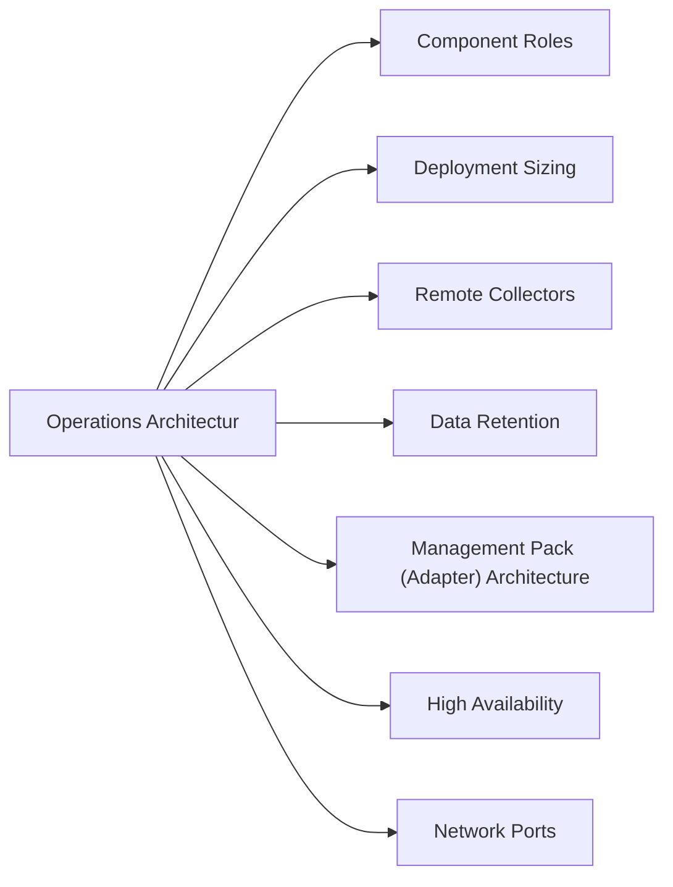

# Aria Operations Architecture

## Overview

VMware Aria Operations (formerly vROps) is deployed as an analytics cluster comprising primary, replica, and optional data nodes. Remote Collectors distribute collection workload across sites without adding to the analytics tier. All components are managed through the Aria Suite Lifecycle Manager.

## Component Roles

| Component | Role |
|---|---|
| Primary Analytics Node | Hosts UI, analytics engine, and master cluster services |
| Replica Analytics Node | Provides HA failover for the primary; promotes automatically on primary failure |
| Data Nodes | Scale-out storage and indexing tier for large environments |
| Remote Collectors | Lightweight collection agents deployed at distributed sites; no local analytics |
| Management Packs | Adapter plugins that connect Aria Operations to third-party platforms |

## Deployment Sizing

| Deployment Size | Nodes | Use Case |
|---|---|---|
| Small (xSmall) | 1 node | Lab / proof-of-concept |
| Medium | Primary + Replica | Up to ~3,000 VMs |
| Large | Primary + Replica + 2–4 Data Nodes | Up to ~10,000 VMs |
| Extra Large | Primary + Replica + 4+ Data Nodes | Enterprise fleet |

Consult the VMware Aria Operations Sizing Guide for current VM/object count thresholds per node size.

## Remote Collectors

Remote Collectors are deployed at branch or remote sites where WAN collection would create latency or bandwidth concerns. They do not perform analytics — all processed data lives on the analytics cluster.

- Deployed as OVA
- Network requirements: TCP 443 outbound to analytics cluster; TCP 443/ICMP to monitored endpoints
- Resource sizing: 2 vCPU / 4 GB RAM (small), 4 vCPU / 8 GB RAM (large)
- Configure under: Admin > Environment > Remote Collectors

## Data Retention

Default retention is 6 months. Extending retention requires additional data node storage.

| Retention Period | Additional Storage Estimate per 1,000 VMs |
|---|---|
| 6 months (default) | ~2 TB per data node |
| 12 months | ~4 TB per data node |
| 24 months | ~8 TB per data node |

Retention configuration: **Admin > Global Settings > Retention Policy**

## Management Pack (Adapter) Architecture

Management packs extend collection beyond native vSphere objects. Each adapter instance is assigned to a collector node (analytics node or remote collector). Key adapters:

| Adapter | Source Platform |
|---|---|
| vCenter Adapter | VMware vCenter (VMs, hosts, clusters, datastores) |
| NSX-T Adapter | NSX overlays, logical routers, edges |
| Pure Storage Adapter | Pure FlashArray/FlashBlade |
| Dell EMC Adapter | PowerStore, PowerMax, Unity |
| Aria Operations for Logs | Log Intelligence integration |

## High Availability

- Cluster failover: automatic promotion of Replica node if Primary becomes unavailable
- Remote Collectors: deploy at least 2 per site for collector HA; assign each adapter instance to both collectors for redundancy
- Minimum RPO/RTO for HA failover: typically under 5 minutes for UI and collection resumption

## Network Ports

| Source | Destination | Port | Purpose |
|---|---|---|---|
| Browser | Analytics Node VIP | TCP 443 | Web UI |
| Analytics Node | vCenter | TCP 443 | Collection |
| Remote Collector | Analytics Node | TCP 443 | Data forwarding |
| Remote Collector | vCenter / adapters | TCP 443 | Collection |
| Aria Operations | ServiceNow | TCP 443 | Alert outbound |
